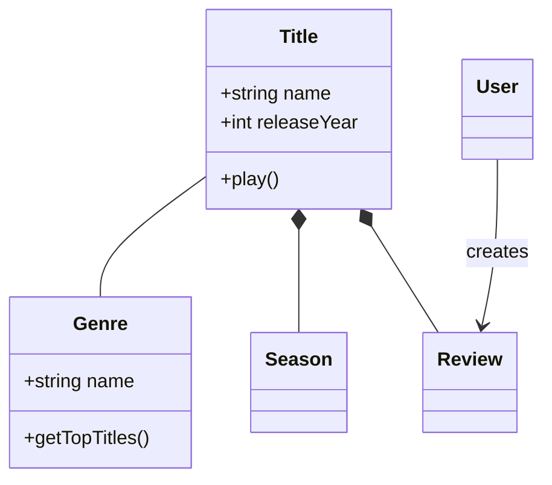
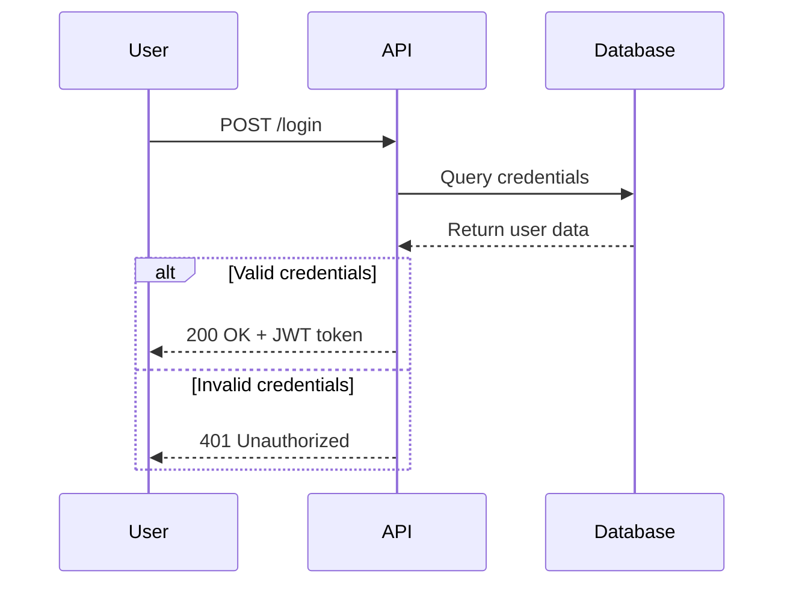
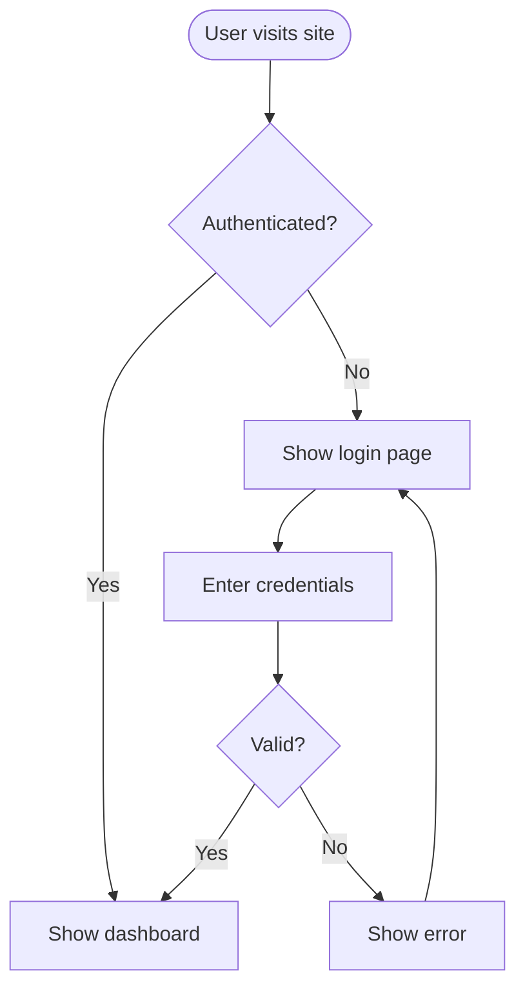
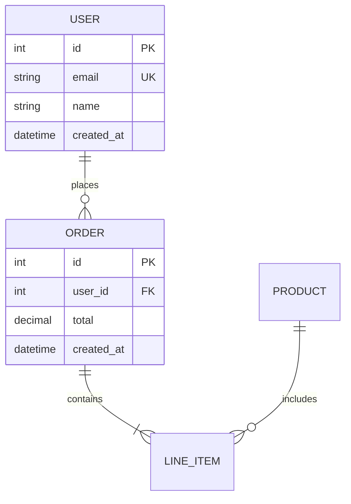
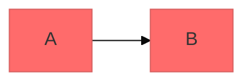

# Mermaid 绘图

使用Mermaid的基于文本的语法创建专业的软件图表。Mermaid通过简单的文本定义渲染图表，使图表可版本控制、易于更新，并能与代码一起维护。

## 核心语法结构

所有Mermaid图表都遵循以下模式：

```mermaid
diagramType
  definition content
```

**关键原则：**
- 第一行声明图表类型（例如：`classDiagram`、`sequenceDiagram`、`flowchart`）
- 使用`%%`添加注释
- 换行和缩进可提升可读性，但并非必需
- 未知词汇会导致图表出错；参数错误不会显示提示

## 图表类型选择指南

**选择合适的图表类型：**

1. **类图** - 领域建模、面向对象设计、实体关系
   - 领域驱动设计文档
   - 面向对象类结构
   - 实体关系与依赖

2. **序列图** - 时序交互、消息流
   - API请求/响应流程
   - 用户认证流程
   - 系统组件交互
   - 方法调用序列

3. **流程图** - 流程、算法、决策树
   - 用户旅程与工作流
   - 业务流程
   - 算法逻辑
   - 部署流水线

4. **实体关系图（ERD）** - 数据库模式
   - 表关系
   - 数据建模
   - 模式设计

5. **C4图** - 多层面软件架构
   - 系统上下文（系统与用户）
   - 容器（应用、数据库、服务）
   - 组件（内部结构）
   - 代码（类/接口层面）

6. **状态图** - 状态机、生命周期状态
7. **Git图** - 版本控制分支策略
8. **甘特图** - 项目时间线、调度
9. **饼图/柱状图** - 数据可视化

## 快速入门示例

### 类图（领域模型）


### 序列图（API流程）


### 流程图（用户旅程）


### ERD（数据库模式）


## 详细参考文档

如需特定图表类型的深入指导，请查看：

- **[references/class-diagrams.md](references/class-diagrams.md)** - 领域建模、关系（关联、组合、聚合、继承）、多重性、方法/属性
- **[references/sequence-diagrams.md](references/sequence-diagrams.md)** - 参与者、消息（同步/异步）、激活、循环、alt/opt/par块、注释
- **[references/flowcharts.md](references/flowcharts.md)** - 节点形状、连接、决策逻辑、子图、样式
- **[references/erd-diagrams.md](references/erd-diagrams.md)** - 实体、关系、基数、键、属性
- **[references/c4-diagrams.md](references/c4-diagrams.md)** - 系统上下文、容器、组件图、边界
- **[references/architecture-diagrams.md](references/architecture-diagrams.md)** - 云服务、基础设施、CI/CD部署
- **[references/advanced-features.md](references/advanced-features.md)** - 主题、样式、配置、布局选项

## 最佳实践

1. **从简开始** - 先从核心实体/组件入手，逐步添加细节
2. **使用有意义的名称** - 清晰的标签让图表具备自文档性
3. **大量添加注释** - 使用`%%`注释解释复杂关系
4. **保持聚焦** - 一个图表对应一个概念；将大型图表拆分为多个聚焦视图
5. **版本控制** - 将`.mmd`文件与代码一起存储，便于更新
6. **添加上下文** - 包含标题和注释说明图表用途
7. **迭代优化** - 随着理解深入不断完善图表

## 配置与主题

使用前置元数据配置图表：



**可用主题：** default、forest、dark、neutral、base

**布局选项：**
- `layout: dagre`（默认）- 经典平衡布局
- `layout: elk` - 适用于复杂图表的高级布局（需要集成支持）

**外观选项：**
- `look: classic` - 传统Mermaid样式
- `look: handDrawn` - 手绘风格外观

## 导出与渲染

**原生支持平台：**
- GitHub/GitLab - 在Markdown中自动渲染
- VS Code - 配合Markdown Mermaid扩展
- Notion、Obsidian、Confluence - 内置支持

**导出选项：**
- [Mermaid Live Editor](https://mermaid.live) - 在线编辑器，支持PNG/SVG导出
- Mermaid CLI - `npm install -g @mermaid-js/mermaid-cli` 然后执行 `mmdc -i input.mmd -o output.png`
- Docker - `docker run --rm -v $(pwd):/data minlag/mermaid-cli -i /data/input.mmd -o /data/output.png`

## 常见陷阱

- **特殊字符问题** - 避免在注释中使用`{}`，对特殊字符使用正确的转义序列
- **语法错误** - 拼写错误会导致图表失效；在Mermaid Live中验证语法
- **过度复杂** - 将复杂图表拆分为多个聚焦视图
- **缺失关系** - 记录实体之间所有重要的连接

## 何时创建图表

**在以下场景务必创建图表：**
- 启动新项目或新功能时
- 文档化复杂系统时
- 解释架构决策时
- 设计数据库模式时
- 规划重构工作时
- 新团队成员入职时

**使用图表来：**
- 让利益相关者在技术决策上达成一致
- 协作文档化领域模型
- 可视化数据流与系统交互
- 编码前进行规划
- 创建随代码一起演进的活文档