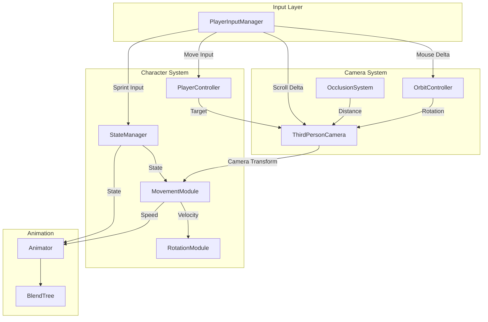

# Design Document

## Overview

本设计文档描述了第三人称角色控制器的技术架构和实现细节。系统采用模块化设计，将摄像机系统和角色移动系统分离，通过输入管理器进行协调。

核心设计原则：
- **响应迅速**：移动立即响应输入，不等待模型转身
- **视觉平滑**：所有过渡使用插值和阻尼，避免突变
- **永不穿模**：智能防遮挡系统确保摄像机始终可见角色

## Architecture



## Components and Interfaces

### 1. PlayerInputManager (输入管理器)

**职责**：统一管理所有输入，提供标准化的输入数据

```csharp
public class PlayerInputManager : MonoBehaviour
{
    // 单例访问
    public static PlayerInputManager Instance { get; }
    
    // 输入属性
    public Vector2 Move { get; }           // WASD 移动输入 (-1 to 1)
    public Vector2 MouseDelta { get; }     // 鼠标增量（已应用灵敏度）
    public float ScrollDelta { get; }      // 滚轮增量（新增）
    public bool SprintDown { get; }        // Shift 按下事件
    public bool IsMouseLocked { get; }     // 鼠标锁定状态
    
    // 配置
    public float MouseSensitivityX { get; set; }
    public float MouseSensitivityY { get; set; }
    
    // 方法
    public void SetCursorLock(bool locked);
    public void ToggleCursorLock();
    public void SetEnable(bool enabled);
}
```

### 2. ThirdPersonCamera (第三人称摄像机)

**职责**：管理摄像机的轨道控制、跟随、缩放和防遮挡

```csharp
public class ThirdPersonCamera : MonoBehaviour
{
    // 配置参数
    [Header("目标")]
    public Transform target;                    // 跟随目标
    public Vector3 targetOffset;                // 目标偏移（头部位置）
    
    [Header("轨道控制")]
    public float orbitSensitivityX = 3f;        // 水平旋转灵敏度
    public float orbitSensitivityY = 2f;        // 垂直旋转灵敏度
    public float orbitDamping = 0.1f;           // 旋转阻尼时间
    public float minPitch = -40f;               // 最小俯仰角
    public float maxPitch = 80f;                // 最大俯仰角
    
    [Header("跟随设置")]
    public float followSmoothTime = 0.1f;       // 跟随平滑时间
    
    [Header("缩放设置")]
    public float defaultDistance = 5f;          // 默认距离
    public float minDistance = 2f;              // 最小距离
    public float maxDistance = 10f;             // 最大距离
    public float zoomSpeed = 2f;                // 缩放速度
    public float zoomSmoothTime = 0.2f;         // 缩放平滑时间
    
    [Header("动态 FOV")]
    public float defaultFOV = 60f;              // 默认视野
    public float sprintFOV = 70f;               // 冲刺视野
    public float fovSmoothTime = 0.3f;          // FOV 平滑时间
    
    [Header("防遮挡")]
    public LayerMask occlusionLayers;           // 遮挡检测层
    public float occlusionRadius = 0.3f;        // 检测球体半径
    public float occlusionBuffer = 0.1f;        // 缓冲距离
    public float occlusionRecoverySpeed = 2f;   // 恢复速度
    
    // 公共属性
    public Vector3 Forward { get; }             // 摄像机水平前向（忽略俯仰）
    public Vector3 Right { get; }               // 摄像机水平右向
    public float CurrentYaw { get; }            // 当前水平角度
    public float CurrentPitch { get; }          // 当前俯仰角度
    
    // 方法
    public void SetTarget(Transform target);
    public void SetSprintMode(bool isSprinting);
    public void ResetCamera();
    public Camera GetCamera();
}
```

### 3. PlayerController (角色控制器)

**职责**：管理角色移动、旋转和状态

```csharp
public class PlayerController : MonoBehaviour
{
    // 配置参数
    [Header("移动设置")]
    public float walkSpeed = 2f;
    public float slowRunSpeed = 4f;
    public float fastRunSpeed = 8f;
    public float acceleration = 10f;
    public float deceleration = 8f;
    public float friction = 6f;
    
    [Header("旋转设置")]
    public float turnSmoothTime = 0.1f;         // 转身平滑时间
    
    [Header("物理设置")]
    public float gravity = -20f;
    public float groundCheckDistance = 0.2f;
    public LayerMask groundLayers;
    
    [Header("状态设置")]
    public float doubleClickWindow = 0.5f;
    
    [Header("引用")]
    public ThirdPersonCamera cameraRig;         // 摄像机引用
    public Animator animator;
    
    // 公共属性
    public PlayerState CurrentState { get; }
    public Vector3 Velocity { get; }
    public bool IsGrounded { get; }
    public float CurrentSpeed { get; }
    
    // 方法
    public void TeleportTo(Vector3 position);
    public Vector3 GetPosition();
}
```

## Data Models

### PlayerState 枚举

```csharp
public enum PlayerState
{
    Idle = 0,       // 静止
    Walk = 1,       // 行走
    SlowRun = 2,    // 慢跑
    FastRun = 3     // 快跑
}
```

### 摄像机状态数据

```csharp
// 内部状态（ThirdPersonCamera 私有）
private float m_CurrentYaw;              // 当前水平角度
private float m_CurrentPitch;            // 当前俯仰角度
private Vector2 m_OrbitVelocity;         // 轨道旋转速度（用于阻尼）
private float m_CurrentDistance;         // 当前距离
private float m_TargetDistance;          // 目标距离
private float m_DistanceVelocity;        // 距离变化速度
private Vector3 m_FollowVelocity;        // 跟随速度
private float m_CurrentFOV;              // 当前 FOV
private float m_FOVVelocity;             // FOV 变化速度
```

### 角色状态数据

```csharp
// 内部状态（PlayerController 私有）
private Vector3 m_Velocity;              // 当前速度
private Vector3 m_TargetDirection;       // 目标移动方向
private float m_CurrentYaw;              // 当前模型朝向
private float m_TurnVelocity;            // 转身速度（用于 SmoothDampAngle）
private PlayerState m_CurrentState;      // 当前状态
private float m_LastForwardReleaseTime;  // 双击检测用
private bool m_WasForwardPressed;        // 双击检测用
```


## Correctness Properties

*A property is a characteristic or behavior that should hold true across all valid executions of a system-essentially, a formal statement about what the system should do. Properties serve as the bridge between human-readable specifications and machine-verifiable correctness guarantees.*

### Property 1: Orbit Rotation Proportionality
*For any* mouse delta input (x, y), the camera's yaw change SHALL be proportional to x and the pitch change SHALL be proportional to y, with the proportionality constants being the configured sensitivity values.
**Validates: Requirements 1.1, 1.2**

### Property 2: Pitch Clamping
*For any* sequence of vertical mouse inputs, the camera pitch angle SHALL always remain within [minPitch, maxPitch] inclusive.
**Validates: Requirements 1.3**

### Property 3: Orbit Damping Decay
*For any* initial orbit velocity, after mouse input stops, the orbit velocity SHALL decay monotonically toward zero over time.
**Validates: Requirements 1.4**

### Property 4: Follow Position Convergence
*For any* target position, the camera position SHALL converge to the expected offset position over time without overshooting.
**Validates: Requirements 2.1, 2.2, 2.3**

### Property 5: Zoom Distance Clamping
*For any* sequence of scroll inputs, the camera distance SHALL always remain within [minDistance, maxDistance] inclusive.
**Validates: Requirements 3.1, 3.2, 3.3, 3.4**

### Property 6: FOV Sprint Mode
*For any* sprint mode state, the camera FOV SHALL approach sprintFOV when sprint mode is enabled and approach defaultFOV when disabled.
**Validates: Requirements 3.5, 3.6**

### Property 7: Occlusion Detection Correctness
*For any* obstacle on the occlusion layer between the character and camera ideal position, the camera distance SHALL be reduced to place the camera in front of the obstacle.
**Validates: Requirements 4.1, 4.2, 4.4**

### Property 8: Occlusion Recovery Smoothness
*For any* occlusion event that ends, the camera distance SHALL increase monotonically toward the target distance without sudden jumps.
**Validates: Requirements 4.3**

### Property 9: Camera-Relative Direction Calculation
*For any* input vector (x, y) and camera orientation, the target direction SHALL equal input.y × cameraForward + input.x × cameraRight, where cameraForward and cameraRight are the camera's horizontal direction vectors.
**Validates: Requirements 5.1, 5.2, 5.3, 5.4, 5.5**

### Property 10: Immediate Movement Response
*For any* non-zero movement input, the character velocity SHALL be applied in the target direction within the same frame, regardless of the current model rotation.
**Validates: Requirements 6.1**

### Property 11: Smooth Model Rotation
*For any* target direction change, the model rotation SHALL approach the target direction monotonically using smooth interpolation, never snapping instantly.
**Validates: Requirements 6.2, 6.3**

### Property 12: Acceleration Time Bounds
*For any* transition from idle to moving, the time to reach maximum speed SHALL be within [0.2, 0.3] seconds.
**Validates: Requirements 7.1**

### Property 13: Deceleration Continuity
*For any* transition from moving to idle, the speed SHALL decrease continuously (no instant stops) until reaching zero.
**Validates: Requirements 7.2**

### Property 14: Slope Velocity Projection
*For any* movement on a slope, the velocity vector SHALL be projected onto the slope plane, maintaining consistent speed regardless of slope angle.
**Validates: Requirements 7.3**

### Property 15: State Transition Correctness
*For any* valid state transition trigger (double-tap, Shift press, input stop), the state SHALL transition to the correct target state and the maximum speed SHALL be updated accordingly.
**Validates: Requirements 8.1, 8.2, 8.3, 8.4, 8.5**

### Property 16: Animation Parameter Mapping
*For any* state and velocity combination, the Animator Speed parameter SHALL be set to a value within the correct threshold range for that state.
**Validates: Requirements 9.1, 9.2, 9.3**

### Property 17: Input Capture Correctness
*For any* mouse lock state, mouse delta SHALL be captured with sensitivity applied when locked, and SHALL be zero when not locked.
**Validates: Requirements 10.1, 10.2**

## Error Handling

### 摄像机系统错误处理

1. **目标丢失**
   - 当 target 为 null 时，摄像机保持当前位置不更新
   - 提供 SetTarget 方法允许运行时重新设置目标

2. **遮挡检测失败**
   - 当 SphereCast 返回异常结果时，使用上一帧的距离值
   - 设置最小安全距离（0.5m）防止摄像机进入角色内部

3. **输入系统未初始化**
   - 检查 PlayerInputManager.Instance 是否为 null
   - 为 null 时使用默认值（零输入）

### 角色控制器错误处理

1. **摄像机引用丢失**
   - 当 cameraRig 为 null 时，使用角色自身朝向作为移动参考
   - 在 Start 中尝试自动查找摄像机

2. **CharacterController 缺失**
   - 使用 RequireComponent 确保组件存在
   - Awake 中自动添加并配置默认参数

3. **地面检测失败**
   - 使用 CharacterController.isGrounded 作为主要检测
   - 备用射线检测作为辅助验证

## Testing Strategy

### 单元测试

1. **方向计算测试**
   - 测试 CalculateCameraRelativeDirection 方法
   - 验证各种输入和摄像机朝向组合的输出

2. **状态转换测试**
   - 测试 HandleStateTransition 方法
   - 验证双击检测、Shift 切换等逻辑

3. **动画参数映射测试**
   - 测试 CalculateBlendTreeSpeed 方法
   - 验证各状态下的参数映射

### 属性测试

使用 NUnit 的 TestCase 或自定义属性测试框架：

1. **Property 2: Pitch Clamping**
   - 生成随机俯仰角序列
   - 验证结果始终在范围内

2. **Property 5: Zoom Distance Clamping**
   - 生成随机滚轮输入序列
   - 验证距离始终在范围内

3. **Property 9: Camera-Relative Direction Calculation**
   - 生成随机输入和摄像机朝向
   - 验证计算结果符合公式

4. **Property 15: State Transition Correctness**
   - 生成随机状态转换序列
   - 验证状态机行为正确

### 集成测试

1. **摄像机-角色协调测试**
   - 验证摄像机正确跟随角色
   - 验证移动方向正确基于摄像机

2. **防遮挡系统测试**
   - 在测试场景中放置障碍物
   - 验证摄像机正确避开障碍

### 测试框架

- 使用 Unity Test Framework (NUnit)
- 属性测试使用 FsCheck.NUnit 或自定义随机测试
- 每个属性测试运行至少 100 次迭代
- 测试文件命名：`*Tests.cs`，放置在 `Assets/Tests/` 目录
