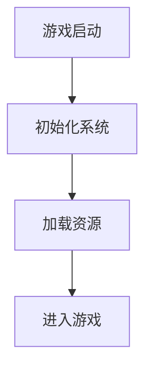

# 论文优化与重构 - 设计文档

**变更名称**: `thesis-comprehensive-optimization`  
**文档类型**: Design  
**创建时间**: 2026-04-06  
**工作流**: Requirements-First

---

## 📐 设计概述

本设计文档描述了如何将 Clash of Gods 毕业论文从当前的 9 章结构重构为参考论文的结构，并优化为出版级别的学术论文。

### 设计原则
1. **参考驱动** - 以参考论文为标准，学习其结构和格式
2. **内容优先** - 优化内容质量，提升学术严谨性
3. **可视化增强** - 通过 25 个专业图表增强论文的可读性
4. **格式统一** - 确保最终输出的格式美观专业

---

## 🏗️ 系统架构设计

### 整体流程架构

```
┌─────────────────────────────────────────────────────────────┐
│                    论文优化与重构流程                        │
└─────────────────────────────────────────────────────────────┘
                              │
                              ▼
        ┌─────────────────────────────────────┐
        │  阶段1：参考论文分析 & 目录重构      │
        │  输入：参考论文 .docx               │
        │  输出：新目录结构、对应表           │
        └─────────────────────────────────────┘
                              │
                              ▼
        ┌─────────────────────────────────────┐
        │  阶段2：论文内容优化 & 分章节组织    │
        │  输入：原论文内容                   │
        │  输出：9 个优化的 .md 文件          │
        └─────────────────────────────────────┘
                              │
                              ▼
        ┌─────────────────────────────────────┐
        │  阶段2.5：图表设计规划              │
        │  输入：论文章节                     │
        │  输出：图表规划文档                 │
        └─────────────────────────────────────┘
                              │
                              ▼
        ┌─────────────────────────────────────┐
        │  阶段3：图表生成与集成              │
        │  输入：图表规划                     │
        │  输出：16 个 .mmd 文件 + 标记       │
        └─────────────────────────────────────┘
                              │
                              ▼
        ┌─────────────────────────────────────┐
        │  阶段4：格式提取与最终生成          │
        │  输入：优化的章节 + 图表            │
        │  输出：最终 .docx 文件              │
        └─────────────────────────────────────┘
```

---

## 📋 阶段1：参考论文分析 & 目录重构

### 设计目标
- 分析参考论文的结构、格式、内容组织
- 设计新的论文目录结构
- 创建旧章节到新章节的对应表

### 实现方案

#### 1.1 参考论文分析
**工具**: docx 技能  
**输入**: `开发文档/毕业论文参考/11、毕业设计（论文）正本-数字第二组-高天寒-数字2001-20202649-刘昱兵.docx`

**分析内容**:
- 目录结构（章节数、层级）
- 格式规范（字体、大小、间距、页边距）
- 内容组织（每章的内容类型和长度）
- 图表使用（图表数量、位置、类型）
- 引用格式（参考文献格式）

**输出**: `参考论文分析.md`

#### 1.2 新目录结构设计
**基于参考论文的结构**，设计新的论文目录：

```
第1章 绪论
  1.1 研究背景
  1.2 研究意义
  1.3 论文结构
  1.4 技术方案
  1.5 论文组织

第2章 相关工作
  2.1 游戏引擎技术
  2.2 游戏架构设计
  2.3 AI 技术
  2.4 本章小结

第3章 系统架构
  3.1 系统概述
  3.2 技术框架
  3.3 系统通信
  3.4 启动流程
  3.5 数据设计

第4章 战斗系统
  4.1 系统架构
  4.2 战斗流程
  4.3 AI 系统
  4.4 Buff 系统

第5章 物品系统
  5.1 系统架构
  5.2 交互设计
  5.3 持久化设计

第6章 卡牌系统
  6.1 系统架构
  6.2 效果系统
  6.3 UI 设计

第7章 TA 系统
  7.1 技术美术概述
  7.2 描边系统
  7.3 动画系统

第8章 性能优化
  8.1 优化方案
  8.2 架构优化
  8.3 优化效果

第9章 总结与展望
  9.1 工作总结
  9.2 存在的问题
  9.3 未来展望
```

#### 1.3 旧章节到新章节的对应表
**创建映射表**，说明原论文的内容如何映射到新结构：

| 原章节 | 新章节 | 说明 |
|--------|--------|------|
| 第1章 绪论 | 第1章 绪论 | 保留，可能需要扩展 |
| 第2章 相关工作 | 第2章 相关工作 | 保留，可能需要优化 |
| 第3章 系统架构 | 第3章 系统架构 | 保留，可能需要重组 |
| 第4章 战斗系统 | 第4章 战斗系统 | 保留 |
| 第5章 物品系统 | 第5章 物品系统 | 保留 |
| 第6章 卡牌系统 | 第6章 卡牌系统 | 保留 |
| 第7章 TA系统 | 第7章 TA 系统 | 保留 |
| 第8章 性能优化 | 第8章 性能优化 | 保留 |
| 第9章 总结 | 第9章 总结与展望 | 保留，可能需要扩展 |

---

## 📝 阶段2：论文内容优化 & 分章节组织

### 设计目标
- 优化论文内容，提升学术质量
- 将论文分解为 9 个独立的 .md 文件
- 保持内容的完整性和连贯性

### 实现方案

#### 2.1 内容优化策略

**优化维度**:
1. **学术严谨性** - 规范学术用语，提升论证严谨性
2. **逻辑连贯性** - 改进章节间的逻辑关系，确保论证连贯
3. **论证说服力** - 增强论证的说服力，补充必要的论据
4. **可读性** - 改进表述方式，提升可读性

**优化工具**:
- `paper-writing` 技能 - 学术论文写作指导
- `scientific-writing` 技能 - 科学写作增强

#### 2.2 分章节组织

**输出文件结构**:
```
项目知识库（AI）/论文写作/章节文件/
├── 第1章_绪论.md
├── 第2章_相关工作.md
├── 第3章_系统架构.md
├── 第4章_战斗系统.md
├── 第5章_物品系统.md
├── 第6章_卡牌系统.md
├── 第7章_TA系统.md
├── 第8章_性能优化.md
└── 第9章_总结与展望.md
```

**每个文件的结构**:
```markdown
# 第X章 [章节标题]

## X.1 [小节标题]
[内容]

## X.2 [小节标题]
[内容]

...

## 本章小结
[总结]
```

#### 2.3 内容优化检查清单

对于每个章节，需要检查：
- [ ] 学术用语规范
- [ ] 逻辑关系清晰
- [ ] 论证充分有力
- [ ] 表述简洁明了
- [ ] 没有拼写或语法错误
- [ ] 与其他章节的连贯性

---

## 🎨 阶段2.5：图表设计规划

### 设计目标
- 设计 25 个图表（16 个 Mermaid + 6 个手动 + 3 个可选）
- 明确每个图表的位置、用途、生成方式
- 创建图表插入指南

### 实现方案

#### 2.5.1 图表分类

**系统架构类（6个 Mermaid）**:
- 游戏整体架构（C4 Context）
- GameFramework 框架结构
- 系统间通信关系
- 战斗系统架构
- 物品系统架构
- 卡牌系统架构

**流程与交互类（7个 Mermaid）**:
- 游戏启动流程
- 战斗回合流程
- AI 决策流程
- 物品拖拽交互流程
- 卡牌效果执行流程
- Buff 应用与移除流程
- 事件驱动通信流程

**数据模型类（3个 Mermaid）**:
- 数据表关系图（ERD）
- 配置表结构概览
- Buff 数据结构

**参考与示意类（6个手动）**:
- 参考论文目录结构
- 游戏主界面效果图
- 战斗场景示意图
- 物品背包 UI 布局
- 卡牌界面示意图
- 系统交互示意图

**补充说明类（3个 Mermaid，可选）**:
- 开发时间线
- 性能优化对比
- 系统复杂度对比

#### 2.5.2 图表插入位置

详见 `EXTENDED_FIGURE_PLAN.md` 中的"图表插入位置详细表"。

#### 2.5.3 图表生成方式

**Mermaid 图表**:
- 使用 `mermaid-diagrams` 技能生成
- 保存为 `.mmd` 文件
- 在对应章节中嵌入代码块

**手动插入图表**:
- 在对应位置标记 `[INSERT_FIGURE_XX_NAME]`
- 后续手动插入截图或示意图

---

## 📊 阶段3：图表生成与集成

### 设计目标
- 生成 16 个 Mermaid 图表
- 在对应章节中插入图表代码
- 标记手动插入的图表位置

### 实现方案

#### 3.1 Mermaid 图表生成

**工具**: `mermaid-diagrams` 技能

**生成流程**:
1. 根据图表规划，逐个生成 Mermaid 图表
2. 每个图表保存为 `.mmd` 文件
3. 在对应章节中嵌入图表代码

**输出文件结构**:
```
项目知识库（AI）/论文写作/图表文件/
├── 图1_游戏整体架构.mmd
├── 图2_框架结构.mmd
├── ... (16个 .mmd 文件)
```

#### 3.2 图表集成

**集成方式**:
- 在对应章节的 .md 文件中，使用 Markdown 代码块嵌入 Mermaid 图表
- 在图表前后添加说明文字

**示例**:
```markdown
## 3.1 系统概述

游戏的整体架构如图1所示。



图1：游戏整体架构

该架构包括以下主要模块：
- ...
```

#### 3.3 手动插入标记

**标记方式**:
- 在对应位置标记 `[INSERT_FIGURE_XX_NAME]`
- 后续手动插入截图或示意图

**示例**:
```markdown
## 1.2 研究意义

游戏的主界面如下所示：

[INSERT_FIGURE_18_MAIN_UI]

该界面包括以下主要元素：
- ...
```

---

## 📄 阶段4：格式提取与最终生成

### 设计目标
- 提取参考论文的格式
- 生成格式一致的最终 .docx 文件
- 验证格式一致性

### 实现方案

#### 4.1 格式提取

**工具**: `docx-format-replicator` 技能

**提取内容**:
- 页面设置（页边距、纸张大小、方向）
- 字体设置（字体、大小、颜色、加粗、斜体等）
- 段落设置（行距、对齐、缩进等）
- 样式设置（标题、正文、列表等）
- 页眉页脚设置
- 目录格式

**输出**: `thesis_format.json`

#### 4.2 最终 .docx 生成

**工具**: `docx` 技能

**生成流程**:
1. 读取所有优化的章节 .md 文件
2. 读取格式配置文件 `thesis_format.json`
3. 生成最终的 .docx 文件
4. 应用格式配置

**输出**: `Clash_Of_Gods_毕业论文_最终版.docx`

#### 4.3 格式验证

**验证清单**:
- [ ] 页面设置正确
- [ ] 字体设置一致
- [ ] 段落格式一致
- [ ] 目录生成正确
- [ ] 图表位置正确
- [ ] 页码设置正确
- [ ] 没有格式错误

---

## 🔄 数据流设计

### 数据流图

```
参考论文 .docx
    │
    ▼
[阶段1] 参考论文分析
    │
    ├─→ 参考论文分析.md
    └─→ 新目录结构
    │
    ▼
原论文内容
    │
    ▼
[阶段2] 论文内容优化
    │
    ├─→ 第1章_绪论.md
    ├─→ 第2章_相关工作.md
    ├─→ ... (9个章节文件)
    │
    ▼
[阶段2.5] 图表设计规划
    │
    └─→ 图表规划文档
    │
    ▼
[阶段3] 图表生成与集成
    │
    ├─→ 图1_游戏整体架构.mmd
    ├─→ 图2_框架结构.mmd
    ├─→ ... (16个 .mmd 文件)
    │
    ▼
优化的章节 + 图表
    │
    ▼
[阶段4] 格式提取与最终生成
    │
    ├─→ thesis_format.json
    └─→ Clash_Of_Gods_毕业论文_最终版.docx
```

---

## 🛠️ 技术方案

### 使用的技能

| 技能 | 用途 | 阶段 |
|------|------|------|
| `docx` | 读取参考论文、生成最终 .docx | 1, 4 |
| `paper-writing` | 优化论文内容 | 2 |
| `scientific-writing` | 增强学术质量 | 2 |
| `mermaid-diagrams` | 生成 Mermaid 图表 | 3 |
| `docx-format-replicator` | 提取格式配置 | 4 |

### 文件格式

| 文件类型 | 用途 | 数量 |
|---------|------|------|
| `.md` | 章节内容 | 9 |
| `.mmd` | Mermaid 图表 | 16 |
| `.json` | 格式配置 | 1 |
| `.docx` | 最终输出 | 1 |

---

## ✅ 质量保证

### 质量检查清单

#### 内容质量
- [ ] 学术用语规范
- [ ] 逻辑关系清晰
- [ ] 论证充分有力
- [ ] 表述简洁明了
- [ ] 没有拼写或语法错误

#### 图表质量
- [ ] 图表清晰易懂
- [ ] 图表标题准确
- [ ] 图表在正文中被引用
- [ ] 图表位置合理

#### 格式质量
- [ ] 页面设置正确
- [ ] 字体设置一致
- [ ] 段落格式一致
- [ ] 目录生成正确
- [ ] 没有格式错误

#### 完整性检查
- [ ] 所有 9 个章节已完成
- [ ] 所有 16 个 Mermaid 图表已生成
- [ ] 所有 6 个手动插入位置已标记
- [ ] 最终 .docx 文件已生成

---

## 📌 关键决策

### 决策1：图表数量
**决策**: 设计 25 个图表（16 个 Mermaid + 6 个手动 + 3 个可选）  
**理由**: 
- 16 个 Mermaid 图表覆盖核心系统和流程
- 6 个手动图表提供视觉效果和参考
- 3 个可选图表提供补充说明

### 决策2：章节结构
**决策**: 保留原有的 9 章结构，基于参考论文优化  
**理由**:
- 原有结构已经合理
- 参考论文的结构与原有结构相似
- 避免大规模重组导致的内容丢失

### 决策3：文件组织
**决策**: 将所有文件保存到 `项目知识库（AI）/论文写作/` 文件夹  
**理由**:
- 统一管理所有论文相关文件
- 便于后续维护和更新
- 符合项目的文件组织规范

---

## 🚀 下一步

设计文档已完成。准备好创建任务列表吗？

