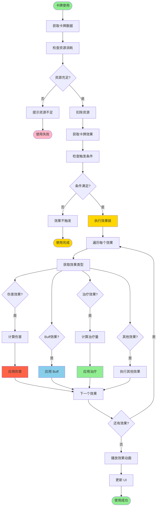

# 图11：卡牌效果执行流程

**位置**: 第6章 卡牌系统  
**章节**: 6.2 效果系统  
**类型**: 流程图  
**用途**: 说明卡牌效果的执行机制

## Mermaid 代码

## 说明

卡牌效果执行的完整流程：

1. **资源检查** - 检查是否有足够的资源使用卡牌
2. **资源扣除** - 扣除使用卡牌所需的资源
3. **条件检查** - 检查卡牌的触发条件是否满足
4. **效果执行** - 依次执行卡牌的所有效果：
   - 伤害效果：计算伤害并应用
   - Buff 效果：应用 Buff 到目标
   - 治疗效果：计算治疗量并应用
   - 其他效果：执行特殊效果
5. **动画播放** - 播放效果相关的动画
6. **UI 更新** - 更新游戏 UI 显示

