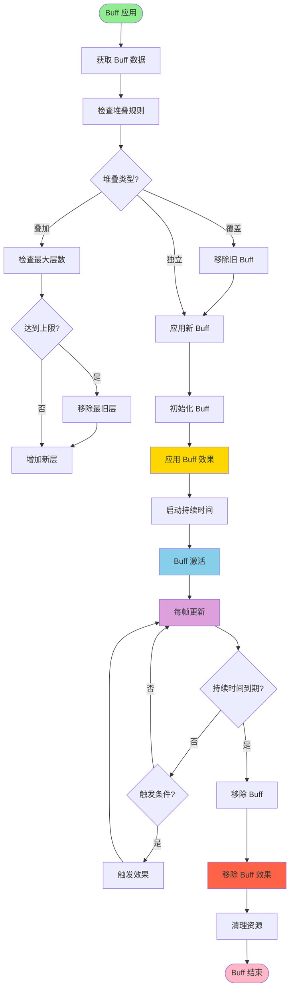

# 图12：Buff 应用与移除流程

**位置**: 第4章 战斗系统  
**章节**: 4.4 Buff 系统  
**类型**: 流程图  
**用途**: 展示 Buff 的生命周期

## Mermaid 代码

## 说明

Buff 的完整生命周期：

1. **应用阶段**
   - 获取 Buff 数据
   - 根据堆叠规则处理现有 Buff
   - 应用新 Buff 的效果

2. **激活阶段**
   - 初始化 Buff 参数
   - 应用 Buff 效果到目标
   - 启动持续时间计时

3. **活跃阶段**
   - 每帧更新 Buff 状态
   - 检查触发条件
   - 执行周期性效果

4. **移除阶段**
   - 持续时间到期时移除 Buff
   - 移除 Buff 效果
   - 清理相关资源

