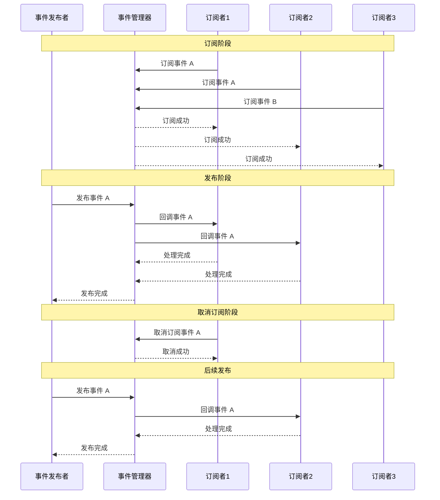

# 图13：事件驱动通信流程

**位置**: 第3章 系统架构  
**章节**: 3.3 系统通信  
**类型**: 序列图  
**用途**: 说明事件驱动的通信机制

## Mermaid 代码

## 说明

事件驱动通信的完整流程：

1. **订阅阶段**
   - 各个系统向事件管理器注册事件监听
   - 事件管理器维护订阅者列表

2. **发布阶段**
   - 事件发布者向事件管理器发布事件
   - 事件管理器查找所有订阅者
   - 依次调用订阅者的回调函数
   - 订阅者处理事件

3. **取消订阅阶段**
   - 订阅者可以随时取消订阅
   - 事件管理器更新订阅者列表

4. **解耦优势**
   - 发布者和订阅者完全解耦
   - 支持一对多的通信模式
   - 易于扩展和维护

