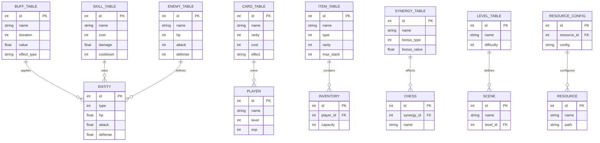

# 图14：数据表关系图（ERD）

**位置**: 第3章 系统架构  
**章节**: 3.5 数据设计  
**类型**: ERD（实体关系图）  
**用途**: 展示数据模型的设计

## Mermaid 代码

## 说明

主要配置表之间的关系：

1. **Buff 表** - 定义所有 Buff 的属性和效果
2. **技能表** - 定义所有技能的属性和消耗
3. **卡牌表** - 定义所有卡牌的属性和效果
4. **物品表** - 定义所有物品的属性和堆叠规则
5. **敌人表** - 定义所有敌人的属性和行为
6. **协同表** - 定义棋子之间的协同效果
7. **关卡表** - 定义游戏关卡的配置
8. **资源配置表** - 定义资源的加载和管理配置

这些表通过外键关系相互关联，形成完整的游戏数据模型。

