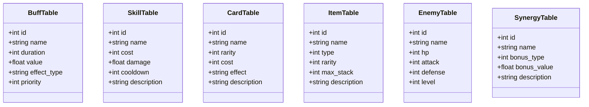

# 图15：配置表结构概览

**位置**: 第3章 系统架构  
**章节**: 3.5 数据设计  
**类型**: 表格  
**用途**: 说明配置表的设计

## Mermaid 代码

## 说明

主要配置表的字段结构和用途：

| 表名 | 主要字段 | 用途 |
|------|---------|------|
| **BuffTable** | id, name, duration, value, effect_type | 定义 Buff 属性和效果 |
| **SkillTable** | id, name, cost, damage, cooldown | 定义技能属性和消耗 |
| **CardTable** | id, name, rarity, cost, effect | 定义卡牌属性和效果 |
| **ItemTable** | id, name, type, rarity, max_stack | 定义物品属性和堆叠规则 |
| **EnemyTable** | id, name, hp, attack, defense, level | 定义敌人属性 |
| **SynergyTable** | id, name, bonus_type, bonus_value | 定义协同效果 |

