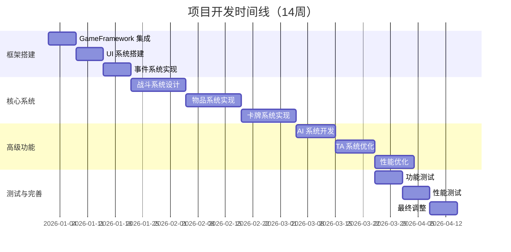

# 图23：开发时间线

**位置**: 第1章 绪论  
**章节**: 1.5 论文组织  
**类型**: 甘特图  
**用途**: 展示项目的开发进度

## Mermaid 代码

## 说明

项目开发分为四个阶段，总计 14 周：

1. **框架搭建**（第 1-3 周）
   - GameFramework 集成
   - UI 系统搭建
   - 事件系统实现

2. **核心系统**（第 4-9 周）
   - 战斗系统设计与实现
   - 物品系统实现
   - 卡牌系统实现

3. **高级功能**（第 10-12 周）
   - AI 系统开发
   - TA 系统优化
   - 性能优化

4. **测试与完善**（第 13-14 周）
   - 功能测试
   - 性能测试
   - 最终调整

