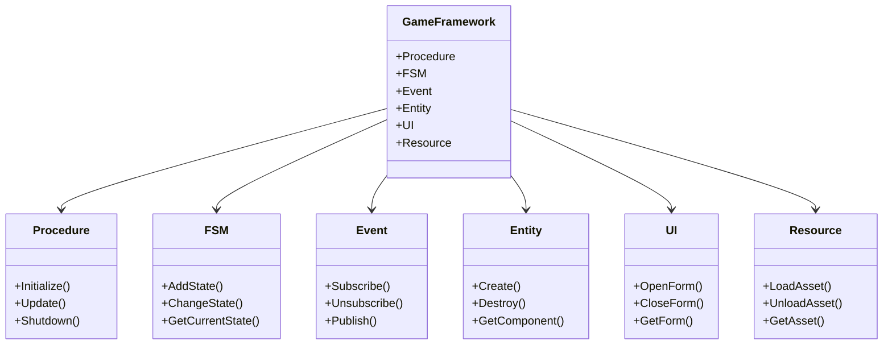

# 图2：GameFramework 框架结构

## 说明

GameFramework 是游戏的核心框架，提供了以下主要模块：

- **Procedure**：游戏流程管理
- **FSM**：有限状态机
- **Event**：事件系统
- **Entity**：实体系统
- **UI**：UI管理系统
- **Resource**：资源管理系统

这些模块相互协作，为游戏提供了完整的基础设施。
