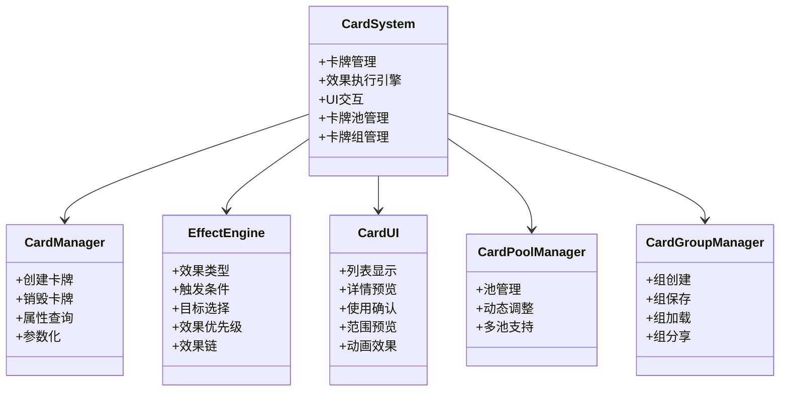

# 图6：卡牌系统架构

```mermaid
classDiagram
    class CardSystem {
        +卡牌管理
        +效果执行引擎
        +UI交互
        +卡牌池管理
        +卡牌组管理
    }
    
    class CardManager {
        +创建卡牌
        +销毁卡牌
        +属性查询
        +参数化
    }
    
    class EffectEngine {
        +效果类型
        +触发条件
        +目标选择
        +效果优先级
        +效果链
    }
    
    class CardUI {
        +列表显示
        +详情预览
        +使用确认
        +范围预览
        +动画效果
    }
    
    class CardPoolManager {
        +池管理
        +动态调整
        +多池支持
    }
    
    class CardGroupManager {
        +组创建
        +组保存
        +组加载
        +组分享
    }
    
    CardSystem --> CardManager
    CardSystem --> EffectEngine
    CardSystem --> CardUI
    CardSystem --> CardPoolManager
    CardSystem --> CardGroupManager
```

## 说明

卡牌系统由多个子模块组成：

- **卡牌管理**：管理卡牌的生命周期
- **效果执行引擎**：执行卡牌的效果
- **UI交互**：提供卡牌的用户界面
- **卡牌池管理**：管理可用的卡牌集合
- **卡牌组管理**：管理玩家的卡牌组

这些模块共同提供了完整的卡牌系统功能。
