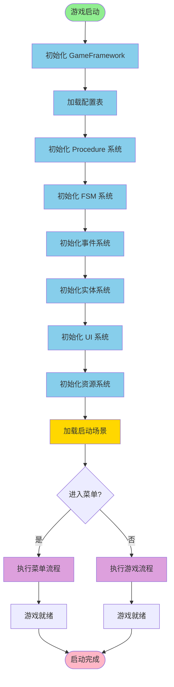

# 图7：游戏启动流程

**位置**: 第1章 绪论 / 第3章 系统架构  
**章节**: 1.4 技术方案 或 3.4 启动流程  
**类型**: 流程图  
**用途**: 说明游戏的初始化过程

## Mermaid 代码

## 说明

游戏启动流程包括以下关键步骤：

1. **框架初始化** - 初始化 GameFramework 的各个系统
2. **配置加载** - 加载所有配置表数据
3. **系统初始化** - 依次初始化 Procedure、FSM、Event、Entity、UI、Resource 系统
4. **场景加载** - 加载启动场景
5. **流程选择** - 根据游戏状态进入菜单或游戏流程
6. **就绪状态** - 游戏完全初始化，可以开始运行

