# 敌人AI状态机转换图

```dot
digraph AI_StateMachine {
    rankdir=LR;
    nodesep=0.6;
    ranksep=1.5;
    splines=true;
    fontname="SimHei,sans-serif";
    
    node [shape=box, style="filled,rounded", fontname="SimHei,sans-serif", fontsize=10, penwidth=1.5];
    edge [fontname="SimHei,sans-serif", fontsize=9, penwidth=1.2];
    
    // ========== 初始化 ==========
    subgraph cluster_init {
        label="初始化";
        style="filled,rounded";
        fillcolor="#eceff1";
        color="#546e7a";
        fontname="SimHei,sans-serif";
        fontsize=12;
        
        START [label="敌人生成\n(EnemyEntityManager)", fillcolor="#cfd8dc", color="#546e7a"];
    }
    
    // ========== 基础状态（蓝色系） ==========
    subgraph cluster_basic {
        label="基础状态";
        style="filled,rounded";
        fillcolor="#e3f2fd";
        color="#1565c0";
        fontname="SimHei,sans-serif";
        fontsize=12;
        
        Idle [label="Idle (休息)\n---\n原地待机\n可被偷袭\nAlertLevel=0", fillcolor="#bbdefb", color="#1565c0"];
        Patrol [label="Patrol (巡逻)\n---\nNavMesh随机移动\n配置范围内巡逻\n低警觉度", fillcolor="#bbdefb", color="#1565c0"];
    }
    
    // ========== 警戒状态（黄色系） ==========
    subgraph cluster_alert {
        label="警戒状态";
        style="filled,rounded";
        fillcolor="#fffde7";
        color="#f57f17";
        fontname="SimHei,sans-serif";
        fontsize=12;
        
        Alert [label="Alert (警戒)\n---\nVisionCone检测玩家\n警觉度逐渐上升\n显示警觉度UI\n广播通知附近敌人", fillcolor="#fff9c4", color="#f57f17"];
    }
    
    // ========== 追击状态（橙色系） ==========
    subgraph cluster_chase {
        label="追击状态";
        style="filled,rounded";
        fillcolor="#fff3e0";
        color="#e65100";
        fontname="SimHei,sans-serif";
        fontsize=12;
        
        Chase [label="Chase (追击)\n---\nNavMesh追踪玩家\n加速移动\n接近触发战斗", fillcolor="#ffe0b2", color="#e65100"];
    }
    
    // ========== 战斗状态（红色系） ==========
    subgraph cluster_combat {
        label="战斗状态";
        style="filled,rounded";
        fillcolor="#fce4ec";
        color="#c2185b";
        fontname="SimHei,sans-serif";
        fontsize=12;
        
        Combat [label="Combat (战斗)\n---\nCombatTriggerManager接管\n敌人实体隐藏\n生成战斗棋子", fillcolor="#f8bbd0", color="#c2185b"];
        END [label="敌人销毁\n---\n战斗胜利净化\n或Boss被击败", fillcolor="#ffcdd2", color="#b71c1c"];
    }
    
    // ========== 状态转移 ==========
    
    // 初始化
    START -> Idle [label="初始化完成"];
    
    // Idle 转移
    Idle -> Patrol [label="休息结束"];
    Idle -> Alert [label="玩家进入视野"];
    
    // Patrol 转移
    Patrol -> Idle [label="随机休息(概率)"];
    Patrol -> Alert [label="玩家进入视野"];
    
    // Alert 转移
    Alert -> Idle [label="玩家离开(立即)"];
    Alert -> Patrol [label="警戒超时"];
    Alert -> Chase [label="警觉度达到阈值"];
    
    // Chase 转移
    Chase -> Alert [label="玩家逃离(距离增加)", constraint=false];
    Chase -> Patrol [label="追击失败/超时", constraint=false];
    Chase -> Combat [label="进入战斗距离"];
    
    // Combat 转移
    Combat -> Patrol [label="战斗失败(玩家败)\n恢复敌人实体", constraint=false];
    Combat -> END [label="战斗胜利(玩家胜)\n敌人被净化"];
    
    // ========== 行对齐 ==========
    {rank=same; Idle; Patrol}
    {rank=same; Combat; END}
}
```

## 状态说明

| 状态 | 颜色 | 触发条件 | 退出条件 |
|------|------|---------|---------|
| **Idle** | 蓝色 | 初始化/休息概率/玩家离开 | 休息结束→Patrol / 发现玩家→Alert |
| **Patrol** | 蓝色 | 休息结束/追击失败/战斗失败 | 随机休息→Idle / 发现玩家→Alert |
| **Alert** | 黄色 | 玩家进入VisionCone检测范围 | 玩家离开→Idle / 超时→Patrol / 警觉满→Chase |
| **Chase** | 橙色 | 警觉度达到阈值 | 逃离→Alert / 超时→Patrol / 接近→Combat |
| **Combat** | 红色 | 追击进入战斗距离 | 玩家败→Patrol / 玩家胜→END(销毁) |
