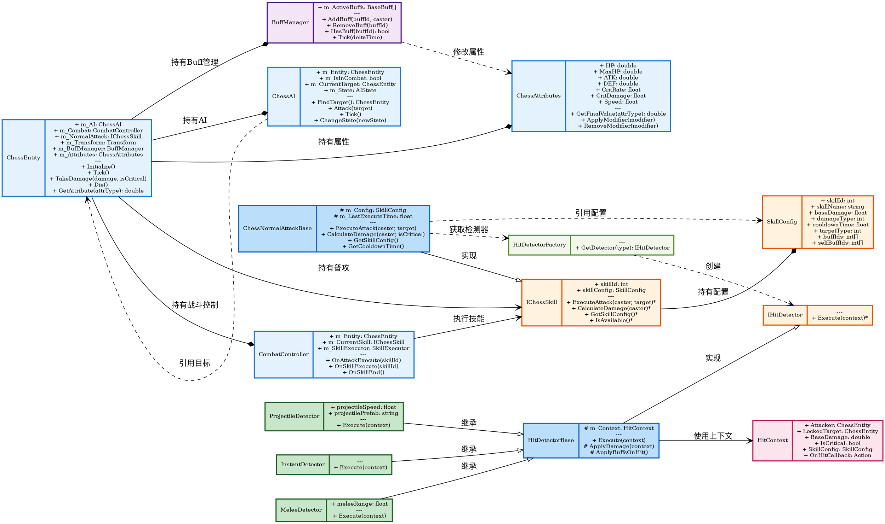

# 棋子系统类图

## 类设计说明

### 核心实体

**ChessEntity** (棋子实体)
- 棋子系统的核心类，代表场上一个战斗单位
- 持有AI、战斗控制器、属性、Buff管理器
- 提供初始化、受击、死亡等生命周期接口

**ChessAI** (棋子AI)
- 控制棋子的自动行为
- 寻找目标、发起攻击
- 支持状态切换

**CombatController** (战斗控制器)
- 协调技能执行流程
- 处理攻击和技能事件
- 管理当前执行的技能

**ChessAttributes** (棋子属性)
- 管理棋子的所有战斗属性
- 支持Buff修正器的叠加和移除
- 提供最终属性值计算

### 接口与抽象类

**IChessSkill** (技能接口)
- 所有技能的统一接口
- 支持多态实现不同技能类型

**IHitDetector** (命中检测接口)
- 定义命中检测的统一接口

**ChessNormalAttackBase** (普攻基类)
- 实现IChessSkill接口
- 提供普通攻击的通用逻辑

**HitDetectorBase** (命中检测基类)
- 实现IHitDetector接口
- 提供伤害应用和Buff触发的通用逻辑

### 具体实现

- **InstantDetector**: 即时命中检测（法术直接命中）
- **MeleeDetector**: 近战命中检测（带距离判定）
- **ProjectileDetector**: 弹道命中检测（投射物飞行）

### 辅助类

**HitDetectorFactory** (检测器工厂)
- 根据类型创建对应的命中检测器

**HitContext** (命中上下文)
- 传递命中检测所需的所有信息

**SkillConfig** (技能配置)
- 来自SkillTable的技能配置数据

**BuffManager** (Buff管理器)
- 管理棋子身上的所有Buff效果
- 通过修改ChessAttributes影响战斗

## 关键设计特点

1. **组合模式**: ChessEntity 通过组合持有各子系统
2. **多态技能**: IChessSkill 接口支持不同职业技能实现
3. **策略模式**: HitDetector 按类型选择不同命中检测策略
4. **工厂模式**: HitDetectorFactory 统一创建检测器
5. **配置驱动**: 技能参数全部来自配置表
6. **属性修正**: BuffManager 通过修正器影响 ChessAttributes
