# 图4-1 系统分层架构设计图

```dot
digraph LayeredArchitecture {
    rankdir=TB;
    nodesep=0.5;
    ranksep=1.0;
    splines=ortho;
    fontname="SimHei,sans-serif";
    
    node [shape=box, style="filled,rounded", fontname="SimHei,sans-serif", fontsize=10, penwidth=1.5];
    edge [fontname="SimHei,sans-serif", fontsize=9, penwidth=1.2];
    
    // ========== 第1层：表现层（蓝色系） ==========
    subgraph cluster_presentation {
        label="表现层 (Presentation Layer)";
        style="filled,rounded";
        fillcolor="#e3f2fd";
        color="#1565c0";
        fontname="SimHei,sans-serif";
        fontsize=12;
        
        CombatUI [label="战斗UI\n(CombatUIForm)", fillcolor="#bbdefb", color="#1565c0"];
        InventoryUI [label="背包UI\n(InventoryUIForm)", fillcolor="#bbdefb", color="#1565c0"];
        CardUI [label="卡牌UI\n(CardUIForm)", fillcolor="#bbdefb", color="#1565c0"];
        VFX [label="粒子特效\n(VFX Manager)", fillcolor="#90caf9", color="#0d47a1"];
        Anim [label="角色动画\n(Animator)", fillcolor="#90caf9", color="#0d47a1"];
        Audio [label="音效系统\n(SoundManager)", fillcolor="#90caf9", color="#0d47a1"];
    }
    
    // ========== 第2层：业务逻辑层（橙色系） ==========
    subgraph cluster_business {
        label="业务逻辑层 (Business Logic Layer)";
        style="filled,rounded";
        fillcolor="#fff3e0";
        color="#e65100";
        fontname="SimHei,sans-serif";
        fontsize=12;
        
        CombatSys [label="战斗系统\n---\n棋子AI / 技能执行\n伤害计算 / Buff管理", fillcolor="#ffe0b2", color="#e65100"];
        ItemSys [label="物品系统\n---\n背包管理 / 装备\n宝物词条", fillcolor="#ffe0b2", color="#e65100"];
        CardSys [label="卡牌系统\n---\n卡牌管理\n效果执行", fillcolor="#ffe0b2", color="#e65100"];
        ExploreSys [label="探索系统\n---\n敌人管理 / AI状态机\n战斗触发", fillcolor="#ffe0b2", color="#e65100"];
        ConfigSys [label="配置系统\n---\n配置数据\n访问接口封装", fillcolor="#ffccbc", color="#d84315"];
    }
    
    // ========== 第3层：核心系统层（紫色系） ==========
    subgraph cluster_core {
        label="核心系统层 (Core System Layer)";
        style="filled,rounded";
        fillcolor="#f3e5f5";
        color="#4a148c";
        fontname="SimHei,sans-serif";
        fontsize=12;
        
        EventSys [label="事件系统\n(GF.Event)\n---\n发布-订阅模式\n模块间解耦通信", fillcolor="#e1bee7", color="#6a1b9a"];
        EntitySys [label="实体系统\n(GF.Entity)\n---\n对象生命周期\n对象池管理", fillcolor="#e1bee7", color="#6a1b9a"];
        UISys [label="UI系统\n(GF.UI)\n---\n界面管理\nUIForm生命周期", fillcolor="#e1bee7", color="#6a1b9a"];
        DataTableSys [label="数据表系统\n(GF.DataTable)\n---\n加载配置数据\n缓存管理", fillcolor="#e1bee7", color="#6a1b9a"];
        ResourceSys [label="资源系统\n(GF.Resource)\n---\n动态加载\n引用计数", fillcolor="#e1bee7", color="#6a1b9a"];
    }
    
    // ========== 第4层：基础框架层（绿色系） ==========
    subgraph cluster_framework {
        label="基础框架层 (Framework Layer)";
        style="filled,rounded";
        fillcolor="#e8f5e9";
        color="#2e7d32";
        fontname="SimHei,sans-serif";
        fontsize=12;
        
        Unity [label="Unity 引擎\n---\nRendering / Physics\nAudio / Input", fillcolor="#c8e6c9", color="#2e7d32"];
        GF [label="GameFramework\n---\nFSM / ObjectPool\nProcedure / Network", fillcolor="#c8e6c9", color="#2e7d32"];
    }
    
    // ========== 表现层 → 业务逻辑层 ==========
    CombatUI -> CombatSys [label="显示战斗数据"];
    InventoryUI -> ItemSys [label="显示物品数据"];
    CardUI -> CardSys [label="显示卡牌数据"];
    VFX -> CombatSys [label="播放战斗特效"];
    Anim -> CombatSys [label="播放技能动画"];
    Audio -> ExploreSys [label="播放探索音效"];
    
    // ========== 表现层 → 核心UI系统 ==========
    CombatUI -> UISys [label="UI管理", style=dashed];
    InventoryUI -> UISys [label="UI管理", style=dashed];
    CardUI -> UISys [label="UI管理", style=dashed];
    
    // ========== 业务逻辑层 → 核心系统层 ==========
    CombatSys -> EventSys [label="发布战斗事件"];
    ItemSys -> EventSys [label="发布物品事件"];
    CardSys -> EventSys [label="发布卡牌事件"];
    ExploreSys -> EventSys [label="发布探索事件"];
    ConfigSys -> EventSys [label="订阅配置变更"];
    
    CombatSys -> EntitySys [label="管理棋子实体"];
    ItemSys -> EntitySys [label="管理物品实体"];
    ExploreSys -> EntitySys [label="管理敌人实体"];
    
    CombatSys -> DataTableSys [label="读取战斗配置"];
    ItemSys -> DataTableSys [label="读取物品配置"];
    ExploreSys -> DataTableSys [label="读取敌人配置"];
    ConfigSys -> DataTableSys [label="封装配置访问"];
    
    CombatSys -> ResourceSys [label="加载战斗资源"];
    ItemSys -> ResourceSys [label="加载物品图标"];
    CardSys -> ResourceSys [label="加载卡牌资源"];
    ExploreSys -> ResourceSys [label="加载场景资源"];
    
    // ========== 核心系统层 → 基础框架层 ==========
    EventSys -> GF [label="基于GF事件模块"];
    EntitySys -> GF [label="基于GF实体模块"];
    UISys -> GF [label="基于GF.UI模块"];
    DataTableSys -> GF [label="基于GF数据表模块"];
    ResourceSys -> GF [label="基于GF资源模块"];
    
    GF -> Unity [label="运行于Unity引擎"];
}
```

## 架构说明

### 四层架构设计

| 层级 | 颜色 | 职责 | 核心模块 |
|------|------|------|---------|
| **表现层** | 蓝色 | 用户界面和视觉效果 | UI界面、动画、特效、音效 |
| **业务逻辑层** | 橙色 | 游戏核心功能 | 战斗、物品、卡牌、探索、配置 |
| **核心系统层** | 紫色 | 通用框架服务 | 事件、实体、UI、数据表、资源 |
| **基础框架层** | 绿色 | 引擎和框架支持 | Unity引擎、GameFramework |

### 架构特点

1. **单向依赖**：上层依赖下层，下层不感知上层
2. **解耦通信**：各业务系统通过事件系统进行解耦通信
3. **职责清晰**：各层职责明确，易于维护和扩展
4. **配置驱动**：业务层通过数据表系统读取配置，支持热更新
