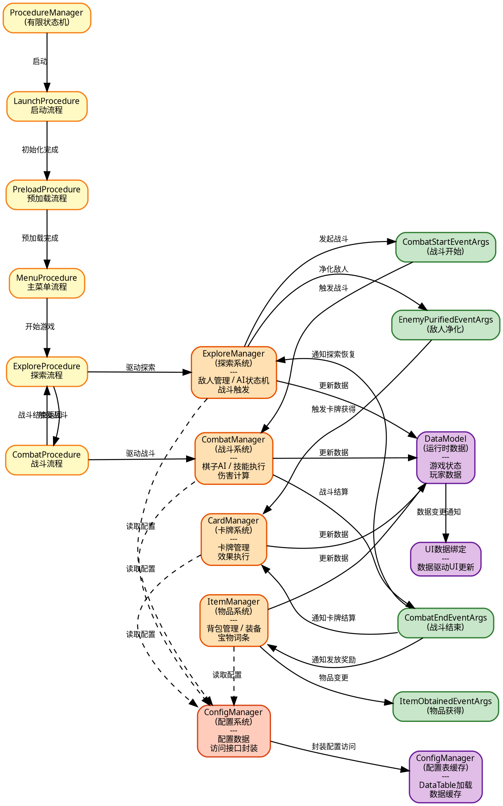

# 图4-2 系统整体架构与流程设计图



## 系统设计说明

### 1. 游戏流程管理

**ProcedureManager** 基于有限状态机（FSM）管理游戏的整体流程，控制游戏在以下流程之间切换：

#### 流程状态
- **LaunchProcedure** (启动流程)
  - 初始化游戏基础设置
  - 加载配置表和资源
  - 准备进入下一个流程

- **PreloadProcedure** (预加载流程)
  - 预加载必要的游戏资源
  - 初始化核心系统
  - 准备显示主菜单

- **MenuProcedure** (主菜单流程)
  - 显示主菜单UI
  - 等待玩家输入
  - 切换到游戏流程

- **ExploreProcedure** (探索流程)
  - 加载探索场景
  - 管理敌人实体和AI
  - 检测战斗触发条件
  - 可被打断进入战斗流程

- **CombatProcedure** (战斗流程)
  - 加载战斗场景
  - 管理棋子战斗
  - 战斗结束后返回探索流程

### 2. 业务系统协作

#### 系统交互流程

**探索 → 战斗**:
```
ExploreManager 检测到战斗条件
    ↓
发布 CombatStartEventArgs 事件
    ↓
ProcedureManager 切换到 CombatProcedure
    ↓
CombatManager 初始化战斗场景
```

**战斗 → 探索**:
```
CombatManager 战斗结束
    ↓
发布 CombatEndEventArgs 事件
    ↓
ItemManager 处理战斗奖励
CardManager 处理卡牌获得
EnemyManager 处理敌人净化
    ↓
ProcedureManager 切换回 ExploreProcedure
```

### 3. 事件系统设计

系统采用发布-订阅模式，通过事件进行模块间解耦通信：

- **CombatStartEventArgs**: 战斗开始事件
  - 触发者：探索系统（CombatTriggerManager）
  - 订阅者：战斗系统、UI系统

- **CombatEndEventArgs**: 战斗结束事件
  - 触发者：战斗系统
  - 订阅者：探索系统、物品系统、卡牌系统

- **ItemObtainedEventArgs**: 物品获得事件
  - 触发者：物品系统
  - 订阅者：UI系统

- **EnemyPurifiedEventArgs**: 敌人净化事件
  - 触发者：探索系统
  - 订阅者：卡牌系统、UI系统

### 4. 数据流向

**单向数据流设计**:
1. 配置数据：DataTable → ConfigManager → 各业务系统
2. 运行时数据：各业务系统 → DataModel（数据中心）
3. UI更新：DataModel → UI数据绑定 → 界面更新

**数据驱动架构**:
- 所有游戏参数通过配置表管理
- 业务系统通过配置系统访问数据
- 支持热更新和版本管理

### 5. 架构优势

1. **解耦**: 各系统通过事件通信，修改一个系统不影响其他系统
2. **可维护**: 清晰的流程流转和系统职责边界
3. **可扩展**: 新增功能只需实现系统接口，订阅相关事件
4. **性能**: 事件延迟触发、对象池复用、资源异步加载
5. **可测试**: 各系统相对独立，便于单元测试和集成测试
