# Buff系统类图

```dot
digraph BuffSystem {
    rankdir=LR;
    nodesep=0.6;
    ranksep=1.0;
    splines=orthogonal;
    
    node [shape=box, style=filled, fontsize=10];
    edge [arrowhead=vee];
    
    BuffManager [label="{BuffManager|+ m_ActiveBuffs: BaseBuff[]\n+ m_Owner: ChessEntity\n+ m_BuffFactory: BuffFactory\n---\n+ AddBuff(buffId, caster)\n+ RemoveBuff(buffId)\n+ RemoveBuffByType(type)\n+ Tick(deltaTime)\n+ GetBuffByType(type): BaseBuff\n+ HasBuff(buffId): bool}", shape=record, fillcolor="#e3f2fd", color="#1976d2", penwidth=2];
    
    BaseBuff [label="{BaseBuff|# m_Id: int\n# m_Name: string\n# m_Type: BuffType\n# m_StackCount: int\n# m_Duration: float\n# m_RemainingTime: float\n# m_EffectType: BuffEffectType\n# m_Caster: ChessEntity\n# m_Owner: ChessEntity\n---\n+ OnApply()*\n+ OnTick(deltaTime)*\n+ OnRemove()*\n+ CanStack(): bool\n+ Refresh()\n+ IsExpired(): bool}", shape=record, fillcolor="#fff3e0", color="#e65100", penwidth=2];
    
    StatModBuff [label="{StatModBuff|+ m_AttrType: AttributeType\n+ m_ModValue: float\n+ m_ModType: ModifierType\n---\n+ OnApply()\n+ OnRemove()\n+ CalculateModifier(): float}", shape=record, fillcolor="#bbdefb", color="#1565c0", penwidth=2];
    
    FrostBuff [label="{FrostBuff|+ m_SlowPercentage: float\n+ m_CanAttack: bool\n---\n+ OnApply()\n+ OnTick(deltaTime)}", shape=record, fillcolor="#bbdefb", color="#1565c0", penwidth=2];
    
    BurnBuff [label="{BurnBuff|+ m_DamagePerTick: float\n+ m_TickInterval: float\n---\n+ OnApply()\n+ OnTick(deltaTime)}", shape=record, fillcolor="#bbdefb", color="#1565c0", penwidth=2];
    
    ShieldBuff [label="{ShieldBuff|+ m_ShieldAmount: float\n+ m_RemainingShield: float\n---\n+ OnApply()\n+ BlockDamage(damage): float}", shape=record, fillcolor="#bbdefb", color="#1565c0", penwidth=2];
    
    BuffFactory [label="{BuffFactory|---\n+ CreateBuff(buffId, caster, owner): BaseBuff\n+ GetBuffConfig(buffId): BuffTable}", shape=record, fillcolor="#f1f8e9", color="#558b2f", penwidth=2];
    
    BuffTable [label="{BuffTable|+ Id: int\n+ Name: string\n+ Type: BuffType\n+ EffectType: BuffEffectType\n+ Duration: float\n+ Parameter1: float\n+ Parameter2: float\n+ StackLimit: int\n+ IsStackable: bool}", shape=record, fillcolor="#fff9c4", color="#f57f17", penwidth=2];
    
    SkillConfig [label="{SkillConfig|+ BuffIds: int[]\n+ SelfBuffIds: int[]\n+ BuffTriggerType: int\n---\n+ GetBuffsToApply(): int[]\n+ GetSelfBuffsToApply(): int[]}", shape=record, fillcolor="#f3e5f5", color="#4a148c", penwidth=2];
    
    EffectExecutor [label="{EffectExecutor|---\n+ ApplyBuffsOnHit(context)\n+ ApplyDamageBuffs(target)\n+ CalculateBuffModifier(entity)}", shape=record, fillcolor="#e8f5e9", color="#1b5e20", penwidth=2];
    
    HitContext [label="{HitContext|+ Attacker: ChessEntity\n+ LockedTarget: ChessEntity\n+ SkillConfig: SkillConfig\n+ OnHitCallback: Action}", shape=record, fillcolor="#fce4ec", color="#c2185b", penwidth=2];
    
    BuffEventArgs [label="{BuffEventArgs|+ buffId: int\n+ caster: ChessEntity\n+ target: ChessEntity\n+ eventType: BuffEventType\n+ stackCount: int}", shape=record, fillcolor="#fce4ec", color="#c2185b", penwidth=2];
    
    // 组合关系
    BuffManager -> BaseBuff [label="管理Buff列表", arrowhead=diamond];
    BuffManager -> BuffFactory [label="委托创建"];
    
    // 继承关系
    StatModBuff -> BaseBuff [arrowhead=empty, label="继承"];
    FrostBuff -> BaseBuff [arrowhead=empty, label="继承"];
    BurnBuff -> BaseBuff [arrowhead=empty, label="继承"];
    ShieldBuff -> BaseBuff [arrowhead=empty, label="继承"];
    
    // 工厂关系
    BuffFactory -> BaseBuff [label="创建", style=dashed];
    BuffFactory -> BuffTable [label="读取配置", style=dashed];
    
    // 配置关系
    BaseBuff -> BuffTable [label="引用配置", style=dashed];
    
    // 执行关系
    EffectExecutor -> BuffManager [label="调用添加Buff"];
    EffectExecutor -> HitContext [label="使用上下文"];
    HitContext -> SkillConfig [label="持有配置", arrowhead=diamond];
    SkillConfig -> BuffTable [label="引用BuffId", style=dashed];
    
    // 事件
    BuffManager -> BuffEventArgs [label="发布事件", style=dashed];
}
```

## 类设计说明

### 核心管理

**BuffManager** (Buff管理器)
- 管理棋子身上所有活跃Buff
- 处理Buff的添加、移除、刷新、叠层
- 每帧Tick驱动所有Buff更新

### Buff基类与实现

**BaseBuff** (Buff抽象基类)
- 所有Buff的基类，定义生命周期接口
- OnApply/OnTick/OnRemove 三阶段回调
- 支持叠层、刷新、过期判定

**具体Buff实现**:
- **StatModBuff**: 属性修正Buff（攻击力/防御力/生命值等修正）
- **FrostBuff**: 冰冻Buff（减速、禁止攻击）
- **BurnBuff**: 灼烧Buff（持续伤害DOT）
- **ShieldBuff**: 护盾Buff（吸收伤害）

### 配置与工厂

**BuffFactory** (Buff工厂)
- 根据BuffId创建对应的Buff实例
- 读取BuffTable配置数据

**BuffTable** (Buff配置表)
- 来自Excel配置表的Buff参数
- 包含类型、持续时间、效果参数、叠层限制等

### 执行与上下文

**EffectExecutor** (效果执行器)
- 技能命中后调用，负责Buff的应用
- 通过HitContext获取技能配置中的BuffId列表

**HitContext** (命中上下文)
- 传递攻击者、目标、技能配置等信息

**BuffEventArgs** (Buff事件参数)
- Buff添加/移除/刷新时发布事件
- UI系统订阅此事件更新显示

## 关键设计特点

1. **工厂模式**: BuffFactory根据配置表创建不同类型Buff
2. **模板方法**: BaseBuff定义OnApply/OnTick/OnRemove生命周期
3. **配置驱动**: 所有Buff参数来自BuffTable
4. **事件驱动**: Buff状态变化通过事件通知UI
5. **叠层机制**: 支持Buff叠层和刷新策略
