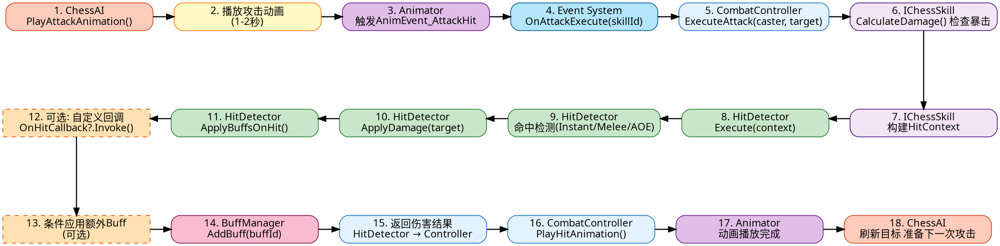

# 技能执行时序图

```dot
// 技能执行时序图 - 蛇形布局
digraph SkillExecutionSequence {
    graph [
        rankdir=TB
        splines=ortho
        nodesep=0.4
        ranksep=1.5
        fontname="SimHei,sans-serif"
    ]
    
    node [shape=box, style="filled,rounded", fontname="SimHei,sans-serif", width=2.8]
    edge [penwidth=1.5]
    
    // 节点定义
    s1 [label="1. ChessAI\nPlayAttackAnimation()", fillcolor="#ffccbc", color="#d84315"]
    s2 [label="2. 播放攻击动画\n(1-2秒)", fillcolor="#fff9c4", color="#f57f17"]
    s3 [label="3. Animator\n触发AnimEvent_AttackHit", fillcolor="#e1bee7", color="#6a1b9a"]
    s4 [label="4. Event System\nOnAttackExecute(skillId)", fillcolor="#b3e5fc", color="#01579b"]
    s5 [label="5. CombatController\nExecuteAttack(caster, target)", fillcolor="#e3f2fd", color="#1976d2"]
    s6 [label="6. IChessSkill\nCalculateDamage() 检查暴击", fillcolor="#f3e5f5", color="#4a148c"]
    
    s7 [label="7. IChessSkill\n构建HitContext", fillcolor="#f3e5f5", color="#4a148c"]
    s8 [label="8. HitDetector\nExecute(context)", fillcolor="#c8e6c9", color="#2e7d32"]
    s9 [label="9. HitDetector\n命中检测(Instant/Melee/AOE)", fillcolor="#c8e6c9", color="#2e7d32"]
    s10 [label="10. HitDetector\nApplyDamage(target)", fillcolor="#c8e6c9", color="#2e7d32"]
    s11 [label="11. HitDetector\nApplyBuffsOnHit()", fillcolor="#c8e6c9", color="#2e7d32"]
    s12 [label="12. 可选: 自定义回调\nOnHitCallback?.Invoke()", fillcolor="#ffe0b2", color="#e65100", style="filled,dashed"]
    
    s13 [label="13. 条件应用额外Buff\n(可选)", fillcolor="#ffe0b2", color="#e65100", style="filled,dashed"]
    s14 [label="14. BuffManager\nAddBuff(buffId)", fillcolor="#f8bbd0", color="#880e4f"]
    s15 [label="15. 返回伤害结果\nHitDetector → Controller", fillcolor="#e3f2fd", color="#1976d2"]
    s16 [label="16. CombatController\nPlayHitAnimation()", fillcolor="#e3f2fd", color="#1976d2"]
    s17 [label="17. Animator\n动画播放完成", fillcolor="#e1bee7", color="#6a1b9a"]
    s18 [label="18. ChessAI\n刷新目标 准备下一次攻击", fillcolor="#ffccbc", color="#d84315"]
    
    // === 第1行：左→右 ===
    {rank=same; s1; s2; s3; s4; s5; s6}
    s1 -> s2 -> s3 -> s4 -> s5 -> s6
    
    // === 第2行：右→左（蛇形折返）===
    {rank=same; s7; s8; s9; s10; s11; s12}
    // 不可见边控制排列顺序：s12在左, s7在右
    s12 -> s11 -> s10 -> s9 -> s8 -> s7 [style=invis]
    // 可见流程边（从右往左画箭头）
    s7 -> s8 -> s9 -> s10 -> s11 -> s12 [constraint=false]
    
    // === 第3行：左→右 ===
    {rank=same; s13; s14; s15; s16; s17; s18}
    s13 -> s14 -> s15 -> s16 -> s17 -> s18
    
    // === 蛇形转弯连接 ===
    s6 -> s7    // 右侧向下转弯
    s12 -> s13  // 左侧向下转弯
}
```
