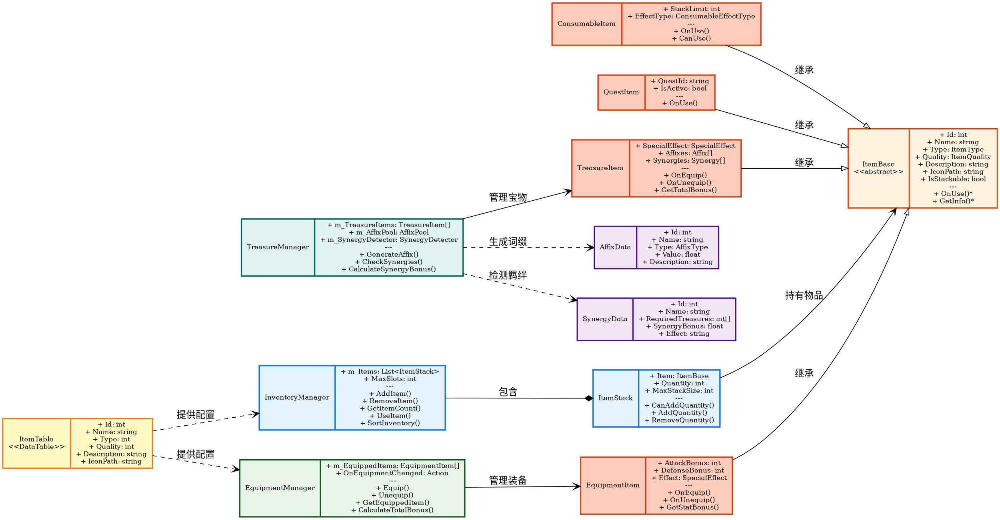

# 物品系统类图

```dot
digraph ItemSystemClassDiagram {
    rankdir=LR;
    nodesep=0.6;
    ranksep=1.0;
    splines=orthogonal;
    
    node [shape=box, style=filled, fontsize=10];
    edge [arrowhead=vee];
    
    ItemBase [label="{ItemBase\n\<\<abstract\>\>|+ Id: int\n+ Name: string\n+ Type: ItemType\n+ Quality: ItemQuality\n+ Description: string\n+ IconPath: string\n+ IsStackable: bool\n---\n+ OnUse()*\n+ GetInfo()*}", shape=record, fillcolor="#fff3e0", color="#e65100", penwidth=2];
    
    ConsumableItem [label="{ConsumableItem|+ StackLimit: int\n+ EffectType: ConsumableEffectType\n---\n+ OnUse()\n+ CanUse()}", shape=record, fillcolor="#ffccbc", color="#d84315", penwidth=2];
    
    QuestItem [label="{QuestItem|+ QuestId: string\n+ IsActive: bool\n---\n+ OnUse()}", shape=record, fillcolor="#ffccbc", color="#d84315", penwidth=2];
    
    TreasureItem [label="{TreasureItem|+ SpecialEffect: SpecialEffect\n+ Affixes: Affix[]\n+ Synergies: Synergy[]\n---\n+ OnEquip()\n+ OnUnequip()\n+ GetTotalBonus()}", shape=record, fillcolor="#ffccbc", color="#d84315", penwidth=2];
    
    EquipmentItem [label="{EquipmentItem|+ AttackBonus: int\n+ DefenseBonus: int\n+ Effect: SpecialEffect\n---\n+ OnEquip()\n+ OnUnequip()\n+ GetStatBonus()}", shape=record, fillcolor="#ffccbc", color="#d84315", penwidth=2];
    
    InventoryManager [label="{InventoryManager|+ m_Items: List\<ItemStack\>\n+ MaxSlots: int\n---\n+ AddItem()\n+ RemoveItem()\n+ GetItemCount()\n+ UseItem()\n+ SortInventory()}", shape=record, fillcolor="#e3f2fd", color="#1976d2", penwidth=2];
    
    ItemStack [label="{ItemStack|+ Item: ItemBase\n+ Quantity: int\n+ MaxStackSize: int\n---\n+ CanAddQuantity()\n+ AddQuantity()\n+ RemoveQuantity()}", shape=record, fillcolor="#e3f2fd", color="#1976d2", penwidth=2];
    
    EquipmentManager [label="{EquipmentManager|+ m_EquippedItems: EquipmentItem[]\n+ OnEquipmentChanged: Action\n---\n+ Equip()\n+ Unequip()\n+ GetEquippedItem()\n+ CalculateTotalBonus()}", shape=record, fillcolor="#e8f5e9", color="#1b5e20", penwidth=2];
    
    TreasureManager [label="{TreasureManager|+ m_TreasureItems: TreasureItem[]\n+ m_AffixPool: AffixPool\n+ m_SynergyDetector: SynergyDetector\n---\n+ GenerateAffix()\n+ CheckSynergies()\n+ CalculateSynergyBonus()}", shape=record, fillcolor="#e0f2f1", color="#00695c", penwidth=2];
    
    AffixData [label="{AffixData|+ Id: int\n+ Name: string\n+ Type: AffixType\n+ Value: float\n+ Description: string}", shape=record, fillcolor="#f3e5f5", color="#4a148c", penwidth=2];
    
    SynergyData [label="{SynergyData|+ Id: int\n+ Name: string\n+ RequiredTreasures: int[]\n+ SynergyBonus: float\n+ Effect: string}", shape=record, fillcolor="#f3e5f5", color="#4a148c", penwidth=2];
    
    ItemTable [label="{ItemTable\n\<\<DataTable\>\>|+ Id: int\n+ Name: string\n+ Type: int\n+ Quality: int\n+ Description: string\n+ IconPath: string}", shape=record, fillcolor="#fff9c4", color="#f57f17", penwidth=2];
    
    // 继承关系
    ConsumableItem -> ItemBase [arrowhead=empty, label="继承"];
    QuestItem -> ItemBase [arrowhead=empty, label="继承"];
    TreasureItem -> ItemBase [arrowhead=empty, label="继承"];
    EquipmentItem -> ItemBase [arrowhead=empty, label="继承"];
    
    // 组合/聚合关系
    InventoryManager -> ItemStack [label="包含", arrowhead=diamond];
    ItemStack -> ItemBase [label="持有物品"];
    
    // 管理关系
    EquipmentManager -> EquipmentItem [label="管理装备"];
    TreasureManager -> TreasureItem [label="管理宝物"];
    TreasureManager -> AffixData [label="生成词缀", style=dashed];
    TreasureManager -> SynergyData [label="检测羁绊", style=dashed];
    
    // 配置关系
    ItemTable -> InventoryManager [label="提供配置", style=dashed];
    ItemTable -> EquipmentManager [label="提供配置", style=dashed];
}
```
