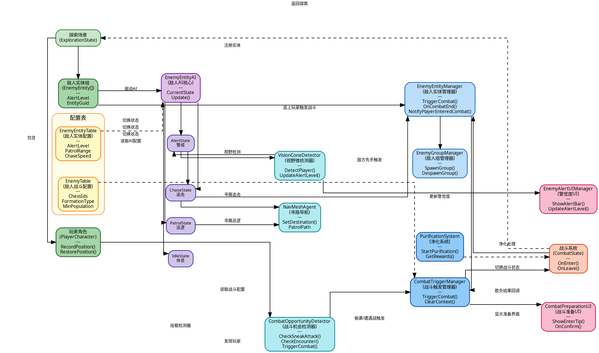

# 探索系统架构图

```dot
digraph ExplorationArchitecture {
    rankdir=LR;
    nodesep=0.5;
    ranksep=1.2;
    splines=ortho;
    fontname="SimHei,sans-serif";
    
    node [shape=box, style="filled,rounded", fontname="SimHei,sans-serif", fontsize=10, penwidth=1.5];
    edge [fontname="SimHei,sans-serif", fontsize=9, penwidth=1.2];
    
    // ========== 第1列：场景层（绿色系） ==========
    subgraph cluster_scene {
        label="场景层";
        style="filled,rounded";
        fillcolor="#e8f5e9";
        color="#2e7d32";
        fontname="SimHei,sans-serif";
        fontsize=12;
        
        ExploreScene [label="探索场景\n(ExplorationState)", fillcolor="#c8e6c9", color="#2e7d32"];
        Player [label="玩家角色\n(PlayerCharacter)\n---\nRecordPosition()\nRestorePosition()", fillcolor="#a5d6a7", color="#1b5e20"];
        EnemyGroup [label="敌人实体组\n(EnemyEntity[])\n---\nAlertLevel\nEntityGuid", fillcolor="#a5d6a7", color="#1b5e20"];
    }
    
    // ========== 第2列：管理层（蓝色系） ==========
    subgraph cluster_manage {
        label="管理层";
        style="filled,rounded";
        fillcolor="#e3f2fd";
        color="#1565c0";
        fontname="SimHei,sans-serif";
        fontsize=12;
        
        EntityMgr [label="EnemyEntityManager\n(敌人实体管理器)\n---\nTriggerCombat()\nOnCombatEnd()\nNotifyPlayerEnteredCombat()", fillcolor="#bbdefb", color="#1565c0"];
        GroupMgr [label="EnemyGroupManager\n(敌人组管理器)\n---\nSpawnGroup()\nDespawnGroup()", fillcolor="#bbdefb", color="#1565c0"];
        PurifySystem [label="PurificationSystem\n(净化系统)\n---\nStartPurification()\nGetRewards()", fillcolor="#90caf9", color="#0d47a1"];
        TriggerMgr [label="CombatTriggerManager\n(战斗触发管理器)\n---\nTriggerCombat()\nClearContext()", fillcolor="#90caf9", color="#0d47a1"];
    }
    
    // ========== 第3列：AI状态层（紫色系） ==========
    subgraph cluster_ai {
        label="AI 状态机";
        style="filled,rounded";
        fillcolor="#f3e5f5";
        color="#4a148c";
        fontname="SimHei,sans-serif";
        fontsize=12;
        
        AICore [label="EnemyEntityAI\n(敌人AI核心)\n---\nCurrentState\nUpdate()", fillcolor="#e1bee7", color="#6a1b9a"];
        
        subgraph cluster_states {
            label="FSM States";
            style="filled,rounded";
            fillcolor="#ede7f6";
            color="#512da8";
            fontname="SimHei,sans-serif";
            fontsize=10;
            
            IdleState [label="IdleState\n休息", fillcolor="#d1c4e9", color="#512da8", fontsize=9];
            PatrolState [label="PatrolState\n巡逻", fillcolor="#d1c4e9", color="#512da8", fontsize=9];
            AlertState [label="AlertState\n警戒", fillcolor="#d1c4e9", color="#512da8", fontsize=9];
            ChaseState [label="ChaseState\n追击", fillcolor="#d1c4e9", color="#512da8", fontsize=9];
        }
    }
    
    // ========== 第4列：检测与导航（青色系） ==========
    subgraph cluster_detect {
        label="检测与导航";
        style="filled,rounded";
        fillcolor="#e0f7fa";
        color="#00695c";
        fontname="SimHei,sans-serif";
        fontsize=12;
        
        VisionDetector [label="VisionConeDetector\n(视野锥检测器)\n---\nDetectPlayer()\nUpdateAlertLevel()", fillcolor="#b2ebf2", color="#00838f"];
        OpportunityDetector [label="CombatOpportunityDetector\n(战斗机会检测器)\n---\nCheckSneakAttack()\nCheckEncounter()\nTriggerCombat()", fillcolor="#b2ebf2", color="#00838f"];
        NavAgent [label="NavMeshAgent\n(寻路导航)\n---\nSetDestination()\nPatrolPath", fillcolor="#b2ebf2", color="#00838f"];
    }
    
    // ========== 底部：配置层（黄色系） ==========
    subgraph cluster_config {
        label="配置表";
        style="filled,rounded";
        fillcolor="#fffde7";
        color="#f57f17";
        fontname="SimHei,sans-serif";
        fontsize=12;
        
        EntityTable [label="EnemyEntityTable\n(敌人实体配置)\n---\nAlertLevel\nPatrolRange\nChaseSpeed", fillcolor="#fff9c4", color="#f57f17"];
        EnemyTable [label="EnemyTable\n(敌人战斗配置)\n---\nChessIds\nFormationType\nMinPopulation", fillcolor="#fff9c4", color="#f57f17"];
    }
    
    // ========== 右侧：交互与UI（粉色系） ==========
    subgraph cluster_ui {
        label="UI 交互";
        style="filled,rounded";
        fillcolor="#fce4ec";
        color="#c2185b";
        fontname="SimHei,sans-serif";
        fontsize=12;
        
        AlertUI [label="EnemyAlertUIManager\n(警觉度UI)\n---\nShowAlertBar()\nUpdateAlertLevel()", fillcolor="#f8bbd0", color="#c2185b"];
        PrepUI [label="CombatPreparationUI\n(战斗准备UI)\n---\nShowEnterTip()\nOnConfirm()", fillcolor="#f8bbd0", color="#c2185b"];
    }
    
    // 外部系统
    CombatSystem [label="战斗系统\n(CombatState)\n---\nOnEnter()\nOnLeave()", fillcolor="#ffccbc", color="#d84315"];
    
    // ========== 场景层 → 管理层 ==========
    ExploreScene -> Player [label="包含"];
    ExploreScene -> EnemyGroup [label="包含"];
    EnemyGroup -> EntityMgr [label="注册实体"];
    EntityMgr -> GroupMgr [label="管理分组"];
    
    // ========== 管理层 → AI层 ==========
    EnemyGroup -> AICore [label="驱动AI"];
    AICore -> IdleState [label="切换状态"];
    AICore -> PatrolState [label="切换状态"];
    AICore -> AlertState [label="切换状态"];
    AICore -> ChaseState [label="切换状态"];
    
    // ========== AI层 → 检测层 ==========
    AlertState -> VisionDetector [label="视野检测"];
    PatrolState -> NavAgent [label="寻路巡逻"];
    ChaseState -> NavAgent [label="寻路追击"];
    Player -> OpportunityDetector [label="挂载检测器"];
    
    // ========== 状态转换 ==========
    VisionDetector -> AlertState [label="发现玩家", constraint=false];
    AlertState -> ChaseState [label="警觉度满"];
    ChaseState -> EntityMgr [label="追上玩家触发战斗"];
    
    // ========== 检测 → 触发 ==========
    OpportunityDetector -> TriggerMgr [label="偷袭/遭遇战触发"];
    EntityMgr -> TriggerMgr [label="敌方先手触发"];
    
    // ========== 触发 → 战斗 ==========
    TriggerMgr -> CombatSystem [label="切换战斗状态"];
    PurifySystem -> CombatSystem [label="净化处理", style=dashed];
    
    // ========== 配置驱动 ==========
    EntityTable -> AICore [label="读取AI配置", style=dashed];
    EnemyTable -> TriggerMgr [label="读取战斗配置", style=dashed];
    
    // ========== UI交互 ==========
    VisionDetector -> AlertUI [label="更新警觉度"];
    TriggerMgr -> PrepUI [label="显示准备界面"];
    
    // ========== 战斗结束回路 ==========
    CombatSystem -> EntityMgr [label="胜负结果回调", constraint=false];
    CombatSystem -> ExploreScene [label="返回探索", style=dashed, constraint=false];
    
    // ========== 列对齐 ==========
    {rank=same; ExploreScene; Player; EnemyGroup}
    {rank=same; EntityMgr; GroupMgr; PurifySystem; TriggerMgr}
    {rank=same; AICore; IdleState; PatrolState; AlertState; ChaseState}
    {rank=same; VisionDetector; OpportunityDetector; NavAgent}
    {rank=same; AlertUI; PrepUI; CombatSystem}
}
```
