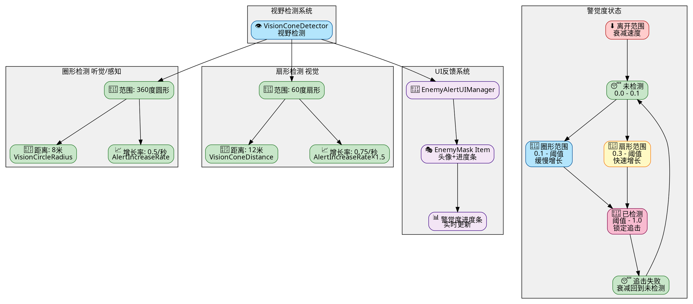

# 视野检测示意图

```dot
// 视野检测示意图 - Graphviz DOT格式
// 强制正交线条，显示检测方式与警觉度状态流转
digraph VisionDetectionSystem {
    graph [
        rankdir=TB
        splines=orthogonal
        nodesep=0.9
        ranksep=1.2
        fontname="SimHei,sans-serif"
    ]
    
    node [shape=box, style="filled,rounded", fontname="SimHei,sans-serif"]
    
    // 视野检测主系统
    subgraph cluster_detector {
        label="视野检测系统"
        style=filled
        fillcolor="#f0f0f0"
        
        A [label="👁️ VisionConeDetector\n视野检测", fillcolor="#b3e5fc", color="#01579b"]
    }
    
    // 圈形检测 听觉/感知
    subgraph cluster_circle {
        label="圈形检测 听觉/感知"
        style=filled
        fillcolor="#f0f0f0"
        
        B [label="🔵 范围: 360度圆形", fillcolor="#c8e6c9", color="#2e7d32"]
        C [label="📏 距离: 8米\nVisionCircleRadius", fillcolor="#c8e6c9", color="#2e7d32"]
        D [label="📈 增长率: 0.5/秒\nAlertIncreaseRate", fillcolor="#c8e6c9", color="#2e7d32"]
    }
    
    // 扇形检测 视觉
    subgraph cluster_cone {
        label="扇形检测 视觉"
        style=filled
        fillcolor="#f0f0f0"
        
        E [label="🔶 范围: 60度扇形", fillcolor="#c8e6c9", color="#2e7d32"]
        F [label="📏 距离: 12米\nVisionConeDistance", fillcolor="#c8e6c9", color="#2e7d32"]
        G [label="📈 增长率: 0.75/秒\nAlertIncreaseRate×1.5", fillcolor="#c8e6c9", color="#2e7d32"]
    }
    
    // 警觉度状态流转
    subgraph cluster_alert {
        label="警觉度状态"
        style=filled
        fillcolor="#f0f0f0"
        
        H [label="⬇️ 离开范围\n衰减速度", fillcolor="#ffcccc", color="#b71c1c"]
        I [label="😴 未检测\n0.0 - 0.1", fillcolor="#c8e6c9", color="#2e7d32"]
        J [label="👀 圈形范围\n0.1 - 阈值\n缓慢增长", fillcolor="#b3e5fc", color="#01579b"]
        K [label="🎯 扇形范围\n0.3 - 阈值\n快速增长", fillcolor="#fff9c4", color="#f57f17"]
        L [label="🚨 已检测\n阈值 - 1.0\n锁定追击", fillcolor="#f8bbd0", color="#880e4f"]
        M [label="😴 追击失败\n衰减回到未检测", fillcolor="#c8e6c9", color="#2e7d32"]
    }
    
    // UI反馈系统
    subgraph cluster_ui {
        label="UI反馈系统"
        style=filled
        fillcolor="#f0f0f0"
        
        N [label="🎨 EnemyAlertUIManager", fillcolor="#f3e5f5", color="#4a148c"]
        O [label="🎭 EnemyMask Item\n头像+进度条", fillcolor="#f3e5f5", color="#4a148c"]
        P [label="📊 警觉度进度条\n实时更新", fillcolor="#f3e5f5", color="#4a148c"]
    }
    
    // 检测系统到各检测方式
    A -> B
    A -> E
    B -> C
    B -> D
    E -> F
    E -> G
    
    // 警觉度状态流转
    H -> I
    I -> J
    I -> K
    J -> L
    K -> L
    L -> M
    M -> I
    
    // 检测到UI反馈
    A -> N
    N -> O
    O -> P
}
```
