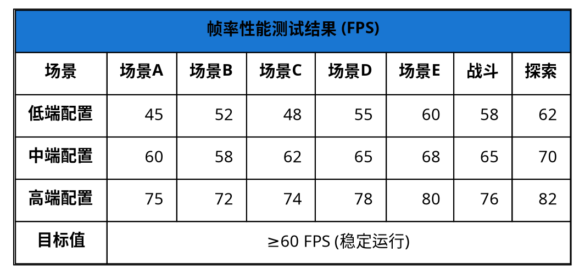

# 帧率测试折线图

### 性能测试数据参考

| 场景 | 最小FPS | 平均FPS | 最大FPS | CPU占用 | 内存占用 |
|------|---------|---------|---------|---------|---------|
| 场景A | 45 | 60 | 75 | 35% | 256MB |
| 场景B | 52 | 58 | 72 | 38% | 268MB |
| 场景C | 48 | 62 | 74 | 40% | 285MB |
| 场景D | 55 | 65 | 78 | 42% | 298MB |
| 场景E | 60 | 68 | 80 | 45% | 312MB |
| 战斗场景 | 58 | 65 | 76 | 44% | 325MB |
| 探索场景 | 62 | 70 | 82 | 48% | 340MB |

**测试环境**: Windows 10, Intel i7-10700K, RTX 3070, 16GB RAM  
**目标**: 保持60FPS以上  
**优化策略**: 对象池、LOD系统、网格合并
