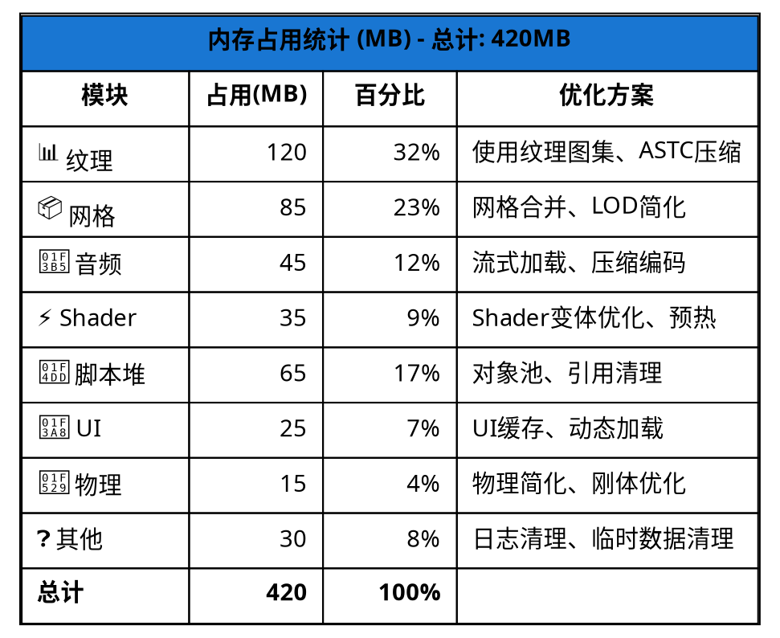

# 内存占用柱状图

### 内存占用详细分析

| 模块 | 占用空间(MB) | 百分比 | 优化方案 |
|------|------------|--------|---------|
| **纹理** | 120 | 32% | 使用纹理图集、压缩格式(ASTC) |
| **网格** | 85 | 23% | 网格合并、LOD简化 |
| **音频** | 45 | 12% | 流式加载、压缩编码 |
| **Shader** | 35 | 9% | Shader变体优化、预热 |
| **脚本堆** | 65 | 17% | 对象池、引用清理 |
| **UI** | 25 | 7% | UI缓存、动态加载 |
| **物理** | 15 | 4% | 物理简化、刚体优化 |
| **其他** | 30 | 8% | 日志清理、临时数据清理 |
| **总计** | **420** | **100%** | - |

### 优化建议

1. **纹理优化** (32%)
   - 使用ASTC压缩（移动）或DXT压缩（PC）
   - 实施纹理图集合并
   - 降低高分辨率纹理使用

2. **网格优化** (23%)
   - 合并静态网格
   - 实施LOD距离优化
   - 简化不可见网格

3. **脚本内存** (17%)
   - 优化对象池大小
   - 及时释放大对象
   - 避免运行时创建大量临时对象

4. **音频流式加载** (12%)
   - 大型音频文件使用流式加载
   - 音乐和环境音使用压缩编码

5. **Shader优化** (9%)
   - 减少Shader变体数量
   - 预热关键Shader
   - 移除未使用的Pass
