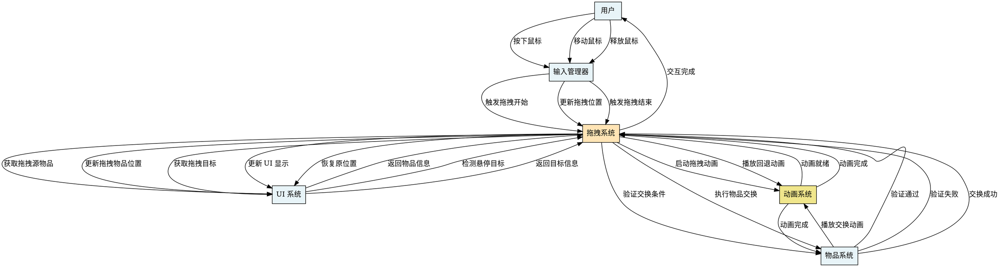

# 图10：物品拖拽交互流程

**位置**: 第5章 物品系统  
**章节**: 5.2 交互设计  
**类型**: 序列图  
**用途**: 展示交互的时序关系

## Graphviz DOT 代码

## 说明

物品拖拽交互的完整时序：

1. **拖拽开始** - 用户按下鼠标，系统获取拖拽源物品
2. **拖拽进行** - 用户移动鼠标，系统实时更新拖拽物品位置和悬停状态
3. **拖拽结束** - 用户释放鼠标，系统获取拖拽目标
4. **验证交换** - 验证目标是否有效
5. **执行交换** - 如果有效，执行物品交换并播放动画
6. **回退处理** - 如果无效，播放回退动画并恢复原位置

