# 图16：Buff 数据结构

**位置**: 第4章 战斗系统  
**章节**: 4.4 Buff 系统  
**类型**: 类图  
**用途**: 展示 Buff 的数据模型

## Graphviz DOT 代码

```dot
digraph G {
    rankdir=LR;
    splines=orthogonal;
    nodesep=0.7;
    ranksep=1.0;
    
    // 类定义
    Buff [shape=record, label="{Buff|- id: int\n- name: string\n- duration: int\n- remaining_time: int\n- value: float\n- effect_type: string\n- stack_count: int\n- target: Entity|+ Apply()\n+ Update()\n+ Remove()\n+ GetRemainingTime()\n+ IsActive()}", style=filled, fillcolor="#FFE4B5"];
    
    BuffEffect [shape=record, label="{BuffEffect|- type: string\n- value: float\n- condition: string|+ Execute()\n+ Undo()}", style=filled, fillcolor="#87CEEB"];
    
    BuffManager [shape=record, label="{BuffManager|- active_buffs: List~Buff~|+ AddBuff()\n+ RemoveBuff()\n+ UpdateBuffs()\n+ GetBuffsByType()\n+ GetTotalValue()}", style=filled, fillcolor="#F0E68C"];
    
    Entity [shape=record, label="{Entity|- id: int\n- hp: float\n- attack: float\n- defense: float\n- buffs: List~Buff~|+ ApplyBuff()\n+ RemoveBuff()\n+ GetModifiedStats()}", style=filled, fillcolor="#DDA0DD"];
    
    // 关系定义
    Buff -> BuffEffect [label="has", arrowhead=vee];
    BuffManager -> Buff [label="manages", arrowhead=vee];
    Entity -> Buff [label="contains", arrowhead=vee];
    Entity -> BuffManager [label="uses", arrowhead=vee];
}
```

## 说明

Buff 数据结构的设计：

1. **Buff 类** - 表示单个 Buff 实例
   - 属性：ID、名称、持续时间、效果值、效果类型、堆叠数
   - 方法：应用、更新、移除、获取剩余时间

2. **BuffEffect 类** - 表示 Buff 的具体效果
   - 属性：效果类型、效果值、触发条件
   - 方法：执行效果、撤销效果

3. **BuffManager 类** - 管理所有活跃的 Buff
   - 维护活跃 Buff 列表
   - 提供 Buff 查询和管理接口

4. **Entity 类** - 游戏实体（角色、敌人等）
   - 维护应用到该实体的 Buff 列表
   - 计算 Buff 对属性的修改

