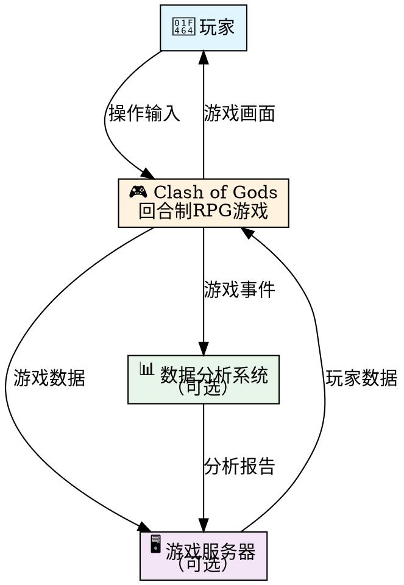

# 图1：游戏整体架构（C4 Context）

```dot
digraph {
    rankdir=TB;
    nodesep=0.9;
    ranksep=1.2;
    splines=orthogonal;
    
    Player [label="👤 玩家", style="filled", fillcolor="#e1f5ff", shape="box"];
    Game [label="🎮 Clash of Gods\n回合制RPG游戏", style="filled", fillcolor="#fff3e0", shape="box"];
    Server [label="🖥️ 游戏服务器\n（可选）", style="filled", fillcolor="#f3e5f5", shape="box"];
    Analytics [label="📊 数据分析系统\n（可选）", style="filled", fillcolor="#e8f5e9", shape="box"];
    
    Player -> Game [label="操作输入"];
    Game -> Player [label="游戏画面"];
    Game -> Server [label="游戏数据"];
    Server -> Game [label="玩家数据"];
    Game -> Analytics [label="游戏事件"];
    Analytics -> Server [label="分析报告"];
}
```

## 说明

本图展示了游戏系统的顶层架构，包括：

- **玩家**：游戏的最终用户
- **游戏系统**：核心游戏引擎，包含所有游戏逻辑
- **服务器**：可选的后端服务，用于多人功能和数据存储
- **数据分析**：可选的分析系统，用于收集游戏数据

游戏系统与玩家进行交互，与服务器进行数据同步，与分析系统进行数据上报。
