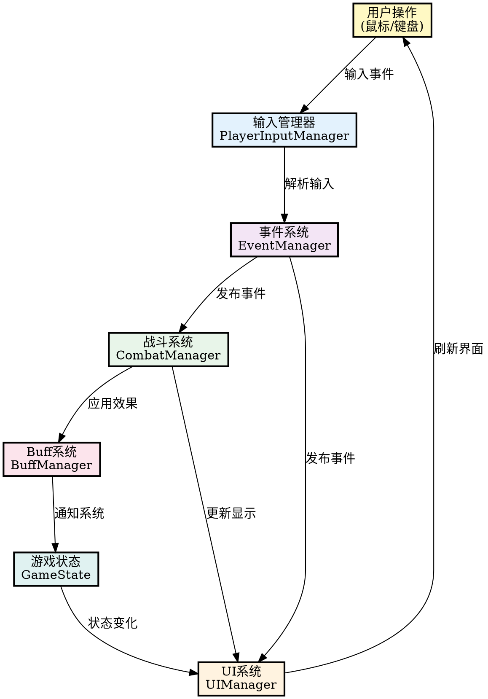

# 图22：系统交互示意图

## 系统交互设计说明

### 交互流程

**1. 用户输入阶段**
- 用户通过鼠标或键盘进行操作
- 所有输入必须走 PlayerInputManager

**2. 输入管理与事件发布**
- InputManager 解析原始输入
- EventManager 负责事件分发
- 采用发布-订阅模式

**3. 系统响应**
- 各系统独立订阅所需事件
- CombatSystem 处理战斗逻辑
- BuffSystem 应用效果状态
- UIManager 更新用户界面

**4. 状态更新与反馈**
- GameState 维护全局状态
- UI 实时反映当前状态
- 用户获得视觉反馈

