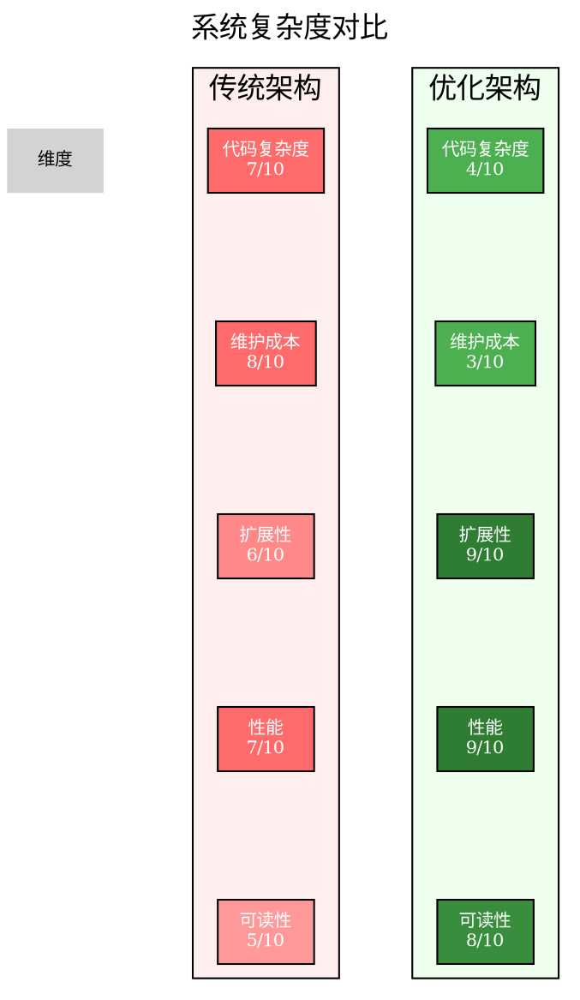

# 图25：系统复杂度对比

**位置**: 第8章 性能优化  
**章节**: 8.2 架构优化  
**类型**: 雷达图  
**用途**: 说明架构选择的权衡

## Graphviz DOT 代码

## 说明

不同架构方案的复杂度对比：

| 维度 | 传统架构 | 优化架构 | 说明 |
|------|---------|---------|------|
| **代码复杂度** | 7 | 4 | 优化架构代码更简洁 |
| **维护成本** | 8 | 3 | 优化架构更易维护 |
| **扩展性** | 6 | 9 | 优化架构更易扩展 |
| **性能** | 7 | 9 | 优化架构性能更好 |
| **可读性** | 5 | 8 | 优化架构代码更易读 |

**架构选择权衡**：
- 传统架构：代码简单但性能和扩展性有限
- 优化架构：虽然初期设计复杂，但长期收益更大

