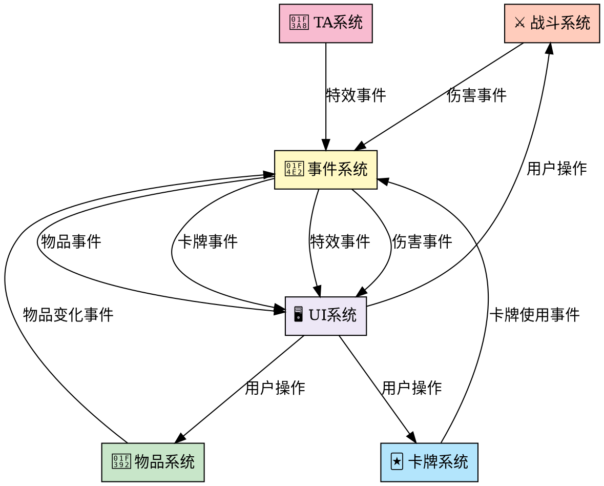

# 图3：系统间通信关系

## 说明

各个系统通过事件系统进行通信，实现了低耦合的架构：

- **战斗系统**：发送伤害事件
- **物品系统**：发送物品变化事件
- **卡牌系统**：发送卡牌使用事件
- **TA系统**：发送特效事件
- **UI系统**：订阅所有事件并更新界面
- **事件系统**：中央事件总线，负责事件的发布和订阅

这种设计使得各个系统可以独立开发和测试。
