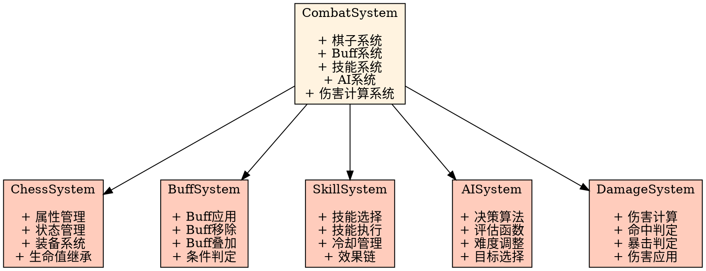

# 图4：战斗系统架构

```dot
digraph {
    rankdir=TB;
    nodesep=0.9;
    ranksep=1.2;
    splines=orthogonal;
    
    CombatSystem [label="CombatSystem\n\n+ 棋子系统\n+ Buff系统\n+ 技能系统\n+ AI系统\n+ 伤害计算系统", style="filled", fillcolor="#fff3e0", shape="box"];
    
    ChessSystem [label="ChessSystem\n\n+ 属性管理\n+ 状态管理\n+ 装备系统\n+ 生命值继承", style="filled", fillcolor="#ffccbc", shape="box"];
    BuffSystem [label="BuffSystem\n\n+ Buff应用\n+ Buff移除\n+ Buff叠加\n+ 条件判定", style="filled", fillcolor="#ffccbc", shape="box"];
    SkillSystem [label="SkillSystem\n\n+ 技能选择\n+ 技能执行\n+ 冷却管理\n+ 效果链", style="filled", fillcolor="#ffccbc", shape="box"];
    AISystem [label="AISystem\n\n+ 决策算法\n+ 评估函数\n+ 难度调整\n+ 目标选择", style="filled", fillcolor="#ffccbc", shape="box"];
    DamageSystem [label="DamageSystem\n\n+ 伤害计算\n+ 命中判定\n+ 暴击判定\n+ 伤害应用", style="filled", fillcolor="#ffccbc", shape="box"];
    
    CombatSystem -> ChessSystem;
    CombatSystem -> BuffSystem;
    CombatSystem -> SkillSystem;
    CombatSystem -> AISystem;
    CombatSystem -> DamageSystem;
}
```

## 说明

战斗系统由多个子模块组成：

- **棋子系统**：管理战斗中的角色
- **Buff系统**：管理角色的增益/减益效果
- **技能系统**：管理角色的技能
- **AI系统**：管理敌人的决策
- **伤害计算系统**：计算战斗中的伤害

这些模块通过事件系统相互协作。
