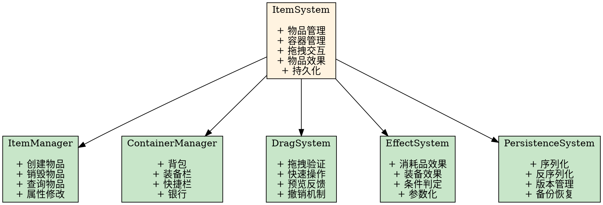

# 图5：物品系统架构

```dot
digraph {
    rankdir=TB;
    nodesep=0.9;
    ranksep=1.2;
    splines=orthogonal;
    
    ItemSystem [label="ItemSystem\n\n+ 物品管理\n+ 容器管理\n+ 拖拽交互\n+ 物品效果\n+ 持久化", style="filled", fillcolor="#fff3e0", shape="box"];
    
    ItemManager [label="ItemManager\n\n+ 创建物品\n+ 销毁物品\n+ 查询物品\n+ 属性修改", style="filled", fillcolor="#c8e6c9", shape="box"];
    ContainerManager [label="ContainerManager\n\n+ 背包\n+ 装备栏\n+ 快捷栏\n+ 银行", style="filled", fillcolor="#c8e6c9", shape="box"];
    DragSystem [label="DragSystem\n\n+ 拖拽验证\n+ 快速操作\n+ 预览反馈\n+ 撤销机制", style="filled", fillcolor="#c8e6c9", shape="box"];
    EffectSystem [label="EffectSystem\n\n+ 消耗品效果\n+ 装备效果\n+ 条件判定\n+ 参数化", style="filled", fillcolor="#c8e6c9", shape="box"];
    PersistenceSystem [label="PersistenceSystem\n\n+ 序列化\n+ 反序列化\n+ 版本管理\n+ 备份恢复", style="filled", fillcolor="#c8e6c9", shape="box"];
    
    ItemSystem -> ItemManager;
    ItemSystem -> ContainerManager;
    ItemSystem -> DragSystem;
    ItemSystem -> EffectSystem;
    ItemSystem -> PersistenceSystem;
}
```

## 说明

物品系统由多个子模块组成：

- **物品管理**：管理物品的生命周期
- **容器管理**：管理物品的存储空间
- **拖拽交互**：处理玩家的拖拽操作
- **物品效果**：执行物品的效果
- **持久化**：保存和加载物品数据

这些模块共同提供了完整的物品管理功能。
