# 图8：战斗回合流程

**位置**: 第4章 战斗系统  
**章节**: 4.2 战斗流程  
**类型**: 流程图  
**用途**: 展示战斗的核心逻辑

## Mermaid 代码

```dot
digraph {
    rankdir=TB;
    nodesep=0.8;
    ranksep=1.0;
    splines=orthogonal;
    
    Start [label="回合开始", style="filled", fillcolor="#90EE90", shape="ellipse"];
    GetOrder [label="获取行动顺序", style="filled", fillcolor="#87CEEB", shape="box"];
    NextActor [label="获取下一个行动者", style="filled", fillcolor="#87CEEB", shape="box"];
    IsPlayer [label="是玩家?", style="filled", fillcolor="#87CEEB", shape="diamond"];
    PlayerAction [label="等待玩家输入", style="filled", fillcolor="#87CEEB", shape="box"];
    PlayerChoose [label="玩家选择行动", style="filled", fillcolor="#87CEEB", shape="box"];
    ValidateAction [label="验证行动有效性", style="filled", fillcolor="#87CEEB", shape="box"];
    AIDecide [label="AI 决策", style="filled", fillcolor="#87CEEB", shape="box"];
    AIChoose [label="AI 选择行动", style="filled", fillcolor="#87CEEB", shape="box"];
    IsValid [label="行动有效?", style="filled", fillcolor="#87CEEB", shape="diamond"];
    InvalidAction [label="提示无效行动", style="filled", fillcolor="#FF6347", shape="box"];
    ExecuteAction [label="执行行动", style="filled", fillcolor="#FFD700", shape="box"];
    ApplyEffect [label="应用效果", style="filled", fillcolor="#FFD700", shape="box"];
    UpdateBuff [label="更新 Buff", style="filled", fillcolor="#87CEEB", shape="box"];
    CheckDamage [label="计算伤害", style="filled", fillcolor="#87CEEB", shape="box"];
    ApplyDamage [label="应用伤害", style="filled", fillcolor="#87CEEB", shape="box"];
    CheckDeath [label="角色死亡?", style="filled", fillcolor="#FF6347", shape="diamond"];
    RemoveEntity [label="移除角色", style="filled", fillcolor="#FF6347", shape="box"];
    ContinueBattle [label="继续战斗", style="filled", fillcolor="#87CEEB", shape="box"];
    CheckEnd [label="战斗结束?", style="filled", fillcolor="#87CEEB", shape="diamond"];
    End [label="回合结束", style="filled", fillcolor="#FFB6C6", shape="ellipse"];
    
    Start -> GetOrder;
    GetOrder -> NextActor;
    NextActor -> IsPlayer;
    IsPlayer -> PlayerAction [label="是"];
    IsPlayer -> AIDecide [label="否"];
    PlayerAction -> PlayerChoose;
    PlayerChoose -> ValidateAction;
    AIDecide -> AIChoose;
    AIChoose -> ValidateAction;
    ValidateAction -> IsValid;
    IsValid -> InvalidAction [label="否"];
    InvalidAction -> NextActor;
    IsValid -> ExecuteAction [label="是"];
    ExecuteAction -> ApplyEffect;
    ApplyEffect -> UpdateBuff;
    UpdateBuff -> CheckDamage;
    CheckDamage -> ApplyDamage;
    ApplyDamage -> CheckDeath;
    CheckDeath -> RemoveEntity [label="是"];
    CheckDeath -> ContinueBattle [label="否"];
    RemoveEntity -> ContinueBattle;
    ContinueBattle -> CheckEnd;
    CheckEnd -> NextActor [label="否"];
    CheckEnd -> End [label="是"];
}
```

## 说明

战斗回合流程的核心步骤：

1. **获取行动顺序** - 根据速度属性确定行动顺序
2. **行动选择** - 玩家输入或 AI 决策选择行动
3. **行动验证** - 检查行动是否有效（资源、条件等）
4. **行动执行** - 执行选定的行动
5. **效果应用** - 应用行动的效果（伤害、Buff 等）
6. **状态更新** - 更新 Buff、检查死亡等
7. **战斗检查** - 检查战斗是否结束
8. **循环** - 继续下一个行动者的回合

