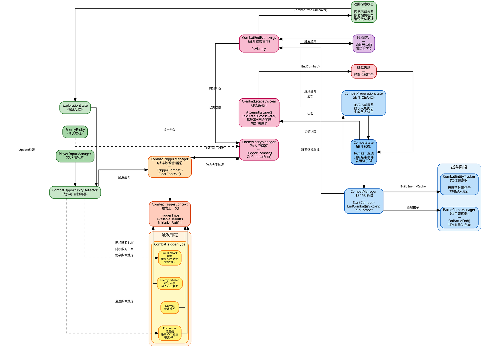

# 战斗触发与脱战机制架构图



## 架构说明

### 四大阶段

| 阶段 | 核心组件 | 职责 |
|------|---------|------|
| 探索阶段 | ExplorationState, CombatOpportunityDetector | 检测偷袭/遭遇战机会，等待玩家空格触发 |
| 触发判定 | CombatTriggerManager, CombatTriggerContext | 判断触发类型，分配先手Buff/偷袭Debuff |
| 战斗阶段 | CombatState, CombatManager, CombatEntityTracker | 管理战斗全生命周期，追踪所有棋子 |
| 结束/脱战 | CombatEscapeSystem, CombatEndEventArgs | 脱战成功率计算，战斗结果处理 |

### 触发类型

| 类型 | 条件 | 效果 |
|------|------|------|
| SneakAttack（偷袭） | 距离<3m, 背后, 警觉<0.3 | 给敌人施加Debuff池 |
| Encounter（遭遇战） | 距离<5m, 正面, 警觉<0.5 | 随机获得玩家先手Buff |
| EnemyInitiated（敌方先手） | 敌人追击到达 | 随机敌方获得先手Buff |
| Normal（普通） | 默认 | 无额外效果 |

### 脱战机制

- **成功率** = 基础率 + 回合数 × 时间奖励，上限封顶
- **冷却期**：失败后N回合内成功率减半
- **代价**：成功脱战增加污染值
- **失败**：设置冷却回合数，继续战斗

### 关键事件流

```
CombatEndEventArgs  → CombatState.OnCombatEnd() → 更新污染值（失败时）
                    → EnemyEntityManager.OnCombatEnd() → 胜利销毁敌人/失败恢复敌人
CombatLeaveEventArgs → ChessStateUIWorldManager → 清理战斗UI
```
