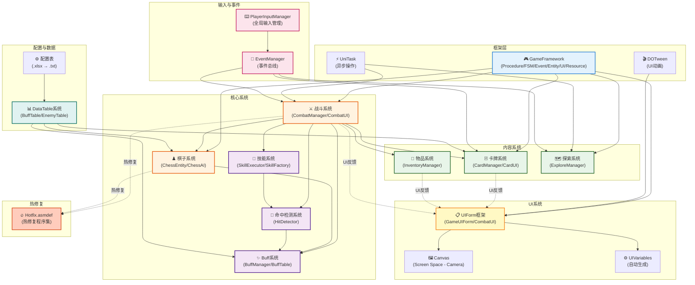
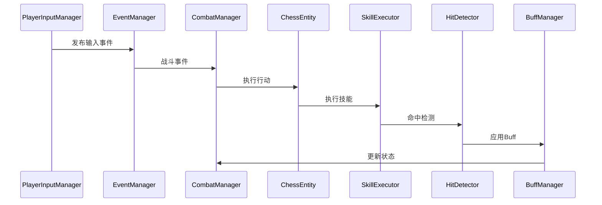
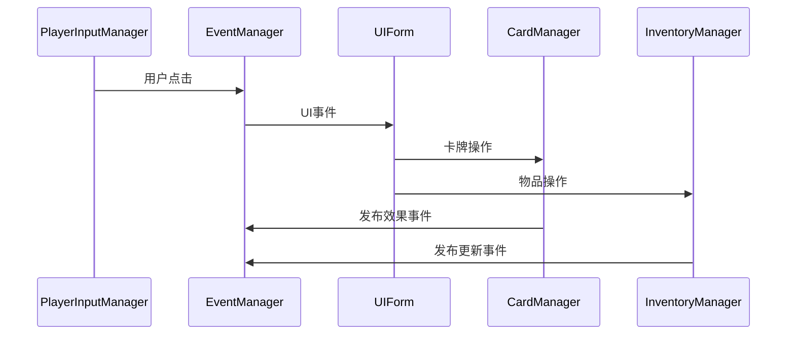
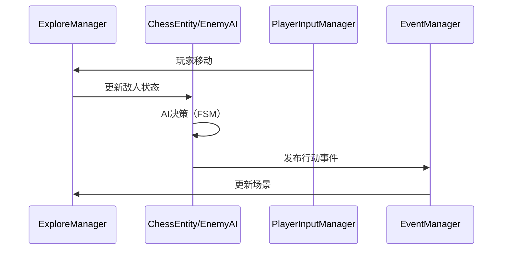

# 项目系统架构与模块关系图

## 核心系统架构（7个集群）



---

## 3个主要执行流

### 1️⃣ 战斗流程（最核心）



### 2️⃣ UI交互流程



### 3️⃣ 探索与敌人AI流程



---

## 模块依赖关系矩阵

| 模块 | 依赖 GameFramework | 依赖 UniTask | 依赖 DOTween | 依赖 DataTable |
|------|:--:|:--:|:--:|:--:|
| **战斗系统** | ✅ | ✅ | ✅ | ✅ |
| **棋子系统** | ✅ | ✅ | - | ✅ |
| **Buff系统** | ✅ | - | - | ✅ |
| **技能系统** | ✅ | ✅ | - | ✅ |
| **命中检测** | ✅ | - | - | - |
| **卡牌系统** | ✅ | ✅ | ✅ | ✅ |
| **物品系统** | ✅ | - | ✅ | ✅ |
| **探索系统** | ✅ | ✅ | - | ✅ |
| **UI系统** | ✅ | ✅ | ✅ | - |
| **事件系统** | ✅ | - | - | - |
| **输入管理** | ✅ | - | - | - |

---

## GitNexus 索引统计

```
项目：Clash_Of_Gods
├─ 源文件数：53,471
├─ 索引节点：85,248（类、函数、变量、类型等）
├─ 关系数：86,780（继承、调用、引用等）
├─ 模块集群：7个（对应核心系统）
├─ 执行流：3条（战斗、UI、探索）
└─ 索引时间：2026-04-17 01:37:27 UTC
```

---

## 如何查询图结构？

使用 GitNexus exploring 技能进行高级查询：

```bash
# 查询特定类的所有依赖
gitnexus explore-dependencies CombatManager

# 查询特定函数的调用链
gitnexus explore-callers ExecuteSkill

# 查询某个类的所有继承者
gitnexus explore-implementations IChessSkill

# 查询模块间的通信
gitnexus explore-communication Combat Buff Skill
```

> **注**：GitNexus 数据存储在 KuzuDB（图数据库）中，目前没有内置的可视化导出功能，但可以通过技能查询获取详细信息。
