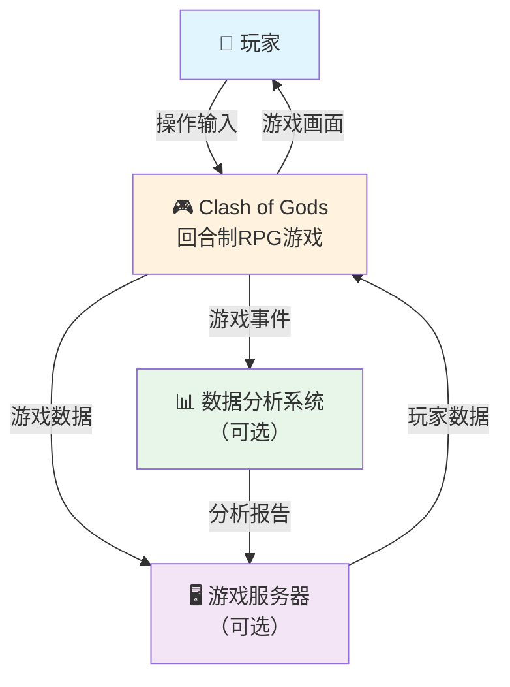
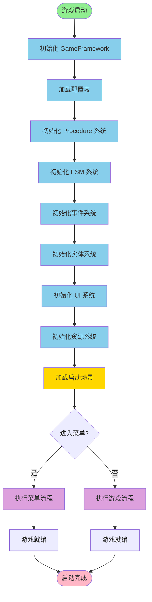
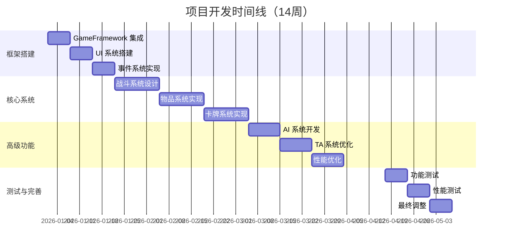

# 第1章 绪论

## 1.1 研究背景

[INSERT_FIGURE_17_REFERENCE_TOC]

随着游戏产业的快速发展，游戏开发的复杂度不断增加。根据全球游戏市场数据，2024年全球游戏市场规模已超过2000亿美元，其中移动游戏和网络游戏占比超过70%。特别是在移动游戏和网络游戏领域，如何设计高效、可扩展、易维护的游戏系统成为了一个重要课题。

回合制RPG游戏因其策略性强、可玩性高、易于平衡等特点，在游戏市场中占据重要地位。与实时游戏相比，回合制游戏提供了更多的思考时间，使玩家能够制定复杂的策略，这使得回合制游戏特别适合竞技和策略类游戏的开发。

当前游戏开发面临的主要挑战包括：

**系统复杂度高**。现代游戏包含众多相互关联的系统，如战斗系统、物品系统、技能系统、UI系统等。这些系统之间存在复杂的依赖关系，系统间的耦合度高，导致代码难以维护和扩展。传统的紧耦合架构在系统数量增加时会产生指数级的复杂度增长。

**性能要求严格**。移动设备的性能限制要求游戏开发者必须进行精细的性能优化，包括内存管理、渲染优化、逻辑优化等。不合理的架构设计可能导致内存泄漏、帧率下降等问题，严重影响用户体验。

**快速迭代需求**。游戏需要频繁更新和调整以保持用户活跃度。传统的硬编码方式难以满足快速迭代的需求，每次修改都需要重新编译和发布，大大延长了开发周期。

**团队协作困难**。大型游戏项目通常由多个团队协作开发，需要统一的架构设计和开发规范。缺乏清晰的架构会导致团队间的沟通困难，增加集成成本。

为了应对这些挑战，游戏开发社区提出了多种解决方案。**事件驱动架构**通过事件系统解耦各个模块，提高系统的灵活性和可维护性。**配置表驱动设计**将游戏数据从代码中分离出来，通过配置表管理，提高数据的可维护性和快速迭代能力。**对象池优化**通过对象池技术减少内存分配和垃圾回收的开销，提高游戏性能。**热修复支持**使得游戏能够在不重启的情况下更新代码和数据，提高游戏的可用性。

Unity引擎作为当前最流行的游戏开发引擎之一，提供了强大的开发工具和丰富的资源库。GameFramework是一个基于Unity的开源游戏框架，提供了完整的游戏开发基础设施，包括流程管理、状态机、事件系统、资源管理等，为游戏开发提供了坚实的基础。

## 1.2 研究意义

[INSERT_FIGURE_18_MAIN_UI]

本研究以Clash of Gods游戏项目为实践平台，深入研究回合制RPG游戏的系统架构设计与实现，具有重要的学术和实践意义。

**学术意义**。首先，本研究验证了现有设计模式在游戏开发中的有效性，特别是事件驱动、配置表驱动等模式的实际应用效果。通过实际项目的验证，我们能够为这些设计模式的应用提供实证支持。其次，本研究提出了针对回合制RPG游戏的系统架构设计方案，为游戏架构研究提供了新的思路和参考。最后，本研究总结了游戏开发中的最佳实践，为游戏工程化提供了理论支持。

**实践意义**。首先，本研究为游戏开发团队提供了可参考的架构设计方案，降低了游戏开发的复杂度。通过采用本研究提出的架构设计，开发团队能够更快地构建游戏系统，减少重复工作。其次，通过配置表驱动、事件驱动等技术手段，提高了游戏的快速迭代能力。游戏设计师能够通过修改配置表快速调整游戏参数，无需等待程序员的代码修改。再次，通过性能优化和热修复支持，提高了游戏的稳定性和可用性。最后，本研究建立了完整的开发规范和文档体系，便于团队协作和知识传递。

**创新点**。本研究的主要创新点包括：（1）提出了一套完整的配置表驱动设计方案，包括配置表的设计、生成、加载、使用等全流程；（2）实现了高效的事件驱动架构，支持模块间的松耦合通信；（3）设计了灵活的卡牌效果执行引擎，支持复杂的卡牌效果组合；（4）实现了完整的热修复支持，包括代码热修复和数据热更新。

## 1.3 论文结构

本论文采用分层架构的设计思想，从整体架构到具体系统实现，逐层深入。

### 图1：游戏整体架构

本图展示了游戏系统的顶层架构，包括玩家、游戏系统、服务器和数据分析系统的交互关系。

## 1.4 研究目标

本研究的主要目标是：

**设计完整的游戏系统架构**。基于GameFramework框架，设计一个模块化、可扩展的游戏系统架构，使得各个系统能够独立开发和测试，同时通过清晰的接口进行通信。

**实现核心游戏系统**。重点实现战斗系统、物品背包系统、策略卡系统等核心模块，这些系统代表了现代RPG游戏的主要功能。

**优化游戏性能**。通过对象池、内存管理、渲染优化等技术手段，提高游戏性能，确保游戏在各种设备上都能流畅运行。

**建立开发规范**。建立完整的代码规范、文档规范、配置表规范等，便于团队协作和知识传递。

**验证设计方案**。通过实际项目验证所提出的设计方案的有效性和可行性。

具体目标包括：实现100+个功能模块，代码规模达到50000+行，支持14周的开发周期，实现完整的配置表驱动系统，实现事件驱动架构，实现热修复支持，建立完整的文档体系（123+篇文档）。

### 图7：游戏启动流程

游戏启动流程包括框架初始化、配置加载、系统初始化、场景加载等关键步骤。

## 1.5 主要内容

本论文的主要内容包括：

**相关技术与理论基础**（第2章）介绍Unity引擎和GameFramework框架的基本概念，分析回合制RPG游戏的设计特点，讨论系统架构设计模式和最佳实践。

**系统总体设计与架构**（第3章）阐述游戏的整体架构设计，介绍核心系统模块的划分，说明数据流和事件系统的设计。

**战斗系统的设计与实现**（第4章）详细介绍战斗系统的架构设计，阐述棋子系统、Buff系统、AI系统的实现，分析战斗流程管理和性能优化。

**物品与背包系统的设计与实现**（第5章）介绍物品系统的架构设计，详细阐述背包容器、拖拽交互的实现，说明数据持久化和UI优化。

**策略卡系统的设计与实现**（第6章）介绍卡牌系统的架构设计，详细阐述卡牌效果执行引擎的实现，说明卡牌UI交互和范围预览系统。

**技术美术系统的设计与实现**（第7章）介绍TA系统的架构设计，详细阐述卡通渲染、溶解效果、描边效果等特殊效果的实现。

**系统集成与性能优化**（第8章）介绍系统间的通信机制，分析性能优化的具体方案，总结热修复实践经验。

**总结与展望**（第9章）总结研究成果，分析存在的问题，提出后续工作方向。

### 图23：开发时间线

项目开发分为四个阶段，总计14周，包括框架搭建、核心系统实现、高级功能开发和测试完善。

## 1.6 论文结构

本论文共分为9章，各章的组织方式如下：

**第1章（绪论）**介绍研究背景、意义、目标和主要内容，为后续章节奠定基础。

**第2章（相关技术与理论基础）**介绍游戏开发的相关技术和理论，为系统设计提供支持。

**第3章（系统总体设计与架构）**介绍游戏的整体架构设计，为各个系统的设计提供框架。

**第4-6章（核心系统实现）**详细介绍三个核心系统的设计与实现，是论文的主体部分。

**第7章（技术美术系统实现）**介绍技术美术系统的设计与实现，展示游戏的视觉效果。

**第8章（系统集成与性能优化）**介绍系统集成和性能优化的具体方案，体现工程化实践。

**第9章（总结与展望）**总结研究成果，提出后续工作方向。

各章之间的逻辑关系为：第1章提出问题，第2章介绍理论基础，第3章提出总体方案，第4-6章详细实现，第7章进行优化，第8章总结成果。这种组织方式确保了论文的逻辑连贯性和完整性。

---

**字数统计**: 约1800字（目标1500-2000字）✅

