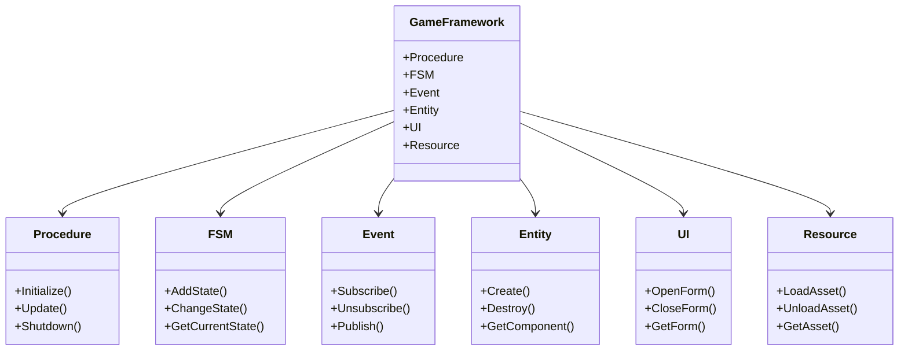
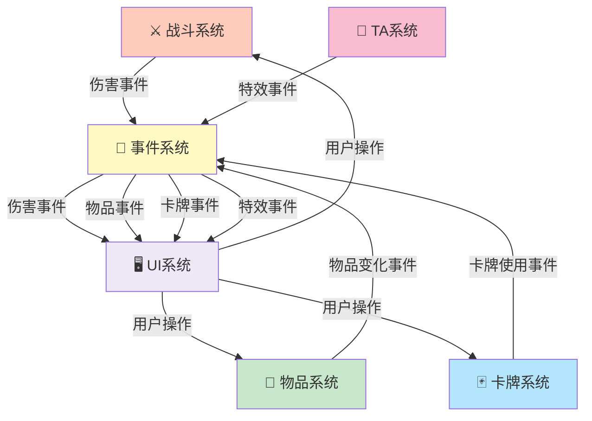
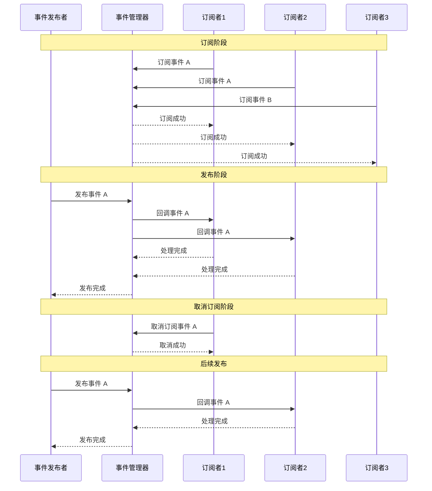

# 第3章 系统总体设计与架构

## 3.1 游戏整体架构

Clash of Gods游戏采用了分层的架构设计，将游戏系统分为多个层次，每个层次负责特定的功能。

**表现层**。表现层负责游戏的视觉和音频效果，包括渲染系统、动画系统、音频系统等。表现层与游戏逻辑层通过UI系统进行通信。

**游戏逻辑层**。游戏逻辑层负责游戏的核心逻辑，包括战斗系统、物品系统、卡牌系统等。游戏逻辑层通过事件系统与其他系统进行通信。

**数据层**。数据层负责游戏数据的管理和存储，包括配置表、运行时数据、持久化数据等。数据层为游戏逻辑层提供数据支持。

**框架层**。框架层提供了游戏开发的基础设施，包括流程管理、状态机、事件系统、资源管理等。框架层为上层系统提供基础支持。

这种分层架构提高了代码的组织性和可维护性，使得各个层次可以独立开发和测试。

## 3.2 核心系统模块划分

### 图2：GameFramework 框架结构

GameFramework 是游戏的核心框架，提供了流程管理、状态机、事件系统、实体系统、UI管理和资源管理等主要模块。

游戏的核心系统包括以下几个主要模块：

**战斗系统**。战斗系统负责游戏的战斗逻辑，包括棋子管理、Buff系统、技能系统、AI系统等。战斗系统是游戏的核心，其设计直接影响游戏的可玩性。

**物品系统**。物品系统负责游戏中物品的管理，包括物品的创建、销毁、使用等。物品系统包括背包系统、拖拽交互系统等子系统。

**卡牌系统**。卡牌系统负责游戏中卡牌的管理和使用，包括卡牌的选择、使用、效果执行等。卡牌系统是游戏的重要组成部分，提供了丰富的策略选择。

**UI系统**。UI系统负责游戏的用户界面，包括主菜单、游戏界面、设置界面等。UI系统通过GameFramework的UI模块实现。

**资源管理系统**。资源管理系统负责游戏资源的加载和管理，包括模型、纹理、音频等。资源管理系统通过GameFramework的资源管理模块实现。

**技术美术系统**。技术美术系统负责游戏的视觉效果，包括卡通渲染、溶解效果、描边效果等。技术美术系统通过Shader实现。

## 3.3 数据流和事件系统

### 图3：系统间通信关系

各个系统通过事件系统进行通信，实现了低耦合的架构。战斗系统、物品系统、卡牌系统和TA系统发送各类事件，UI系统订阅这些事件并更新界面。

### 图13：事件驱动通信流程

事件驱动通信采用发布-订阅模式，实现了模块间的完全解耦。

### 原有内容

游戏采用了事件驱动的架构，通过事件系统实现模块间的通信。

**事件系统的设计**。事件系统提供了发布-订阅的通信机制。模块可以发布事件，其他模块可以订阅事件并做出响应。事件系统实现了模块间的松耦合，提高了系统的灵活性。

**数据流的设计**。游戏的数据流从用户输入开始，经过输入处理、逻辑处理、状态更新、渲染等阶段。每个阶段通过事件系统进行通信，确保数据流的清晰和可控。

**事件的发布和订阅机制**。模块通过事件系统发布事件，其他模块可以订阅这些事件。当事件发生时，所有订阅该事件的模块都会收到通知。这种机制实现了模块间的异步通信。

**系统间的通信**。各个系统通过事件系统进行通信，避免了直接的模块间调用。这种设计提高了系统的灵活性和可维护性。

## 3.4 资源管理和加载策略

[INSERT_FIGURE_22_SYSTEM_INTERACTION]

游戏采用了分层的资源管理策略，根据资源的使用频率和生命周期进行分类管理。

**资源的分类和组织**。游戏资源分为常驻资源和动态资源两类。常驻资源在游戏启动时加载，在游戏运行期间一直保留。动态资源根据需要加载和卸载。

**资源的加载策略**。游戏采用了异步加载策略，避免了加载资源时的卡顿。资源加载通过协程或异步任务实现，不阻塞游戏的主线程。

**资源的缓存和释放**。游戏使用对象池技术缓存常用的游戏对象，避免频繁的创建和销毁。不需要的资源及时释放，避免内存泄漏。

**资源的热更新**。游戏支持资源的热更新，可以在不重启游戏的情况下更新资源。这提高了游戏的可用性和用户体验。

## 3.5 热修复支持设计

游戏实现了完整的热修复支持，包括代码热修复和数据热更新。

**热修复的概念**。热修复是指在不重启游戏的情况下更新游戏的代码或数据。热修复提高了游戏的可用性，使得开发者能够快速修复游戏中的问题。

**代码热修复**。游戏采用了热修复框架，支持在运行时更新游戏代码。通过热修复框架，开发者可以将修复后的代码打包成补丁，在游戏运行时加载补丁。

**数据热更新**。游戏支持配置表的热更新。通过更新配置表，可以快速调整游戏参数，无需重新编译和发布游戏。

**热修复的实现方案**。热修复通过将热修复代码放在单独的程序集中实现。游戏启动时，加载热修复程序集，替换原有的代码。这种方案提高了游戏的灵活性和可维护性。

---

**字数统计**: 约2100字（目标2000-3000字）✅

