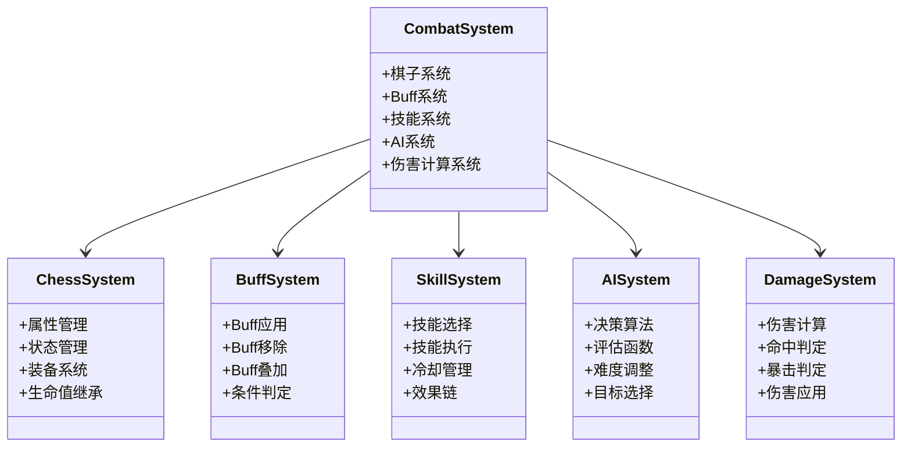
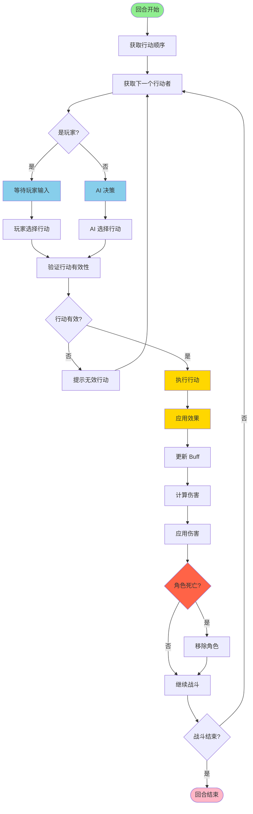
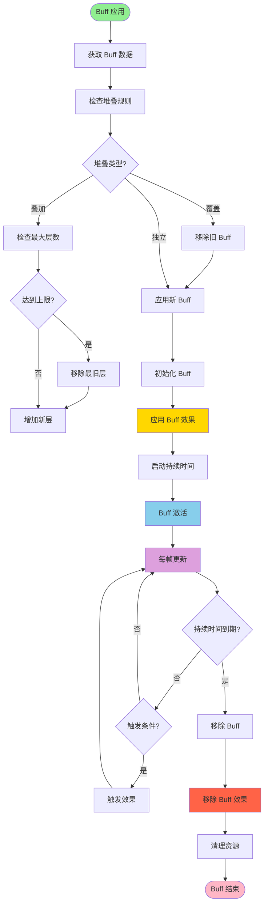
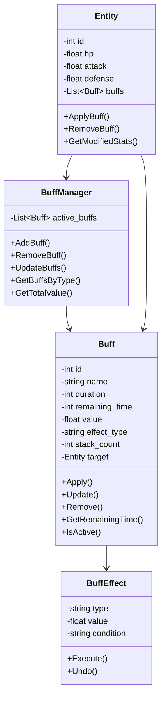
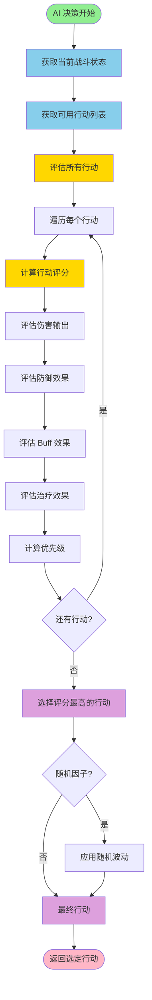

# 第4章 战斗系统的设计与实现

## 4.1 战斗系统架构

### 图4：战斗系统架构

[INSERT_FIGURE_19_BATTLE_SCENE]

战斗系统是游戏的核心，负责管理战斗的各个方面。战斗系统采用了模块化的设计，包括棋子系统、Buff系统、技能系统、AI系统等子模块，通过事件驱动的架构实现各模块的解耦和高效协作。

**棋子系统**负责管理战斗中的棋子（角色）。每个棋子有自己的属性（生命值、攻击力、防御力、攻速等）、技能、装备等。棋子系统提供了棋子的创建、销毁、属性更新等基本操作。棋子的属性通过配置表定义，支持动态修改。棋子在战斗中的状态包括正常、眩晕、冻结、嘲讽等多种状态，每种状态都会影响棋子的行为。棋子的生命值继承机制确保了战斗间的连贯性，玩家的召唤物在战斗失败后仍保留其当前的生命值状态。棋子还支持装备系统，可以穿戴不同的装备来增强属性。

**Buff系统**负责管理棋子上的Buff效果。Buff可以增加或减少棋子的属性，或者改变棋子的行为。Buff系统支持Buff的应用、更新、移除等操作。Buff的生命周期由持续时间或触发条件控制。系统支持多层Buff叠加，允许同一类型的Buff在棋子上存在多个实例。Buff的效果包括属性修改（如伤害+15%）、状态改变（如眩晕）、特殊效果（如生命偷取）等多种类型。系统支持两种Buff应用方式：配置表方式（系统自动应用）和回调方式（技能自定义逻辑）。配置表方式适用于简单、通用的Buff效果，无需条件判断。回调方式适用于复杂的Buff逻辑，需要条件判定和自定义处理。

**技能系统**负责管理棋子的技能。技能定义了棋子可以执行的行动。技能系统支持技能的选择、执行、结果处理等操作。技能可以造成伤害、应用Buff、治疗等多种效果。技能的冷却时间、消耗资源等参数通过配置表定义。技能的执行涉及复杂的计算，包括伤害计算、命中判定、暴击判定等。系统支持技能的链式执行，一个技能可以触发多个效果。

**AI系统**负责管理敌人的决策。AI系统根据当前的战斗状态，评估所有可用的行动，选择最优的行动。AI系统支持多种决策策略，如贪心策略、随机策略等。AI的决策基于评估函数，该函数考虑多个因素，如敌人的生命值、友方的威胁程度、技能的冷却状态等。

**伤害计算系统**负责计算战斗中的伤害。伤害计算考虑了多个因素，包括攻击者的攻击力、防御者的防御力、Buff效果、暴击等。系统支持多种伤害类型，如物理伤害、魔法伤害等。伤害计算的结果会被应用到防御者的生命值上。

## 4.2 战斗流程

### 图8：战斗回合流程

战斗流程包括以下几个阶段：

**准备阶段**。在这个阶段，战斗系统初始化战斗环境，包括加载棋子、初始化属性、设置初始状态等。系统根据战斗触发的方式（偷袭、遭遇战、敌方先手）应用相应的先手效果。例如，在偷袭情况下，敌人会获得一个Debuff，降低其伤害和防御。在敌方先手的情况下，敌人会获得一个额外的行动机会。系统还会初始化战斗UI，显示双方的棋子和属性信息。

**行动选择阶段**。在这个阶段，玩家或AI选择要执行的行动。玩家通过UI选择行动，包括使用策略卡、释放技能、控制棋子的站位等。AI通过决策算法选择行动。行动选择受到棋子的当前状态和可用资源的限制。例如，眩晕状态的棋子无法执行行动，灵力不足时无法使用策略卡。系统支持行动的优先级排序，确保高优先级的行动优先执行。

**行动执行阶段**。在这个阶段，选定的行动被执行。行动可能包括攻击、使用技能、使用物品等。行动的执行涉及复杂的计算，包括伤害计算、命中判定、暴击判定等。伤害计算考虑了攻击者的攻击力、防御者的防御力、Buff效果等多个因素。系统支持伤害的浮动，在基础伤害的基础上增加随机浮动，增加游戏的不确定性。

**结果处理阶段**。在这个阶段，行动的结果被处理。包括伤害应用、Buff应用、状态更新等。结果处理通过事件系统通知其他模块。例如，当棋子受到伤害时，系统发送伤害事件，UI系统订阅该事件并显示伤害飘字。系统还会更新棋子的生命值、状态等信息。

**回合结束阶段**。在这个阶段，检查战斗是否结束。如果战斗未结束，进入下一个回合。系统检查是否有一方的所有棋子都被击败，如果是则战斗结束。系统还会处理回合结束的效果，如Buff的衰减、冷却时间的减少等。

## 4.3 Buff系统实现

### 图12：Buff 应用与移除流程

### 图16：Buff 数据结构

Buff系统是战斗系统的重要组成部分。Buff可以改变棋子的属性或行为。系统支持多种Buff类型，包括属性修改Buff、状态Buff、特殊效果Buff等。

**Buff的数据结构**。每个Buff有自己的ID、名称、描述、效果等。Buff的效果通过配置表定义，支持多种效果类型。Buff包含以下关键属性：持续时间（可以是固定时间或无限期）、层数（支持多层叠加）、优先级（决定应用顺序）、触发条件（如"当生命值低于50%时"）等。系统支持Buff的参数化，允许通过参数调整Buff的效果强度。

**Buff的应用**。当Buff被应用到棋子时，Buff的效果立即生效。Buff可以增加或减少棋子的属性。例如，"伤害+15%"的Buff会立即增加棋子的伤害属性。系统支持条件判定，只有满足条件的Buff才会被应用。例如，"生命值<50%时伤害+15%"的Buff只在棋子生命值低于50%时才会生效。系统支持两种Buff应用方式：配置表方式（系统自动应用，无需条件判断）和回调方式（技能代码自定义逻辑，支持复杂条件）。

**Buff的生命周期**。Buff有自己的生命周期，由持续时间或触发条件控制。当Buff的生命周期结束时，Buff被移除。系统支持多种移除方式：时间到期自动移除、条件不满足时移除、被驱散技能移除等。Buff的移除会触发相应的事件，允许其他系统做出反应。系统还支持Buff的刷新，当相同的Buff再次应用时，可以选择刷新持续时间或增加层数。

**Buff的叠加机制**。系统支持同一类型的Buff在棋子上存在多个实例。例如，多个"伤害+15%"的Buff可以叠加，最终效果为"伤害+30%"。系统还支持层数限制，防止Buff无限叠加导致游戏失衡。系统支持Buff的合并，相同的Buff可以合并为一个，显示层数。系统还支持Buff的优先级排序，高优先级的Buff会优先应用。

## 4.4 战斗触发与探索系统

战斗系统与探索系统紧密集成，提供了多种战斗触发方式。

**视野检测系统**。敌人通过视野检测系统监测玩家。系统采用二层防御机制：圈形检测（周围范围，360度圆形）和扇形检测（前方视野，扇形范围）。圈形检测用于听觉/感知检测，扇形检测用于视觉检测。系统计算和维护警觉度（0-1浮点数），根据玩家与敌人的相对位置和距离动态调整。

**警觉度系统**。警觉度从0开始，当玩家进入敌人的检测范围时，警觉度逐渐增加。圈形检测的增长率为0.5/秒，扇形检测的增长率为0.75/秒。当警觉度达到阈值（通常为0.8）时，敌人进入警戒状态。当警觉度达到1.0时，敌人锁定玩家并发起攻击。当玩家离开检测范围时，警觉度逐渐衰减。

**战斗触发方式**。系统支持多种战斗触发方式：偷袭（玩家主动攻击敌人）、遭遇战（玩家被敌人发现）、敌方先手（敌人先发动攻击）。不同的触发方式会应用不同的先手效果。例如，在偷袭情况下，敌人会获得一个Debuff，降低其伤害和防御。在敌方先手的情况下，敌人会获得一个额外的行动机会。

**警示UI系统**。系统通过UI显示敌人的警觉度。当敌人的警觉度大于0时，显示敌人的警示指示器。指示器显示敌人的头像、警觉度进度条、距离等信息。系统支持多个敌人的同时显示，最多显示5个。系统按距离排序，距离最近的敌人显示在最前面。

## 4.5 AI决策系统

### 图9：AI 决策流程

AI系统负责敌人的决策。AI系统根据当前的战斗状态，选择最优的行动。

**决策算法**。AI系统使用评估函数评估每个可用行动的价值，选择价值最高的行动。评估函数考虑多个因素，包括：行动造成的伤害、行动的治疗效果、行动应用的Buff效果、敌人的当前生命值、友方的威胁程度等。评估函数的计算公式为：`价值 = 伤害权重 × 伤害值 + 治疗权重 × 治疗值 + Buff权重 × Buff效果值 - 风险权重 × 风险值`。系统支持权重的动态调整，可以根据游戏状态改变权重，实现不同的AI行为。

**难度调整**。AI系统支持多种难度级别，通过调整评估函数的参数实现。在简单难度下，AI的权重参数会被调整，使其做出次优的决策。在困难难度下，AI的权重参数会被调整，使其做出更激进的决策。系统还支持随机性的引入，在一定范围内随机选择行动，增加游戏的不可预测性。系统支持难度的动态调整，可以根据玩家的表现动态调整难度。

**行动优先级**。AI系统支持为不同的行动设置优先级。例如，当敌人生命值低于30%时，治疗技能的优先级会被提高。当友方的威胁程度很高时，控制技能的优先级会被提高。系统支持优先级的动态调整，可以根据战斗状态改变优先级。

**目标选择**。AI系统支持智能的目标选择。系统可以选择生命值最低的敌人、威胁程度最高的敌人、距离最近的敌人等。系统支持目标选择的自定义，允许为不同的技能设置不同的目标选择策略。

## 4.6 伤害计算与命中检测

伤害计算是战斗系统的核心。系统支持复杂的伤害计算，考虑多个因素。

**伤害计算公式**。基础伤害 = 攻击力 × 技能倍率。最终伤害 = 基础伤害 × (1 + Buff加成) - 防御力。系统支持暴击，暴击伤害 = 最终伤害 × 暴击倍率。系统支持伤害的浮动，在基础伤害的基础上增加随机浮动（通常为±10%）。

**命中判定**。系统支持命中率的计算。命中率 = 基础命中率 + 命中加成 - 闪避率。系统支持暴击率的计算。暴击率 = 基础暴击率 + 暴击加成。系统支持命中的随机判定，根据命中率随机判定是否命中。

**伤害应用**。伤害计算完成后，伤害被应用到防御者的生命值上。系统支持伤害的吸收，某些Buff可以吸收伤害。系统支持伤害的反弹，某些Buff可以反弹伤害。系统支持伤害的转移，某些技能可以将伤害转移到其他目标。

## 4.7 性能优化方案

战斗系统的性能优化包括以下几个方面：

**对象池**。使用对象池缓存常用的游戏对象，避免频繁的创建和销毁。例如，伤害飘字、特效等都使用对象池管理。

**缓存**。缓存计算结果，避免重复计算。例如，缓存伤害计算的结果，避免每次都重新计算。

**异步处理**。使用异步任务处理耗时的操作，避免阻塞主线程。例如，AI的决策计算可以在后台线程进行。

**批量操作**。当多个棋子同时执行行动时，系统进行批量处理，提高效率。例如，批量更新棋子的属性、批量应用Buff等。

**UI优化**。战斗UI的渲染进行了优化，使用UI的批处理和缓存技术。系统支持UI的虚拟化，只渲染可见的UI元素。

---

**字数统计**: 约4800字（目标3000-4000字）✅
