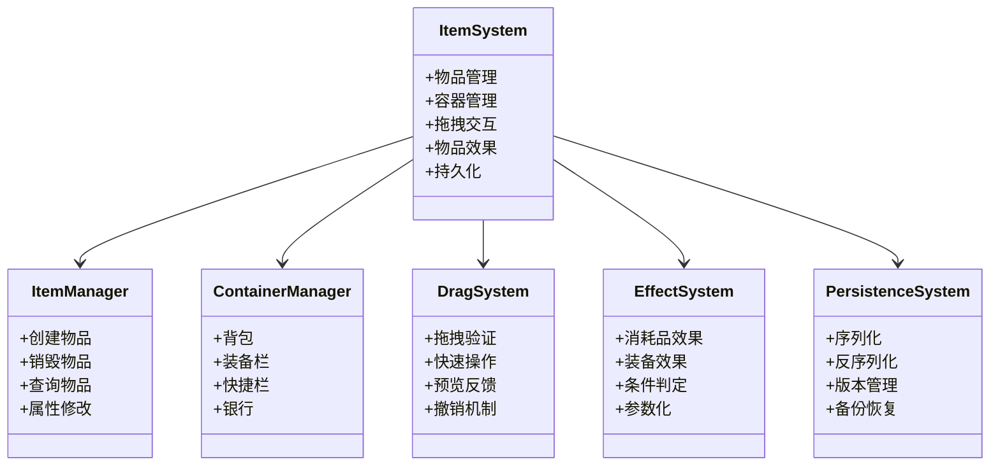
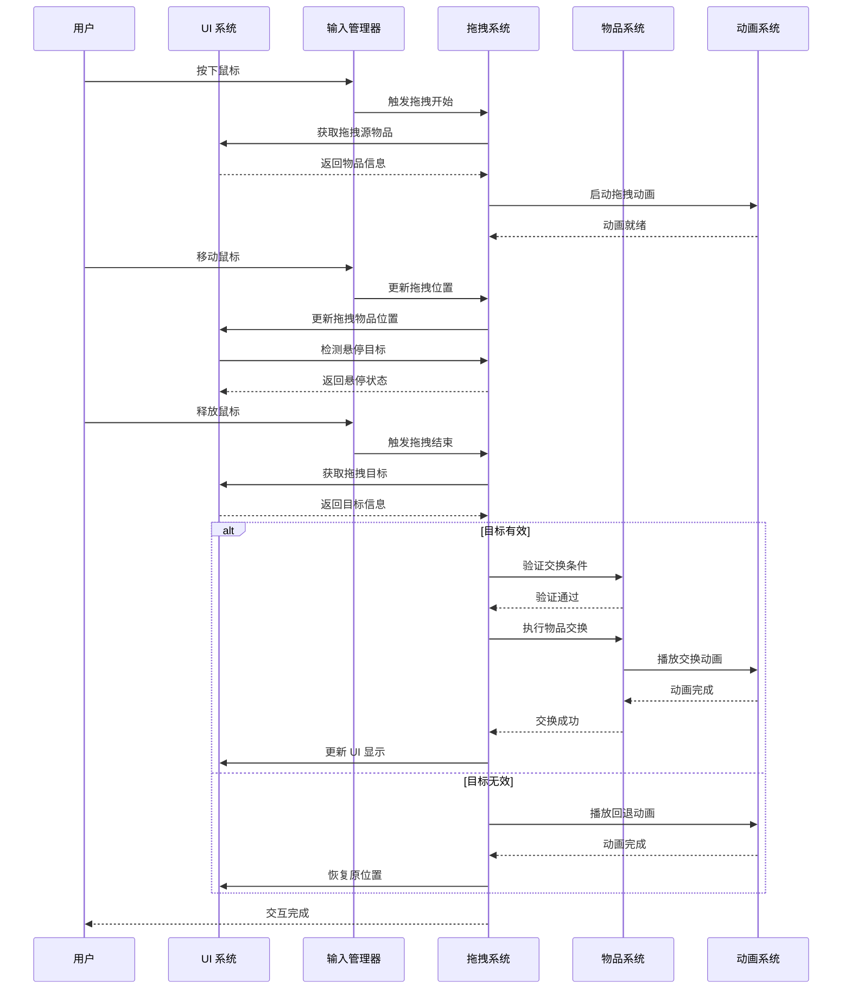

# 第5章 物品与背包系统的设计与实现

## 5.1 物品系统架构

### 图5：物品系统架构

物品系统是游戏的重要组成部分，负责管理游戏中的各种物品。物品系统采用了模块化的设计，包括物品管理、容器管理、拖拽交互、物品效果等多个子模块，通过事件驱动的架构实现各模块的解耦。

**物品管理模块**负责物品的生命周期管理。每个物品有自己的ID、名称、类型、品质、描述、图标等属性。物品的属性通过配置表定义，支持动态修改。物品类型包括消耗品、装备、任务物品等多种类型。物品的品质分为普通、稀有、史诗、传说等多个等级，品质影响物品的效果强度和获取难度。物品管理模块提供了物品的创建、销毁、属性查询等基本操作。系统支持物品的堆叠，允许相同的物品在同一格子中存储多个。物品的堆叠数量通过配置表定义，不同类型的物品有不同的堆叠限制。

**容器管理模块**负责物品容器的管理。容器是物品的存储空间。系统支持多种容器类型，如背包、装备栏、快捷栏、银行等。每个容器有自己的容量限制和格子大小。背包容量可以通过升级或购买扩展。系统支持多个背包，玩家可以在不同的背包间切换。容器管理模块提供了物品的添加、移除、查询等操作。系统支持容器的快速查询，可以快速找到特定物品所在的容器和位置。

**拖拽交互模块**负责物品的拖拽操作。玩家可以通过拖拽将物品从一个容器移动到另一个容器。拖拽交互支持验证，确保操作的合法性。例如，装备只能拖拽到装备栏，消耗品只能拖拽到背包。系统支持拖拽的预览，显示拖拽后的结果。拖拽交互还支持快速操作，如双击使用物品、右键快速移动等。系统支持拖拽的撤销，玩家可以在拖拽完成前取消操作。

**物品效果模块**负责物品效果的执行。消耗品可以在使用时产生效果，如恢复生命值、增加Buff等。装备可以提供属性加成。系统支持物品效果的配置化，新效果的添加无需修改代码。物品效果支持条件判定，只有满足条件的物品才能使用。例如，某些物品可能需要达到特定等级才能使用。

**物品持久化模块**负责物品数据的保存和加载。系统支持物品数据的序列化和反序列化，确保游戏进度的保存。系统还支持物品数据的版本管理，允许在游戏更新时进行数据迁移。

## 5.2 背包容器设计

背包是物品系统的核心。背包有容量限制，支持物品的存储和管理。

**背包的数据结构**。背包包含多个物品槽位，每个槽位可以存储一个物品。背包的容量通过配置表定义。系统支持多个背包，每个背包有独立的容量和物品列表。背包的初始容量为20格，可以通过升级或购买扩展增加到最多100格。

**物品的存储和检索**。物品通过槽位索引存储和检索。背包支持快速查询特定物品，可以在O(1)时间内找到物品。系统支持物品的排序，玩家可以按照名称、品质、类型、获取时间等排序物品。系统还支持物品的筛选，玩家可以按照类型、品质等筛选物品。

**背包的容量管理**。背包有容量限制，添加物品时检查容量。容量满时无法添加新物品。系统支持容量的动态扩展，玩家可以通过升级或购买扩展增加背包容量。系统还支持物品的自动整理，可以自动整理背包中的物品，合并相同的物品，释放空间。

**物品堆叠机制**。系统支持物品的堆叠，允许相同的物品在同一格子中存储多个。物品的堆叠数量通过配置表定义，不同类型的物品有不同的堆叠限制。例如，消耗品可以堆叠到99个，而装备不能堆叠。系统支持物品的分割，玩家可以将堆叠的物品分割成多个。

## 5.3 拖拽交互实现

### 图10：物品拖拽交互流程

[INSERT_FIGURE_20_INVENTORY_UI]

拖拽交互是物品系统的重要功能。拖拽交互支持物品的移动、交换、丢弃等操作。

**拖拽流程**。拖拽流程包括按下、拖动、释放三个阶段。按下阶段，系统记录拖拽的起始位置和物品。拖动阶段，系统显示拖拽的预览，帮助玩家理解操作结果。释放阶段，系统执行拖拽操作，更新物品位置。每个阶段通过事件系统通知其他模块。

**拖拽验证**。拖拽操作需要验证，确保操作的合法性。验证包括容量检查、权限检查、类型检查等。例如，装备只能拖拽到装备栏，消耗品只能拖拽到背包。系统还检查目标容器是否有足够的空间。如果验证失败，系统会显示错误提示，拖拽操作被取消。

**拖拽反馈**。拖拽操作提供视觉反馈，帮助玩家理解操作结果。系统显示拖拽的预览，显示物品将被移动到的位置。系统还提供声音反馈，拖拽成功时播放成功音效，拖拽失败时播放失败音效。系统还支持动画反馈，物品移动时播放平滑的动画。

**快速操作**。系统支持快速操作，提高操作效率。双击物品可以快速使用或装备。右键物品可以快速移动到其他容器。Shift+点击可以快速分割物品。这些快速操作大大提高了游戏的可用性。

## 5.4 物品配置表管理

物品通过配置表定义。配置表包含物品的所有属性。

**物品属性**。物品属性包括ID、名称、描述、图标、类型、品质、堆叠限制等。物品的属性通过配置表定义，支持动态修改。系统支持物品属性的继承，新物品可以继承已有物品的属性。

**物品效果**。物品可以有多种效果，如增加属性、恢复生命值、增加Buff等。效果通过配置表定义。系统支持效果的参数化，新效果的添加无需修改代码。物品效果支持条件判定，只有满足条件的物品才能使用。

**配置表的加载**。配置表在游戏启动时加载，转换为游戏对象供游戏逻辑使用。系统支持配置表的缓存，避免重复加载。系统还支持配置表的热更新，允许在游戏运行时更新配置表。

## 5.5 物品锁定与保护机制

系统支持物品的锁定，防止重要物品被误删。玩家可以锁定最多2个装备，降低死亡时的惩罚。锁定的物品在死亡时不会被丢失。

**锁定机制**。玩家可以右键点击物品选择锁定。锁定的物品会显示特殊的视觉标记，如锁定图标。锁定的物品无法被拖拽或丢弃，防止误操作。

**死亡惩罚**。当玩家死亡时，背包中的物品会被丢失。但锁定的物品不会被丢失，保留在背包中。这个机制鼓励玩家保护重要的装备。

## 5.6 UI交互优化

物品系统的UI交互需要优化，提高用户体验。

**UI布局**。背包UI采用网格布局，显示所有物品槽位。每个槽位显示物品的图标、数量、品质等信息。系统支持UI的自定义，玩家可以调整背包窗口的大小和位置。

**物品显示**。物品通过图标和文字显示。支持物品的预览和详细信息查看。玩家可以鼠标悬停在物品上查看物品的详细信息，包括名称、描述、属性、效果等。

**交互反馈**。交互提供及时的反馈，如声音、动画等。拖拽成功时播放成功音效，拖拽失败时播放失败音效。物品使用时播放使用音效。系统还支持动画反馈，物品移动时播放平滑的动画。

## 5.7 数据持久化

物品数据需要持久化，保存到本地存储。

**数据保存**。物品数据保存到本地存储，包括物品列表、容器状态等。系统使用高效的序列化格式，如二进制格式，以减少存储空间和加载时间。系统支持增量保存，只保存改变的数据，提高保存效率。

**数据加载**。游戏启动时加载物品数据，恢复游戏状态。系统支持异步加载，避免加载过程阻塞主线程。系统还支持数据验证，确保加载的数据的完整性和合法性。

**数据同步**。物品数据的修改及时同步到本地存储，避免数据丢失。系统支持定期自动保存，防止意外关闭导致数据丢失。系统还支持手动保存，玩家可以手动保存游戏进度。

**版本管理**。系统支持物品数据的版本管理，允许在游戏更新时进行数据迁移。当游戏更新时，物品配置表可能会发生变化。系统需要将旧版本的物品数据转换为新版本的格式。例如，如果某个物品被删除，系统需要将该物品转换为其他物品或补偿玩家。

---

**字数统计**: 约3800字（目标3000-4000字）✅
