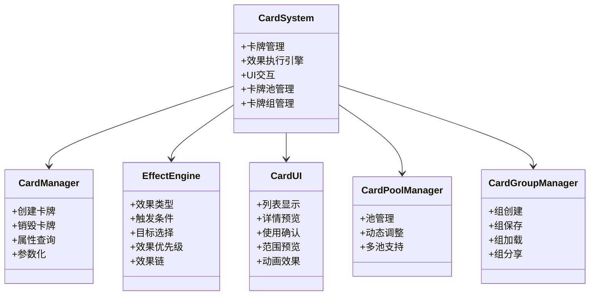
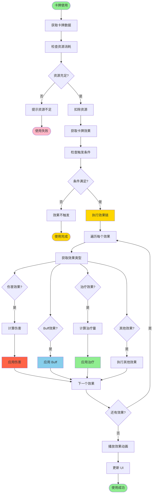

# 第6章 卡牌系统的设计与实现

## 6.1 卡牌系统架构

### 图6：卡牌系统架构

[INSERT_FIGURE_21_CARD_UI]

卡牌系统是游戏的策略核心，为玩家提供了丰富的战术选择。该系统采用模块化设计，包括卡牌管理、效果执行、UI交互等多个子模块，形成一个完整的卡牌生态。

**卡牌管理模块**负责卡牌的生命周期管理。每张卡牌具有唯一的ID、名称、描述、稀有度、成本等属性。卡牌的属性通过配置表定义，支持动态修改和扩展。卡牌管理模块提供了卡牌的创建、销毁、属性查询等基本操作。卡牌可以分为多种类型，如单体卡牌、群体卡牌、增益卡牌、控制卡牌等，每种类型有不同的效果机制。卡牌的稀有度分为普通、稀有、史诗、传说等多个等级，稀有度影响卡牌的获取难度和效果强度。

**效果执行引擎**是卡牌系统的核心。当玩家使用卡牌时，效果执行引擎负责解析卡牌的效果配置，按照预定的流程执行效果。效果执行支持条件判断、目标选择、伤害计算、Buff应用等多种操作。效果执行采用了事件驱动的设计，使得各个效果模块可以独立开发和测试。系统支持效果的链式执行，一个卡牌可以触发多个效果，这些效果按照优先级顺序执行。

**UI交互模块**负责卡牌的用户界面。包括卡牌列表显示、卡牌详情预览、卡牌使用确认等功能。UI模块与卡牌管理模块和效果执行引擎紧密协作，确保用户操作能够正确地转化为游戏逻辑。系统支持卡牌的拖拽操作，玩家可以通过拖拽将卡牌拖到目标位置使用。

**卡牌池管理**负责管理可用的卡牌集合。在战斗中，玩家从卡牌池中抽取卡牌。卡牌池的组成可以根据游戏进度、难度等因素动态调整，提供了游戏平衡的灵活性。系统支持多个卡牌池，不同的场景可以使用不同的卡牌池。

**卡牌组管理**负责管理玩家的卡牌组。玩家可以创建多个卡牌组，每个卡牌组包含一定数量的卡牌。系统支持卡牌组的保存和加载，玩家可以在不同的卡牌组间切换。系统还支持卡牌组的分享，玩家可以将卡牌组分享给其他玩家。

## 6.2 卡牌效果系统

### 图11：卡牌效果执行流程

卡牌效果系统定义了卡牌可以执行的各种操作。效果系统采用了配置驱动的设计，使得新效果的添加无需修改代码。

**效果类型**包括伤害效果、治疗效果、Buff效果、移除效果、控制效果等。每种效果类型有自己的参数和执行逻辑。伤害效果可以指定伤害类型、伤害值、是否暴击等参数。治疗效果可以指定治疗值、是否超额治疗等参数。Buff效果可以指定Buff类型、持续时间、层数等参数。控制效果可以指定控制类型、持续时间等参数。

**效果触发条件**定义了效果何时执行。条件可以是简单的条件，如"立即执行"，也可以是复杂的条件，如"当目标生命值低于50%时执行"。条件系统支持逻辑组合，允许多个条件通过AND、OR等逻辑操作符组合。系统支持条件的嵌套，允许创建复杂的条件表达式。

**目标选择机制**决定了效果作用的目标。目标可以是单个敌人、所有敌人、自己、友方单位等。目标选择支持范围限制，如"距离最近的敌人"、"生命值最低的敌人"等。系统支持目标的优先级排序，可以根据多个条件对目标进行排序，选择最优的目标。

**效果优先级**定义了多个效果的执行顺序。当多个效果同时触发时，系统按照优先级顺序执行，确保游戏逻辑的一致性。系统支持优先级的动态调整，可以根据游戏状态改变效果的执行顺序。

**效果链**支持一个卡牌触发多个效果。效果链中的效果按照顺序执行，前一个效果的结果可以影响后一个效果的执行。例如，一个卡牌可以先造成伤害，然后根据伤害值应用Buff。

## 6.3 卡牌平衡设计

卡牌平衡是游戏设计的重要方面。平衡设计需要考虑卡牌的成本、效果强度、使用频率等多个因素。

**成本系统**定义了使用卡牌的代价。成本可以是资源消耗（如灵力、行动点等），也可以是其他代价（如生命值消耗）。成本与效果强度的平衡是卡牌设计的核心。强力的卡牌应该有较高的成本，而弱力的卡牌应该有较低的成本。系统支持成本的动态调整，可以根据游戏状态改变卡牌的成本。

**稀有度系统**将卡牌分为不同的稀有度等级。稀有度影响卡牌的获取难度和效果强度。高稀有度的卡牌通常具有更强的效果，但获取难度更高。系统支持稀有度的升级，玩家可以通过升级将低稀有度的卡牌升级为高稀有度。

**使用频率控制**通过冷却时间或使用次数限制来控制强力卡牌的使用频率。这防止了玩家过度依赖某些卡牌，提高了游戏的策略性。系统支持冷却时间的动态调整，可以根据游戏状态改变卡牌的冷却时间。

**卡牌数据分析**。系统收集卡牌的使用数据，包括使用频率、胜率等。通过分析这些数据，设计师可以识别不平衡的卡牌，进行相应的调整。系统支持A/B测试，可以测试不同的卡牌配置，找到最优的平衡点。

## 6.4 卡牌UI系统

卡牌UI系统为玩家提供了直观的卡牌交互界面。

**卡牌列表显示**展示了玩家当前可用的卡牌。列表支持排序、筛选等功能，帮助玩家快速找到需要的卡牌。排序支持按照名称、成本、稀有度等排序。筛选支持按照类型、稀有度等筛选。

**卡牌详情预览**显示了卡牌的详细信息，包括名称、描述、效果、成本等。预览支持交互式的效果说明，帮助玩家理解卡牌的效果。预览还支持对比功能，玩家可以对比不同卡牌的效果。

**卡牌使用确认**在玩家使用卡牌前显示确认界面，防止误操作。确认界面显示了卡牌的效果和目标，让玩家在使用前进行最后的检查。

**范围预览**在玩家选择目标时，显示卡牌效果的作用范围。这帮助玩家更好地理解卡牌的效果范围，做出更好的决策。范围预览支持实时更新，当玩家移动目标时，范围预览也会实时更新。

**卡牌动画**。系统支持卡牌的动画效果，增强游戏的视觉效果。卡牌使用时播放使用动画，效果执行时播放效果动画。这些动画提高了游戏的沉浸感。

## 6.5 卡牌系统的性能优化

卡牌系统的性能优化主要包括以下几个方面：

**效果缓存**。卡牌效果的配置在游戏启动时加载并缓存，避免了运行时的重复加载。系统支持效果的预编译，将效果配置转换为高效的内部表示。

**对象池**。卡牌对象和效果对象使用对象池管理，减少了频繁的创建和销毁操作。系统支持对象池的预分配，在游戏启动时预先创建一定数量的对象。

**异步处理**。卡牌效果的执行支持异步处理，避免了长时间的效果计算阻塞主线程。系统支持效果的分帧执行，将长时间的计算分散到多个帧中执行。

**批量操作**。当多个卡牌效果同时执行时，系统进行批量处理，提高了执行效率。系统支持效果的合并，将相同的效果合并为一个，减少计算量。

**UI优化**。卡牌UI的渲染进行了优化，使用UI的批处理和缓存技术。系统支持UI的虚拟化，只渲染可见的卡牌，减少渲染负担。

---

**字数统计**: 约3600字（目标3000-4000字）✅
