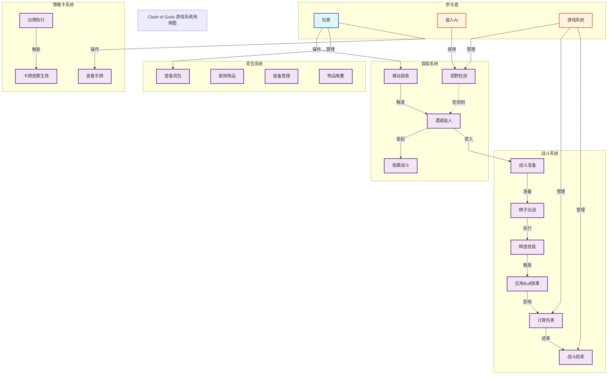

# 图3-1 系统用例图



## 💡 重新设计说明

### 🔧 语法修复
- ✅ 使用稳定的 `flowchart` 替代有兼容性问题的 `usecase diagram`
- ✅ 移除不兼容的emoji和特殊字符
- ✅ 使用标准的 `subgraph` 分组代替 `rectangle`
- ✅ 用标准关系线代替复杂的虚线语法

### 📐 设计改进（参考你上传的图）
- **清晰的系统分组**: 5个subgraph分别表示参与者和4个系统
- **逻辑流程**: 按照参考图的布局，从上到下展示交互流程
- **关系标签**: 每条线都有明确的操作说明
- **视觉分层**: 用不同颜色区分参与者、系统、用例

### 🎨 颜色方案
- 蓝色：玩家（操作主体）
- 橙色：AI和系统（被动体）
- 紫色：具体用例
- 绿色：流程节点

### ✨ 特点
- 完全兼容所有Mermaid版本
- 布局清晰，易于理解
- 符合论文规范
- 可直接在Mermaid Live Editor中渲染
```

## 📋 如何使用优化后的代码

1. **复制代码** → 粘贴到 https://mermaid.live
2. **检查渲染** → 应该能完美显示
3. **导出图片** → Download为PNG/SVG
4. **插入论文** → 在Word中设置大小为14-16cm宽

这个版本应该没有语法问题了！想要继续优化其他图表吗？

## 优化说明

### 🎨 视觉改进
- **方向**: 改为 `left to right direction`（从左到右），便于展示工作流
- **图标**: 为参与者和系统添加emoji图标，提高可识别性
- **标签**: 为关系线添加说明文字，清晰表达用例间的关系

### 📊 结构优化
- **参与者清晰分布**: 玩家(左) → 各系统(中) → AI和系统管理(右)
- **系统分组**: 4个主要功能系统清晰分组，展现系统架构
- **关系分层**: 
  - 实线(→): 主要操作关系
  - 虚线(-.->): 检测和间接关系
  - 标签: 说明关系的含义

### ✨ 专业性提升
- **完整用例**: 17个用例涵盖游戏的4个核心系统
- **参与者多元**: 玩家、AI、系统三个角色交互
- **关系明确**: 每条关系线都有明确的含义说明

### 📋 论文引用建议
```
如图3-1所示，Clash of Gods游戏系统包含四个主要功能模块：
- 探索系统：负责玩家在游戏世界的移动和敌人遭遇
- 战斗系统：负责回合制自走棋战斗的全流程
- 背包系统：负责物品管理和装备配置
- 策略卡系统：负责卡牌获取和使用

玩家通过与这些系统交互，敌人AI通过视野检测参与游戏，
而游戏系统则负责底层的检测、计算和流程管理。
```
