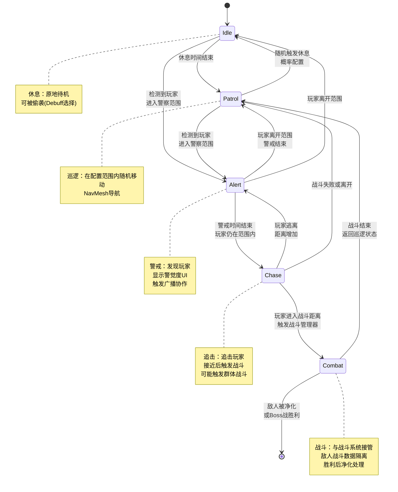

# 敌人AI状态机转换图

```mermaid
---
config:
    stateDiagram:
        nodeSpacing: 70
        rankSpacing: 70
        curve: linear
---
stateDiagram-v2
    [*] --> Idle
    
    Idle --> Patrol: 休息时间结束
    Idle --> Alert: 检测到玩家<br/>进入警察范围
    
    Patrol --> Idle: 随机触发休息<br/>概率配置
    Patrol --> Alert: 检测到玩家<br/>进入警察范围
    
    Alert --> Patrol: 玩家离开范围<br/>警戒结束
    Alert --> Chase: 警戒时间结束<br/>玩家仍在范围内
    Alert --> Idle: 玩家离开范围
    
    Chase --> Combat: 玩家进入战斗距离<br/>触发战斗管理器
    Chase --> Alert: 玩家逃离<br/>距离增加
    Chase --> Patrol: 战斗失败或离开
    
    Combat --> Patrol: 战斗结束<br/>返回巡逻状态
    Combat --> [*]: 敌人被净化<br/>或Boss战胜利
    
    note right of Idle
        休息：原地待机
        可被偷袭(Debuff选择)
    end note
    
    note right of Patrol
        巡逻：在配置范围内随机移动
        NavMesh导航
    end note
    
    note right of Alert
        警戒：发现玩家
        显示警觉度UI
        触发广播协作
    end note
    
    note right of Chase
        追击：追击玩家
        接近后触发战斗
        可能触发群体战斗
    end note
    
    note right of Combat
        战斗：与战斗系统接管
        敌人战斗数据隔离
        胜利后净化处理
    end note
```
