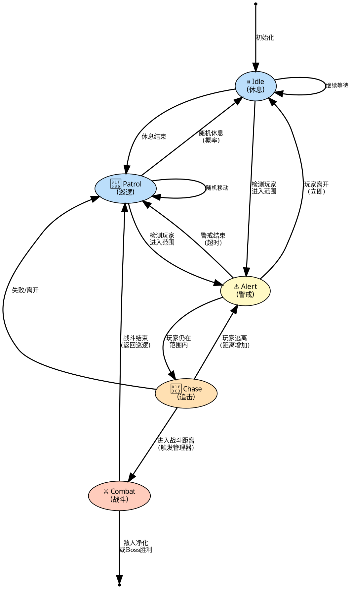

# 敌人AI状态机转换图

## Graphviz DOT 格式（优化正交线条版）

**适用于**: https://edotor.net/

### 📐 状态节点说明

| 状态 | 颜色 | 含义 | 备注 |
|------|------|------|------|
| **Idle** | 蓝色 | 休息待机 | 原地待机，可被偷袭 |
| **Patrol** | 蓝色 | 巡逻移动 | NavMesh导航，配置范围内随机移动 |
| **Alert** | 黄色 | 警戒发现 | 显示警觉度UI，触发广播协作 |
| **Chase** | 橙色 | 追击追逐 | 追击玩家，接近触发战斗 |
| **Combat** | 红色 | 战斗中 | 战斗系统接管，敌人数据隔离 |

### 📐 优化参数说明

| 参数 | 值 | 作用 |
|------|-----|------|
| `rankdir` | TB | 上到下布局（自然的状态流）|
| `splines` | orthogonal | **强制正交线条**（90°转向） |
| `nodesep` | 1.0 | 节点间距（可读性优先） |
| `ranksep` | 1.2 | 层级间距（充分垂直空间） |

### ✨ 优化特性

1. ✅ **强制正交线条** - 所有箭头完全直角
2. ✅ **清晰的状态流** - 从上到下的自然流向
3. ✅ **颜色编码** - 不同状态类型使用不同颜色
4. ✅ **详细标签** - 边标签解释转移条件
5. ✅ **空间优化** - 合理的间距最大化可读性
