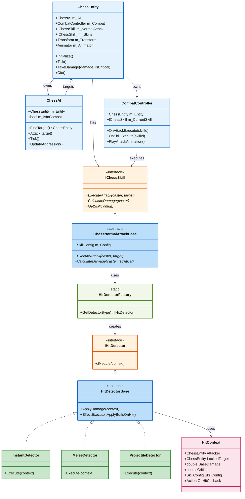

# 棋子系统类图

```mermaid
---
config:
    classDiagram:
        nodeSpacing: 60
        rankSpacing: 80
        curve: linear
---
classDiagram
    class ChessEntity {
        +ChessAI m_AI
        +CombatController m_Combat
        +IChessSkill m_NormalAttack
        +IChessSkill[] m_Skills
        +Transform m_Transform
        +Animator m_Animator
        +Initialize()
        +Tick()
        +TakeDamage(damage, isCritical)
        +Die()
    }
    
    class ChessAI {
        +ChessEntity m_Entity
        +bool m_IsInCombat
        +FindTarget() ChessEntity
        +Attack(target)
        +Tick()
        +UpdateAggression()
    }
    
    class CombatController {
        +ChessEntity m_Entity
        +IChessSkill m_CurrentSkill
        +OnAttackExecute(skillId)
        +OnSkillExecute(skillId)
        +PlayAttackAnimation()
    }
    
    class IChessSkill {
        <<interface>>
        +ExecuteAttack(caster, target)*
        +CalculateDamage(caster)*
        +GetSkillConfig()*
    }
    
    class ChessNormalAttackBase {
        <<abstract>>
        +SkillConfig m_Config
        +ExecuteAttack(caster, target)*
        +CalculateDamage(caster, isCritical)*
    }
    
    class HitDetectorFactory {
        <<static>>
        +GetDetector(type)$ IHitDetector
    }
    
    class IHitDetector {
        <<interface>>
        +Execute(context)*
    }
    
    class HitDetectorBase {
        <<abstract>>
        +ApplyDamage(context)
        +EffectExecutor.ApplyBuffsOnHit()
    }
    
    class InstantDetector {
        +Execute(context)
    }
    
    class MeleeDetector {
        +Execute(context)
    }
    
    class ProjectileDetector {
        +Execute(context)
    }
    
    class HitContext {
        +ChessEntity Attacker
        +ChessEntity LockedTarget
        +double BaseDamage
        +bool IsCritical
        +SkillConfig SkillConfig
        +Action OnHitCallback
    }
    
    ChessEntity --> ChessAI: owns
    ChessEntity --> CombatController: owns
    ChessEntity --> IChessSkill: has
    CombatController --> IChessSkill: executes
    ChessAI --> ChessEntity: targets
    
    IChessSkill <|.. ChessNormalAttackBase
    
    ChessNormalAttackBase --> HitDetectorFactory: uses
    HitDetectorFactory --> IHitDetector: creates
    
    IHitDetector <|.. HitDetectorBase
    HitDetectorBase <|.. InstantDetector
    HitDetectorBase <|.. MeleeDetector
    HitDetectorBase <|.. ProjectileDetector
    
    HitDetectorBase --> HitContext: uses
    
    style ChessEntity fill:#e3f2fd,stroke:#1976d2,stroke-width:2px
    style ChessAI fill:#e3f2fd,stroke:#1976d2,stroke-width:2px
    style CombatController fill:#e3f2fd,stroke:#1976d2,stroke-width:2px
    style IChessSkill fill:#fff3e0,stroke:#e65100,stroke-width:2px
    style ChessNormalAttackBase fill:#bbdefb,stroke:#1565c0,stroke-width:2px
    style HitDetectorFactory fill:#f1f8e9,stroke:#558b2f,stroke-width:2px
    style IHitDetector fill:#fff3e0,stroke:#e65100,stroke-width:2px
    style HitDetectorBase fill:#bbdefb,stroke:#1565c0,stroke-width:2px
    style InstantDetector fill:#c8e6c9,stroke:#2e7d32,stroke-width:2px
    style MeleeDetector fill:#c8e6c9,stroke:#2e7d32,stroke-width:2px
    style ProjectileDetector fill:#c8e6c9,stroke:#2e7d32,stroke-width:2px
    style HitContext fill:#fce4ec,stroke:#c2185b,stroke-width:2px
```
