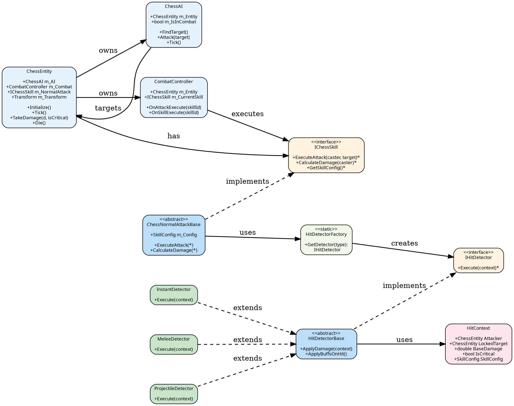

# 棋子系统类图

## Graphviz DOT 格式（优化正交线条版）

**适用于**: https://edotor.net/

### 📊 类关系说明

| 关系 | 符号 | 含义 |
|------|------|------|
| 关联 | → | 一个类使用或拥有另一个类 |
| 实现 | ⋯→ (虚线) | 类实现接口 |
| 继承 | ⋯→ (虚线) | 子类继承父类 |

### 📐 优化参数说明

| 参数 | 值 | 作用 |
|------|-----|------|
| `rankdir` | LR | 左到右布局（类层级流）|
| `splines` | orthogonal | **强制正交线条**（90°转向） |
| `nodesep` | 0.8 | 节点间距（紧凑） |
| `ranksep` | 1.0 | 层级间距（平衡可读性） |

### 🎨 颜色编码

- **蓝色**：核心实体类
- **橙色**：接口定义
- **浅蓝**：抽象基类
- **绿色**：具体实现类
- **粉色**：数据结构类
- **浅绿**：工厂类

### ✨ 优化特性

1. ✅ **强制正交线条** - 所有箭头完全直角
2. ✅ **清晰的类层级** - 4层垂直分布
3. ✅ **颜色分类** - 快速识别类型
4. ✅ **空间最优化** - 紧凑的节点排列
5. ✅ **关系清晰** - 虚线表示继承/实现
