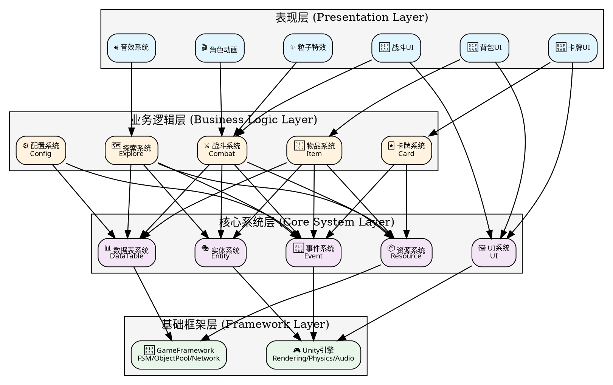

# 图4-1 系统分层架构设计图

## Graphviz DOT 格式（优化正交线条版）

**适用于**: https://edotor.net/

### 📐 分层说明

| 层 | 职责 | 包含模块 |
|----|------|---------|
| **表现层** | 用户界面和视觉效果 | UI、动画、特效、音效 |
| **业务逻辑层** | 游戏核心功能 | 战斗、物品、卡牌、探索、配置 |
| **核心系统层** | 通用框架服务 | 事件、实体、UI、数据表、资源 |
| **基础框架层** | 引擎和框架支持 | Unity引擎、GameFramework |

### 📐 优化参数说明

| 参数 | 值 | 作用 |
|------|-----|------|
| `rankdir` | TB | 上到下（清晰的分层流） |
| `splines` | orthogonal | **强制正交线条**（90°转向） |
| `nodesep` | 0.7 | 节点水平间距 |
| `ranksep` | 1.3 | 层级垂直间距（分层明确） |

### ✨ 优化特性

1. ✅ **强制正交线条** - 所有箭头完全直角
2. ✅ **清晰的层级结构** - 4层垂直分布
3. ✅ **颜色分类** - 快速识别层级
4. ✅ **空间最优化** - 合理的间距

## 架构说明

### 四层架构设计

#### 基础框架层（Foundation Layer）
提供底层的引擎功能和框架支持：
- **Unity引擎**：提供渲染管线、物理引擎、音频系统、输入系统
- **GameFramework**：提供有限状态机、对象池、网络系统、资源管理等

#### 核心系统层（Core System Layer）
基于框架之上，提供游戏开发的标准化服务：
- **事件系统**：基于发布-订阅模式，实现模块间解耦通信
- **实体系统**：管理游戏对象的生命周期和对象池
- **UI系统**：提供完整的界面管理和显示功能
- **数据表系统**：加载和缓存配置数据
- **资源系统**：负责资源的动态加载和管理

#### 业务逻辑层（Business Logic Layer）
游戏功能的核心实现：
- **战斗系统**：棋子AI、技能执行、伤害计算、Buff管理
- **物品系统**：背包管理、装备系统、宝物词条
- **卡牌系统**：卡牌管理、效果执行
- **探索系统**：敌人管理、AI状态机、战斗触发
- **配置系统**：配置数据的访问接口封装

#### 表现层（Presentation Layer）
向玩家呈现游戏状态：
- **UI界面**：战斗UI、背包UI、卡牌UI等
- **动画系统**：角色动画、特效
- **音效系统**：背景音乐、音效播放

### 架构特点

1. **单向依赖**：上层依赖下层，下层不感知上层
2. **解耦通信**：各业务系统通过事件系统进行解耦通信
3. **职责清晰**：各层职责明确，易于维护和扩展
4. **可测试性**：各层相对独立，便于单元测试
