# 图4-7 卡牌执行流程设计图

```mermaid
---
config:
    flowchart:
        nodeSpacing: 70
        rankSpacing: 50
        curve: linear
---
flowchart TD
    subgraph "卡牌获得阶段"
        A1["战斗胜利"]
        A2["检查特殊敌人<br/>Boss/Special"]
        A3["进行敌人净化"]
    end
    
    subgraph "卡牌管理阶段"
        B1["获得卡牌ID"]
        B2["加入手牌池<br/>CardPool"]
        B3["展示卡牌选择UI"]
        B4["玩家选择卡牌<br/>最多3张"]
    end
    
    subgraph "卡牌使用准备"
        C1["下次探索或战斗"]
        C2["卡牌进入手牌<br/>HandCards"]
        C3["玩家查看卡牌"]
        C4["选择使用时机"]
    end
    
    subgraph "卡牌效果执行"
        D1["玩家选择出牌"]
        D2["获取卡牌配置<br/>CardTable"]
        D3["解析卡牌效果"]
        D4["确定作用对象<br/>我方/敌方/场景"]
    end
    
    subgraph "效果应用"
        E1["我方效果<br/>增益/治疗<br/>属性提升"]
        E2["敌方效果<br/>减益/伤害<br/>控制效果"]
        E3["场景效果<br/>改变环境<br/>触发事件"]
    end
    
    subgraph "结算阶段"
        F1["更新游戏状态"]
        F2["发布效果触发事件<br/>CardEffectEventArgs"]
        F3["播放效果特效"]
        F4["播放音效反馈"]
        F5["移除已使用卡牌<br/>从手牌中删除"]
    end
    
    subgraph "流程结束"
        G1["继续游戏"]
    end
    
    A1 --> A2
    A2 -->|是| A3
    A2 -->|否| G1
    A3 --> B1
    
    B1 --> B2
    B2 --> B3
    B3 --> B4
    B4 --> C1
    
    C1 --> C2
    C2 --> C3
    C3 --> C4
    C4 --> D1
    
    D1 --> D2
    D2 --> D3
    D3 --> D4
    
    D4 -->|我方| E1
    D4 -->|敌方| E2
    D4 -->|场景| E3
    
    E1 --> F1
    E2 --> F1
    E3 --> F1
    
    F1 --> F2
    F2 --> F3
    F3 --> F4
    F4 --> F5
    F5 --> G1
    
    style A1 fill:#c8e6c9,stroke:#2e7d32,stroke-width:2px
    style A2 fill:#c8e6c9,stroke:#2e7d32,stroke-width:2px
    style A3 fill:#c8e6c9,stroke:#2e7d32,stroke-width:2px
    
    style B1 fill:#ffccbc,stroke:#d84315,stroke-width:2px
    style B2 fill:#ffccbc,stroke:#d84315,stroke-width:2px
    style B3 fill:#ffccbc,stroke:#d84315,stroke-width:2px
    style B4 fill:#ffccbc,stroke:#d84315,stroke-width:2px
    
    style C1 fill:#b3e5fc,stroke:#01579b,stroke-width:2px
    style C2 fill:#b3e5fc,stroke:#01579b,stroke-width:2px
    style C3 fill:#b3e5fc,stroke:#01579b,stroke-width:2px
    style C4 fill:#b3e5fc,stroke:#01579b,stroke-width:2px
    
    style D1 fill:#fff9c4,stroke:#f57f17,stroke-width:2px
    style D2 fill:#fff9c4,stroke:#f57f17,stroke-width:2px
    style D3 fill:#fff9c4,stroke:#f57f17,stroke-width:2px
    style D4 fill:#fff9c4,stroke:#f57f17,stroke-width:2px
    
    style E1 fill:#f8bbd0,stroke:#880e4f,stroke-width:2px
    style E2 fill:#f8bbd0,stroke:#880e4f,stroke-width:2px
    style E3 fill:#f8bbd0,stroke:#880e4f,stroke-width:2px
    
    style F1 fill:#f3e5f5,stroke:#4a148c,stroke-width:2px
    style F2 fill:#f3e5f5,stroke:#4a148c,stroke-width:2px
    style F3 fill:#f3e5f5,stroke:#4a148c,stroke-width:2px
    style F4 fill:#f3e5f5,stroke:#4a148c,stroke-width:2px
    style F5 fill:#f3e5f5,stroke:#4a148c,stroke-width:2px
    
    style G1 fill:#c8e6c9,stroke:#2e7d32,stroke-width:2px
```



## 卡牌系统流程详解

### 1. 卡牌获得流程

**卡牌获得的触发条件**:
- 战斗胜利后
- 特殊敌人（Boss、精英敌人）被击败
- 进行敌人净化操作

**获得过程**:
1. 确认击败特殊敌人
2. 触发净化系统
3. 从净化奖励池中获得卡牌ID
4. 加入玩家的卡牌池（CardPool）
5. 展示卡牌选择UI，玩家选择最多3张卡牌

### 2. 卡牌管理阶段

**手牌管理**:
- 卡牌池：存储所有可用卡牌
- 手牌：玩家当前可用卡牌（最多N张）
- 使用过的卡牌：从手牌中移除

**UI交互**:
- 卡牌选择界面：展示获得的卡牌，玩家选择要添加的卡牌
- 手牌管理界面：查看当前手牌，查看卡牌详情

### 3. 卡牌效果执行

**卡牌配置表（CardTable）字段**:
- 卡牌ID：唯一标识
- 卡牌名称
- 卡牌描述
- 效果类型：确定作用对象
- 效果参数：具体效果数值

**效果类型分类**:

#### 我方效果（Ally Effect）
```
常见效果:
- 属性提升（ATK、DEF、HP）
- 治疗（回复生命值）
- Buff应用（增益效果）
- 复活（使倒下的棋子复活）
```

#### 敌方效果（Enemy Effect）
```
常见效果:
- 伤害（固定伤害、百分比伤害）
- Debuff应用（减速、灼烧等负面效果）
- 控制效果（晕眩、沉默等）
- 驱散（移除敌方Buff）
```

#### 场景效果（Scene Effect）
```
常见效果:
- 改变环境状态
- 触发特殊事件
- 改变战斗规则
```

### 4. 效果结算

**结算顺序**:
1. 获取卡牌配置信息
2. 解析卡牌效果参数
3. 根据效果类型确定作用对象
4. 应用效果到目标
5. 更新游戏状态

**效果应用模式**:
- **直接应用**：效果立即作用（如伤害、治疗）
- **事件应用**：通过事件系统触发（如Buff应用）
- **延迟应用**：在特定时机应用（如下一回合生效）

### 5. 反馈与结算

**视觉反馈**:
- 播放卡牌特效（如光效、粒子）
- 显示伤害数字或治疗数字
- 显示状态变化提示

**音效反馈**:
- 卡牌使用音效
- 效果命中音效
- 成功/失败提示音

**数据结算**:
- 更新棋子属性
- 更新Buff状态
- 移除使用过的卡牌
- 触发CardEffectEventArgs事件

### 6. 关键类设计

```csharp
// 卡牌配置
public class CardTable : IDataTable
{
    public int CardId { get; set; }
    public string CardName { get; set; }
    public CardEffectType EffectType { get; set; }
    public int[] EffectParams { get; set; }
    // ...
}

// 卡牌管理器
public class CardManager
{
    public void UseCard(int cardId, IEffectTarget target)
    {
        // 1. 验证卡牌有效性
        // 2. 获取卡牌配置
        // 3. 执行效果
        // 4. 发布事件
        // 5. 移除卡牌
    }
}

// 效果执行器
public interface ICardEffect
{
    void Execute(IEffectTarget target);
}
```

### 7. 事件系统集成

**关键事件**:
- `CardObtainedEventArgs`：卡牌获得事件
- `CardUsedEventArgs`：卡牌使用事件
- `CardEffectEventArgs`：卡牌效果触发事件

**事件订阅**:
- UI系统订阅卡牌事件，更新界面
- 战斗系统订阅效果事件，应用状态变化
- 音效系统订阅事件，播放对应音效
