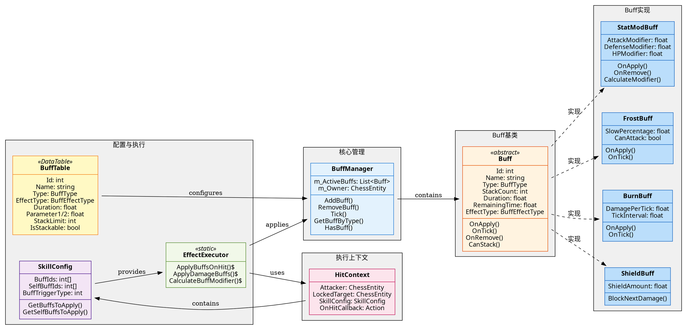

# Buff系统类图

```dot
// Buff系统类图 - Graphviz DOT格式
// 强制正交线条，从左到右显示类关系
digraph BuffSystemClassDiagram {
    graph [
        rankdir=LR
        splines=orthogonal
        nodesep=0.7
        ranksep=1.0
        fontname="SimHei,sans-serif"
    ]
    
    node [shape=plaintext, fontname="SimHei,sans-serif"]
    
    // 核心类
    subgraph cluster_core {
        label="核心管理"
        style=filled
        fillcolor="#f0f0f0"
        
        BuffManager [label=<
            <TABLE BORDER="1" CELLBORDER="0" CELLSPACING="0" CELLPADDING="6" BGCOLOR="#e3f2fd" COLOR="#1976d2">
                <TR><TD><B>BuffManager</B></TD></TR>
                <HR/>
                <TR><TD ALIGN="LEFT">m_ActiveBuffs: List&lt;Buff&gt;<BR/>m_Owner: ChessEntity</TD></TR>
                <HR/>
                <TR><TD ALIGN="LEFT">AddBuff()<BR/>RemoveBuff()<BR/>Tick()<BR/>GetBuffByType()<BR/>HasBuff()</TD></TR>
            </TABLE>
        >]
    }
    
    // 抽象基类
    subgraph cluster_base {
        label="Buff基类"
        style=filled
        fillcolor="#f0f0f0"
        
        Buff [label=<
            <TABLE BORDER="1" CELLBORDER="0" CELLSPACING="0" CELLPADDING="6" BGCOLOR="#fff3e0" COLOR="#e65100">
                <TR><TD><I>&laquo;abstract&raquo;</I><BR/><B>Buff</B></TD></TR>
                <HR/>
                <TR><TD ALIGN="LEFT">Id: int<BR/>Name: string<BR/>Type: BuffType<BR/>StackCount: int<BR/>Duration: float<BR/>RemainingTime: float<BR/>EffectType: BuffEffectType</TD></TR>
                <HR/>
                <TR><TD ALIGN="LEFT">OnApply()<BR/>OnTick()<BR/>OnRemove()<BR/>CanStack()</TD></TR>
            </TABLE>
        >]
    }
    
    // Buff具体实现
    subgraph cluster_impl {
        label="Buff实现"
        style=filled
        fillcolor="#f0f0f0"
        
        StatModBuff [label=<
            <TABLE BORDER="1" CELLBORDER="0" CELLSPACING="0" CELLPADDING="6" BGCOLOR="#bbdefb" COLOR="#1565c0">
                <TR><TD><B>StatModBuff</B></TD></TR>
                <HR/>
                <TR><TD ALIGN="LEFT">AttackModifier: float<BR/>DefenseModifier: float<BR/>HPModifier: float</TD></TR>
                <HR/>
                <TR><TD ALIGN="LEFT">OnApply()<BR/>OnRemove()<BR/>CalculateModifier()</TD></TR>
            </TABLE>
        >]
        FrostBuff [label=<
            <TABLE BORDER="1" CELLBORDER="0" CELLSPACING="0" CELLPADDING="6" BGCOLOR="#bbdefb" COLOR="#1565c0">
                <TR><TD><B>FrostBuff</B></TD></TR>
                <HR/>
                <TR><TD ALIGN="LEFT">SlowPercentage: float<BR/>CanAttack: bool</TD></TR>
                <HR/>
                <TR><TD ALIGN="LEFT">OnApply()<BR/>OnTick()</TD></TR>
            </TABLE>
        >]
        BurnBuff [label=<
            <TABLE BORDER="1" CELLBORDER="0" CELLSPACING="0" CELLPADDING="6" BGCOLOR="#bbdefb" COLOR="#1565c0">
                <TR><TD><B>BurnBuff</B></TD></TR>
                <HR/>
                <TR><TD ALIGN="LEFT">DamagePerTick: float<BR/>TickInterval: float</TD></TR>
                <HR/>
                <TR><TD ALIGN="LEFT">OnApply()<BR/>OnTick()</TD></TR>
            </TABLE>
        >]
        ShieldBuff [label=<
            <TABLE BORDER="1" CELLBORDER="0" CELLSPACING="0" CELLPADDING="6" BGCOLOR="#bbdefb" COLOR="#1565c0">
                <TR><TD><B>ShieldBuff</B></TD></TR>
                <HR/>
                <TR><TD ALIGN="LEFT">ShieldAmount: float</TD></TR>
                <HR/>
                <TR><TD ALIGN="LEFT">BlockNextDamage()</TD></TR>
            </TABLE>
        >]
    }
    
    // 配置与执行
    subgraph cluster_config {
        label="配置与执行"
        style=filled
        fillcolor="#f0f0f0"
        
        BuffTable [label=<
            <TABLE BORDER="1" CELLBORDER="0" CELLSPACING="0" CELLPADDING="6" BGCOLOR="#fff9c4" COLOR="#f57f17">
                <TR><TD><I>&laquo;DataTable&raquo;</I><BR/><B>BuffTable</B></TD></TR>
                <HR/>
                <TR><TD ALIGN="LEFT">Id: int<BR/>Name: string<BR/>Type: BuffType<BR/>EffectType: BuffEffectType<BR/>Duration: float<BR/>Parameter1/2: float<BR/>StackLimit: int<BR/>IsStackable: bool</TD></TR>
            </TABLE>
        >]
        SkillConfig [label=<
            <TABLE BORDER="1" CELLBORDER="0" CELLSPACING="0" CELLPADDING="6" BGCOLOR="#f3e5f5" COLOR="#4a148c">
                <TR><TD><B>SkillConfig</B></TD></TR>
                <HR/>
                <TR><TD ALIGN="LEFT">BuffIds: int[]<BR/>SelfBuffIds: int[]<BR/>BuffTriggerType: int</TD></TR>
                <HR/>
                <TR><TD ALIGN="LEFT">GetBuffsToApply()<BR/>GetSelfBuffsToApply()</TD></TR>
            </TABLE>
        >]
        EffectExecutor [label=<
            <TABLE BORDER="1" CELLBORDER="0" CELLSPACING="0" CELLPADDING="6" BGCOLOR="#f1f8e9" COLOR="#558b2f">
                <TR><TD><I>&laquo;static&raquo;</I><BR/><B>EffectExecutor</B></TD></TR>
                <HR/>
                <TR><TD ALIGN="LEFT">ApplyBuffsOnHit()$<BR/>ApplyDamageBuffs()$<BR/>CalculateBuffModifier()$</TD></TR>
            </TABLE>
        >]
    }
    
    // 上下文
    subgraph cluster_context {
        label="执行上下文"
        style=filled
        fillcolor="#f0f0f0"
        
        HitContext [label=<
            <TABLE BORDER="1" CELLBORDER="0" CELLSPACING="0" CELLPADDING="6" BGCOLOR="#fce4ec" COLOR="#c2185b">
                <TR><TD><B>HitContext</B></TD></TR>
                <HR/>
                <TR><TD ALIGN="LEFT">Attacker: ChessEntity<BR/>LockedTarget: ChessEntity<BR/>SkillConfig: SkillConfig<BR/>OnHitCallback: Action</TD></TR>
            </TABLE>
        >]
    }
    
    // 继承关系
    Buff -> StatModBuff [label="实现", style=dashed]
    Buff -> FrostBuff [label="实现", style=dashed]
    Buff -> BurnBuff [label="实现", style=dashed]
    Buff -> ShieldBuff [label="实现", style=dashed]
    
    // 包含关系
    BuffManager -> Buff [label="contains"]
    
    // 配置关系
    BuffTable -> BuffManager [label="configures"]
    SkillConfig -> EffectExecutor [label="provides"]
    EffectExecutor -> BuffManager [label="applies"]
    
    // 使用关系
    HitContext -> SkillConfig [label="contains"]
    EffectExecutor -> HitContext [label="uses"]
}
```
