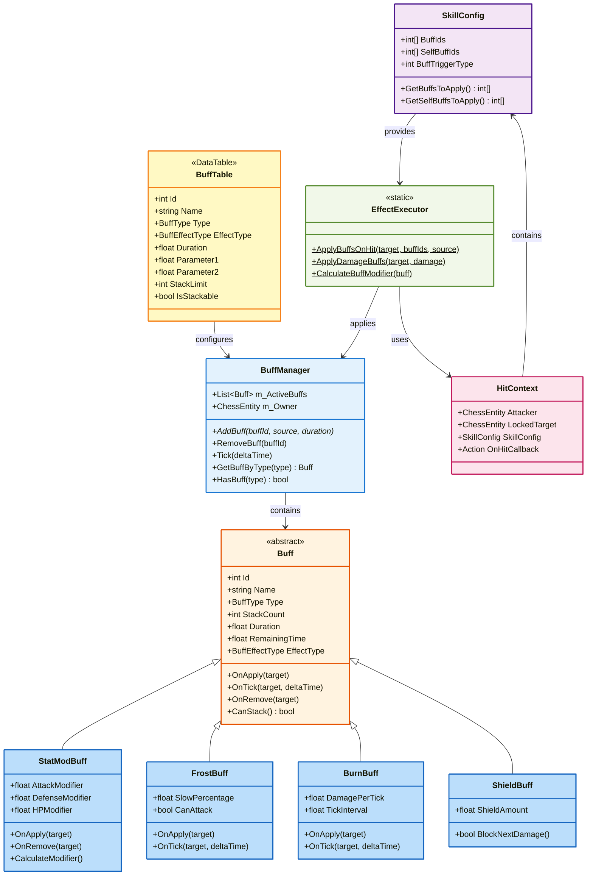

# Buff系统类图

```mermaid
---
config:
    classDiagram:
        nodeSpacing: 60
        rankSpacing: 80
        curve: linear
---
classDiagram
    class BuffManager {
        +List~Buff~ m_ActiveBuffs
        +ChessEntity m_Owner
        +AddBuff(buffId, source, duration)*
        +RemoveBuff(buffId)
        +Tick(deltaTime)
        +GetBuffByType(type) Buff
        +HasBuff(type) bool
    }
    
    class Buff {
        <<abstract>>
        +int Id
        +string Name
        +BuffType Type
        +int StackCount
        +float Duration
        +float RemainingTime
        +BuffEffectType EffectType
        +OnApply(target)
        +OnTick(target, deltaTime)
        +OnRemove(target)
        +CanStack() bool
    }
    
    class StatModBuff {
        +float AttackModifier
        +float DefenseModifier
        +float HPModifier
        +OnApply(target)
        +OnRemove(target)
        +CalculateModifier()
    }
    
    class FrostBuff {
        +float SlowPercentage
        +bool CanAttack
        +OnApply(target)
        +OnTick(target, deltaTime)
    }
    
    class BurnBuff {
        +float DamagePerTick
        +float TickInterval
        +OnApply(target)
        +OnTick(target, deltaTime)
    }
    
    class ShieldBuff {
        +float ShieldAmount
        +bool BlockNextDamage()
    }
    
    class BuffTable {
        <<DataTable>>
        +int Id
        +string Name
        +BuffType Type
        +BuffEffectType EffectType
        +float Duration
        +float Parameter1
        +float Parameter2
        +int StackLimit
        +bool IsStackable
    }
    
    class SkillConfig {
        +int[] BuffIds
        +int[] SelfBuffIds
        +int BuffTriggerType
        +GetBuffsToApply() int[]
        +GetSelfBuffsToApply() int[]
    }
    
    class EffectExecutor {
        <<static>>
        +ApplyBuffsOnHit(target, buffIds, source)$
        +ApplyDamageBuffs(target, damage)$
        +CalculateBuffModifier(buff)$
    }
    
    class HitContext {
        +ChessEntity Attacker
        +ChessEntity LockedTarget
        +SkillConfig SkillConfig
        +Action OnHitCallback
    }
    
    BuffManager --> Buff: contains
    Buff <|-- StatModBuff
    Buff <|-- FrostBuff
    Buff <|-- BurnBuff
    Buff <|-- ShieldBuff
    
    BuffTable --> BuffManager: configures
    SkillConfig --> EffectExecutor: provides
    EffectExecutor --> BuffManager: applies
    
    HitContext --> SkillConfig: contains
    EffectExecutor --> HitContext: uses
    
    style BuffManager fill:#e3f2fd,stroke:#1976d2,stroke-width:2px
    style Buff fill:#fff3e0,stroke:#e65100,stroke-width:2px
    style StatModBuff fill:#bbdefb,stroke:#1565c0,stroke-width:2px
    style FrostBuff fill:#bbdefb,stroke:#1565c0,stroke-width:2px
    style BurnBuff fill:#bbdefb,stroke:#1565c0,stroke-width:2px
    style ShieldBuff fill:#bbdefb,stroke:#1565c0,stroke-width:2px
    style BuffTable fill:#fff9c4,stroke:#f57f17,stroke-width:2px
    style SkillConfig fill:#f3e5f5,stroke:#4a148c,stroke-width:2px
    style EffectExecutor fill:#f1f8e9,stroke:#558b2f,stroke-width:2px
    style HitContext fill:#fce4ec,stroke:#c2185b,stroke-width:2px
```
