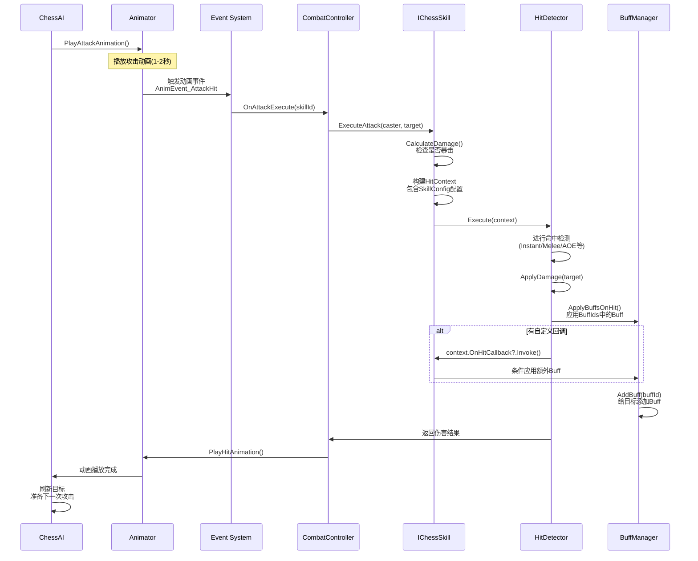

# 技能执行时序图

```mermaid
---
config:
    sequence:
        mirrorActors: true
        messageAlign: center
        actorFontSize: 14
---
sequenceDiagram
    participant ChessAI as ChessAI
    participant Animator as Animator
    participant EventBus as Event System
    participant Controller as CombatController
    participant Skill as IChessSkill
    participant HitDetector as HitDetector
    participant BuffMgr as BuffManager
    
    ChessAI ->> Animator: PlayAttackAnimation()
    note over Animator: 播放攻击动画(1-2秒)
    
    Animator ->> EventBus: 触发动画事件<br/>AnimEvent_AttackHit
    
    EventBus ->> Controller: OnAttackExecute(skillId)
    
    Controller ->> Skill: ExecuteAttack(caster, target)
    
    Skill ->> Skill: CalculateDamage()<br/>检查是否暴击
    
    Skill ->> Skill: 构建HitContext<br/>包含SkillConfig配置
    
    Skill ->> HitDetector: Execute(context)
    
    HitDetector ->> HitDetector: 进行命中检测<br/>(Instant/Melee/AOE等)
    
    HitDetector ->> HitDetector: ApplyDamage(target)
    
    HitDetector ->> BuffMgr: ApplyBuffsOnHit()<br/>应用BuffIds中的Buff
    
    alt 有自定义回调
        HitDetector ->> Skill: context.OnHitCallback?.Invoke()
        Skill ->> BuffMgr: 条件应用额外Buff
    end
    
    BuffMgr ->> BuffMgr: AddBuff(buffId)<br/>给目标添加Buff
    
    HitDetector ->> Controller: 返回伤害结果
    
    Controller ->> Animator: PlayHitAnimation()
    
    Animator ->> ChessAI: 动画播放完成
    
    ChessAI ->> ChessAI: 刷新目标<br/>准备下一次攻击
```
