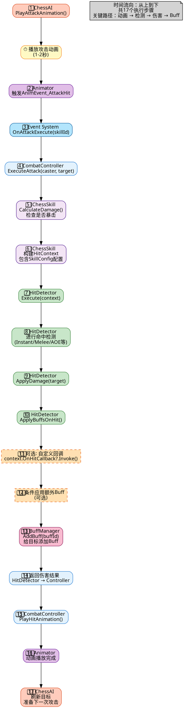

# 技能执行时序图

```dot
// 技能执行时序图 - Graphviz流程图形式
// 自上而下显示技能执行流程
digraph SkillExecutionSequence {
    graph [
        rankdir=TB
        splines=orthogonal
        nodesep=0.8
        ranksep=1.0
        fontname="SimHei,sans-serif"
    ]
    
    node [shape=box, style="filled,rounded", fontname="SimHei,sans-serif"]
    
    // 时间线：从上到下
    s1 [label="1️⃣ ChessAI\nPlayAttackAnimation()", fillcolor="#ffccbc", color="#d84315"]
    s2 [label="⏱️ 播放攻击动画\n(1-2秒)", fillcolor="#fff9c4", color="#f57f17"]
    
    s3 [label="2️⃣ Animator\n触发AnimEvent_AttackHit", fillcolor="#e1bee7", color="#6a1b9a"]
    
    s4 [label="3️⃣ Event System\nOnAttackExecute(skillId)", fillcolor="#b3e5fc", color="#01579b"]
    
    s5 [label="4️⃣ CombatController\nExecuteAttack(caster, target)", fillcolor="#e3f2fd", color="#1976d2"]
    
    s6 [label="5️⃣ IChessSkill\nCalculateDamage()\n检查是否暴击", fillcolor="#f3e5f5", color="#4a148c"]
    
    s7 [label="6️⃣ IChessSkill\n构建HitContext\n包含SkillConfig配置", fillcolor="#f3e5f5", color="#4a148c"]
    
    s8 [label="7️⃣ HitDetector\nExecute(context)", fillcolor="#c8e6c9", color="#2e7d32"]
    
    s9 [label="8️⃣ HitDetector\n进行命中检测\n(Instant/Melee/AOE等)", fillcolor="#c8e6c9", color="#2e7d32"]
    
    s10 [label="9️⃣ HitDetector\nApplyDamage(target)", fillcolor="#c8e6c9", color="#2e7d32"]
    
    s11 [label="🔟 HitDetector\nApplyBuffsOnHit()", fillcolor="#c8e6c9", color="#2e7d32"]
    
    s12 [label="1️⃣1️⃣ 可选: 自定义回调\ncontext.OnHitCallback?.Invoke()", fillcolor="#ffe0b2", color="#e65100", style="filled,dashed"]
    
    s13 [label="1️⃣2️⃣ 条件应用额外Buff\n(可选)", fillcolor="#ffe0b2", color="#e65100", style="filled,dashed"]
    
    s14 [label="1️⃣3️⃣ BuffManager\nAddBuff(buffId)\n给目标添加Buff", fillcolor="#f8bbd0", color="#880e4f"]
    
    s15 [label="1️⃣4️⃣ 返回伤害结果\nHitDetector → Controller", fillcolor="#e3f2fd", color="#1976d2"]
    
    s16 [label="1️⃣5️⃣ CombatController\nPlayHitAnimation()", fillcolor="#e3f2fd", color="#1976d2"]
    
    s17 [label="1️⃣6️⃣ Animator\n动画播放完成", fillcolor="#e1bee7", color="#6a1b9a"]
    
    s18 [label="1️⃣7️⃣ ChessAI\n刷新目标\n准备下一次攻击", fillcolor="#ffccbc", color="#d84315"]
    
    // 线性流程
    s1 -> s2
    s2 -> s3
    s3 -> s4
    s4 -> s5
    s5 -> s6
    s6 -> s7
    s7 -> s8
    s8 -> s9
    s9 -> s10
    s10 -> s11
    s11 -> s12
    s12 -> s13
    s13 -> s14
    s14 -> s15
    s15 -> s16
    s16 -> s17
    s17 -> s18
    
    // 备注说明
    note [label="时间流向：从上到下\n共17个执行步骤\n关键路径：动画 → 检测 → 伤害 → Buff", shape=note]
}
```
